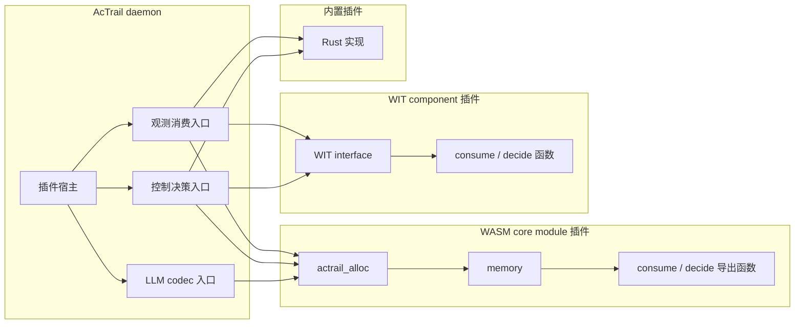
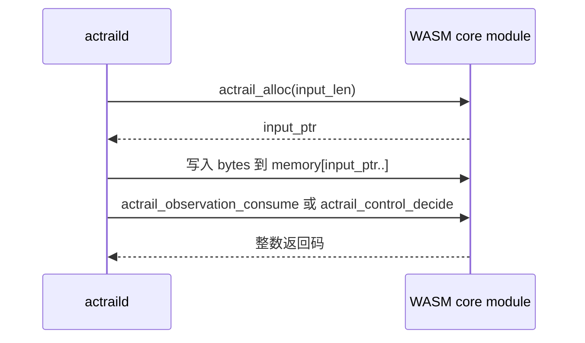
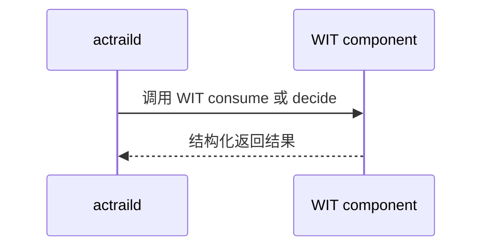
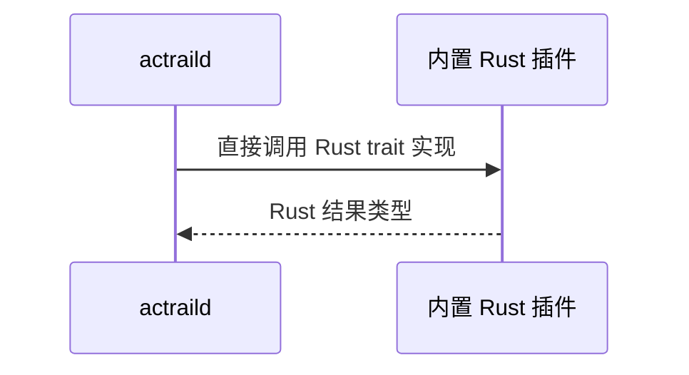

# 插件 ABI 文档索引

本目录说明 AcTrail 插件与 daemon 之间的调用约定。阅读时先按插件运行形态区分承载层，再按插件用途阅读功能层。

## 文档关系

| 文档 | 层级 | 适用对象 | 说明 |
| --- | --- | --- | --- |
| [WASM Core Module ABI](wasm-core-module.zh.md) | 承载层 | 使用普通 WebAssembly module 的插件 | 说明 `memory`、`actrail_alloc`、可选 `actrail_plugin_init`，以及 AcTrail 如何把输入数据写入插件内存。 |
| [观测消费者 ABI](observation-consumer.zh.md) | 功能层 | `observation-consumer` 插件 | 说明观测 batch 的消费入口、输入语义和返回约定。 |
| [控制决策 ABI](control-decider.zh.md) | 功能层 | `control-decider` 插件 | 说明同步治理决策入口、请求语义、返回码和 `once` / `reusable`。 |
| [LLM Codec ABI](llm-codec.zh.md) | 功能层 | `llm-codec` 插件 | 说明 LLM request body 和 SSE event data 的可选解码入口、输出 JSON 和失败回退语义。 |

## 按插件类型阅读

| 你要写的插件 | 必读文档 |
| --- | --- |
| WASM core module 观测消费者 | [WASM Core Module ABI](wasm-core-module.zh.md) + [观测消费者 ABI](observation-consumer.zh.md) |
| WASM core module 控制决策插件 | [WASM Core Module ABI](wasm-core-module.zh.md) + [控制决策 ABI](control-decider.zh.md) |
| WASM core module LLM codec 插件 | [WASM Core Module ABI](wasm-core-module.zh.md) + [LLM Codec ABI](llm-codec.zh.md) |
| WIT component 观测消费者 | [观测消费者 ABI](observation-consumer.zh.md) |
| WIT component 控制决策插件 | [控制决策 ABI](control-decider.zh.md) |
| 内置插件 | 先看具体插件说明；内置插件不需要实现 WASM ABI。 |

## 阅读顺序

1. 先确认插件用途：观测消费、控制决策还是 LLM codec。
2. 再确认运行形态：WASM core module、WIT component 或内置插件。
3. 如果是 WASM core module，先读承载层 ABI，再读对应功能层 ABI。
4. 如果是 WIT component，直接读对应功能层 ABI；底层导出由 component model 处理。

操作侧的加载、卸载、授权、manifest 字段和配置文件说明见 [插件操作手册](../operator-manual.zh.md)。

Rust 插件可以依赖 `actrail_plugin_abi` crate 复用稳定 ABI 常量，例如 `actrail_plugin_abi::control::context::CURRENT_DECISION` 和 `actrail_plugin_abi::control::query::DECISION_SUMMARY`。AcTrail 宿主侧也从同一 crate 引用这些值，避免宿主和示例插件各自维护一份字符串。

## 附录：三种运行形态的区别

AcTrail 当前把“插件用途”和“运行形态”分开看。插件用途回答它做什么，例如观测消费或控制决策；运行形态回答它以什么方式接入 daemon。

| 运行形态 | 插件产物 | 调用边界 | 适合场景 |
| --- | --- | --- | --- |
| WASM core module | 普通 `.wasm` 或 `.wat` module | AcTrail 通过导出函数、线性内存和整数返回码调用插件。 | 需要直接理解底层 ABI、写最小示例、使用不依赖 WIT component 的 WASM 工具链，或实现当前只支持 core module 的 `llm-codec` 插件。 |
| WIT component | WASM component `.wasm` | AcTrail 按 WIT 接口调用插件，参数和返回值是结构化类型。 | 面向正式插件开发，接口更清晰，适合 Rust 等支持 component model 的语言工具链。 |
| 内置插件 | 编译进 AcTrail 的 Rust 代码 | AcTrail 直接调用进程内 Rust 实现，不经过 WASM ABI。 | AcTrail 自带能力，例如内置 OTEL JSONL exporter。 |

选择运行形态时，需要同时考虑隔离性、接口清晰度和同步调用成本。下表给出相对成本和适用建议，用于判断插件应放在哪条执行路径上：

| 运行形态 | 相对调用成本 | 主要开销来源 | 性能建议 |
| --- | --- | --- | --- |
| 内置插件 | 纳秒到低微秒级 | 进程内 Rust 调用，没有 WASM 实例边界和 guest memory 拷贝。 | 适合 AcTrail 自带且稳定的高频能力。 |
| WASM core module | 数微秒到数十微秒级 | 进入 Wasmtime、fuel/资源限制、`actrail_alloc` 调用、host 写入 guest memory、整数 ABI 编解码。 | 适合需要沙箱隔离且 ABI 简单的插件；控制路径上要尽量减少输入大小和 hostcall 次数。 |
| WIT component | 十微秒到百微秒级 | component model 的结构化类型 lowering/lifting、接口适配、Wasmtime 调用边界和资源限制。 | 适合正式第三方插件；用更清晰的接口换取一定适配开销。 |
| 插件内部访问外部服务 | 毫秒到秒级 | TCP/gRPC/HTTP 往返、远端排队、远端策略分析耗时。 | 只应放在明确需要同步判断的路径上，并配置 timeout、fallback 和可复用决策。 |

对同步控制决策插件，开销直接影响被观测进程等待时间，因此应优先依赖 AcTrail 本地快路径筛选：白名单/黑名单本地处理，只有灰名单或显式命中策略才调用插件。对观测消费者插件，开销通常可以通过异步队列、batch 和事件过滤摊销。

模块关系：

WASM core module 调用方式：

WIT component 调用方式：

内置插件调用方式：

对插件作者来说，选择规则通常是：

- 要写普通 WASM module：读 [WASM Core Module ABI](wasm-core-module.zh.md) 和对应功能层 ABI。
- 要写 WIT component：读对应功能层 ABI，并参考示例中的 WIT component 源码。
- 要使用内置插件：读具体插件说明和 [插件操作手册](../operator-manual.zh.md)，不需要实现 ABI。
