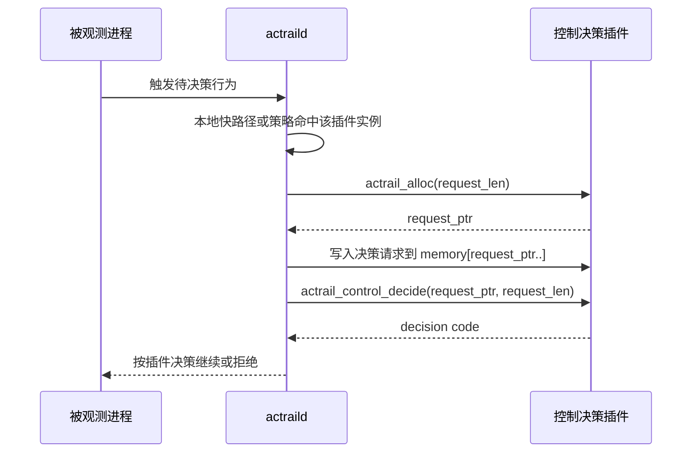
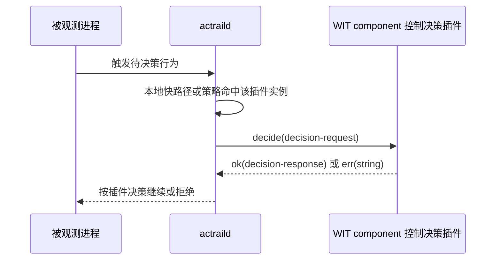
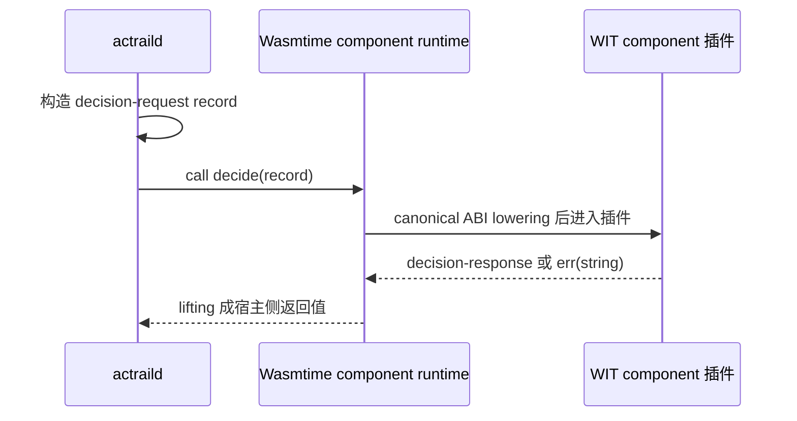

# 控制决策 ABI

本文说明 AcTrail 控制决策插件的功能层 ABI。控制决策插件在文件访问、命令执行或网络连接等待决策行为命中策略后被调用，返回允许或拒绝。

WASM core module 插件还需要遵守 [WASM Core Module ABI](wasm-core-module.zh.md) 中的 `memory`、`actrail_alloc` 和可选 `actrail_plugin_init` 约定。WIT component 插件不需要直接实现这些底层导出，但控制决策语义相同。

## 入口

### WASM Core Module

| 导出 | 必需性 | 调用时机 |
| --- | --- | --- |
| `actrail_control_decide(ptr, len) -> code` | 控制决策插件必需 | 文件访问、命令执行或网络连接请求命中该插件实例时调用。 |

`ptr` 和 `len` 指向 AcTrail 写入插件内存的控制决策 request envelope。

对 WASM core module，request envelope 是 **UTF-8 编码的 JSON 文本**，不是二进制结构体。`len` 表示 JSON 文本的字节数，不是字符数；插件只应读取 `memory[ptr, ptr + len)` 这一段字节，然后按 UTF-8 JSON 解析。

### WIT Component

普通控制插件使用 WIT world `control-plugin`。运行时要求 component 导出以下 interface 和函数：

| 项 | 值 |
| --- | --- |
| Export interface | `actrail:plugin/control-decider@0.1.0` |
| Function | `decide` |

函数签名：

```wit
decide: func(request: decision-request) -> result<decision-response, string>
```

WIT component 不读取 WASM core module 的 JSON envelope。AcTrail 通过 component model 直接传入结构化 `decision-request` record。返回 `ok(decision-response)` 表示插件给出控制结论；返回 `err(string)` 会被 AcTrail 视为插件运行错误。

## 调用流程：WASM Core Module



## 调用流程：WIT Component



AcTrail 只把需要插件参与的行为送进插件。命令和网络控制先由本地显式策略命中插件实例；文件访问控制先由 fanotify 和黑白灰名单快路径筛选，只有需要插件决策的灰名单请求才进入插件。

## 格式约定

控制决策 ABI 的语义字段一致，但不同运行形态使用不同的承载 ABI：

- WASM core module 只有线性内存和整数函数入口。AcTrail 先调用插件导出的 `actrail_alloc`，把 UTF-8 JSON envelope 写入插件 memory，再调用 `actrail_control_decide(ptr, len)`。插件需要自己解析 JSON。
- WIT component 有 Component Model 类型系统。AcTrail 通过 Wasmtime component API 调用插件导出的 `decide`，把同一类决策语义组装成 WIT `decision-request` record 传入。插件看到的是语言绑定生成的结构体或 record，不需要解析 JSON。

这不是两套控制语义，而是两种承载方式：core module 使用 JSON 是为了在普通 WASM module 上建立最低依赖的内存 ABI；WIT component 使用 record 是因为 component model 已经提供结构化参数的 lowering/lifting。AcTrail 在宿主侧负责把内部 `ControlDecisionRequest` 映射到对应承载格式。

WASM core module JSON envelope 的短 key 是 ABI 的一部分，不是给人阅读的展示字段。插件必须按字段表解析，不应把 key 展开为长字段名，也不应依赖未列出的字段。

以下值是稳定 ABI 常量，Rust 插件可以从 `actrail_plugin_abi` 读取：

| 用途 | Rust 常量 | 当前值 |
| --- | --- | --- |
| 当前决策上下文 | `actrail_plugin_abi::control::context::CURRENT_DECISION` | `c` |
| 当前文件策略上下文 | `actrail_plugin_abi::control::context::CURRENT_FILE_POLICY` | `f` |
| 决策摘要查询 | `actrail_plugin_abi::control::query::DECISION_SUMMARY` | `decision-summary.v1` |
| 命中文件策略查询 | `actrail_plugin_abi::control::query::MATCHED_RULE` | `matched-rule.v1` |

AcTrail 只接受这些短 token 和 query 名称，不接受长字段 token。

## 性能约束

控制决策会阻塞被观测行为。AcTrail 的调用原则是先走本地快路径，再在必要时进入插件：

- 文件访问先由 fanotify 和本地黑白灰名单筛选；白名单和黑名单不需要调用插件。
- 灰名单或显式命中某个插件实例的策略才会调用控制决策插件。
- 插件需要额外上下文时，应通过已授权 hostcall 按需查询，不应要求 AcTrail 在每次请求里主动携带完整上下文。
- 可复用结论应通过 `reusable` 返回，让 AcTrail 在当前 trace/task 范围内减少重复调用。

## 输入语义

### WASM Core Module JSON Envelope

WASM core module 控制插件收到的 request envelope 是一个 JSON object。当前字段如下：

| 字段路径 | JSON 类型 | 必填 | 含义 |
| --- | --- | --- | --- |
| `v` | number | 是 | envelope 数字版本，当前为 `1`。 |
| `id` | string | 是 | 当前决策请求标识；不透明字符串。 |
| `tr` | string | 是 | 当前 trace 标识；插件不应假设固定字节长度。 |
| `s` | number | 是 | `1=file-access`、`2=command-execution`、`3=network-action`。 |
| `a` | object | 是 | 发起行为的进程身份。 |
| `a.pid` | number | 是 | 进程 pid。 |
| `a.tid` | number 或 null | 是 | task id。 |
| `a.gen` | number | 是 | 进程身份 generation。 |
| `a.ns` | string 或 null | 是 | pid namespace。 |
| `op` | string | 是 | 待决策操作摘要，例如文件访问、命令执行或网络连接。 |
| `t` | string | 是 | 待访问目标摘要。 |
| `ctx` | string 或 null | 是 | 可选上下文引用；`"c"` 表示当前决策上下文。 |

### JSON 示例

以下示例展示当前 WASM core module JSON envelope 的形状。示例值用于说明字段格式，不代表稳定 id 生成规则。

命令执行控制：

```json
{
  "v": 1,
  "id": "deny-id:018f-example",
  "tr": "018f-example",
  "s": 2,
  "a": { "pid": 1234, "tid": 42, "gen": 7, "ns": "pid:[4026531836]" },
  "op": "execve",
  "t": "path=/usr/bin/id argv=id -u",
  "ctx": "c"
}
```

文件访问控制：

```json
{
  "v": 1,
  "id": "gray-secrets:018f-example",
  "tr": "018f-example",
  "s": 1,
  "a": { "pid": 1234, "tid": 42, "gen": 7, "ns": "pid:[4026531836]" },
  "op": "open",
  "t": "/etc/secret.conf",
  "ctx": "c"
}
```

网络连接控制：

```json
{
  "v": 1,
  "id": "deny-egress:018f-example",
  "tr": "018f-example",
  "s": 3,
  "a": { "pid": 1234, "tid": 42, "gen": 7, "ns": "pid:[4026531836]" },
  "op": "connect",
  "t": "remote=203.0.113.10:443 family=ipv4 fd=5",
  "ctx": "c"
}
```

上面的 JSON 示例用于说明字段类型和形状；实际字符串内容由当前 AcTrail 运行路径生成，插件应把 `id`、`tr`、`op`、`t`、`ctx` 当作不透明值处理，除非对应字段的格式在更高层文档中另有稳定约定。

### WIT Component Record

WIT component 控制插件收到的是结构化 `decision-request` record，不是 JSON 文本。actraild 调用插件时，会在宿主侧把内部决策请求填入 WIT record，然后通过 Wasmtime component API 调用插件导出的 `decide` 函数；Wasmtime 按 Component Model canonical ABI 完成参数 lowering/lifting。插件作者只需要处理语言绑定生成的结构体或 record。



字段名使用 WIT 风格：

| 字段路径 | WIT 类型 | 含义 |
| --- | --- | --- |
| `decision-id` | string | 当前决策请求标识。 |
| `trace-id` | string | 当前 trace 标识。 |
| `task-id` | option<string> | 当前保留为 none。 |
| `subject` | enum | `file-access`、`command-execution`、`network-action`。 |
| `actor-process-identity` | actor-process-identity | 发起行为的结构化进程身份。 |
| `actor-process-identity.pid` | u32 | 进程 pid。 |
| `actor-process-identity.task-id` | option<u32> | task id。 |
| `actor-process-identity.generation` | u64 | 进程身份 generation。 |
| `actor-process-identity.namespace` | option<string> | pid namespace。 |
| `operation` | string | 待决策操作摘要。 |
| `target-summary` | string | 待访问目标摘要。 |
| `context-ref` | option<string> | 可选上下文引用。 |

`decision-response` 返回结构：

| 字段路径 | WIT 类型 | 含义 |
| --- | --- | --- |
| `verdict` | control-verdict | `allow` 或 `deny`。 |
| `scope` | decision-scope | `once` 或 `reusable`。 |
| `reason-code` | option<string> | 可选机器可读原因码。 |
| `reason-message` | option<string> | 可选人类可读原因说明。 |

### WIT Component Hostcall Record

WIT component 控制插件通过 hostcall 查询当前决策上下文和文件策略视图时，返回的是 WIT record，不是 `key=value` 文本，也不是 JSON。

`query-context(context-ref: string, query: string)` 当前只接受 `context-ref = "c"` 和 `query = "decision-summary.v1"`，返回 `decision-summary`：

| 字段路径 | WIT 类型 | 含义 |
| --- | --- | --- |
| `subject` | control-subject | 当前待决策对象类型。 |
| `operation` | string | 当前操作。 |
| `target-summary` | string | 当前目标摘要，变长。 |
| `decision-id` | string | 当前决策 id，变长。 |
| `trace-id` | string | 当前 trace id，变长。 |
| `actor-process-identity` | string | 发起行为的进程身份摘要。 |

`file-access.current-match-get(context-ref: string, query: string)` 当前只接受 `context-ref = "f"` 和 `query = "matched-rule.v1"`，返回 `file-policy-view`：

| 字段路径 | WIT 类型 | 含义 |
| --- | --- | --- |
| `rule-id` | string | 命中的策略规则 id，变长。 |
| `decision` | string | 命中规则决策，例如 `gray`。 |
| `operation` | string | 命中操作。 |
| `path` | string | 当前文件路径，变长。 |
| `plugin-instance` | option<string> | 关联插件实例。 |
| `timeout-ms` | option<u64> | 灰名单插件决策超时。 |
| `concurrency-limit` | option<u32> | 插件并发限制。 |
| `fallback` | option<string> | 超时或错误 fallback。 |

策略批量更新使用独立的文件策略规则接口。插件需要声明并获得 `file-policy.rules.apply:kind=<allow|deny|gray>,path=<absolute-scope>` grant，然后调用规则更新接口。

WASM core module 入口：

| hostcall | ABI |
| --- | --- |
| `file_policy_rules_version_get() -> i64` | 成功返回当前 revision；负数为错误码。 |
| `file_policy_rules_list(filter_ptr, filter_len, cursor_ptr, cursor_len, limit, out, max) -> i64` | `filter` 使用紧凑二进制过滤条件，`cursor` 为空表示第一页；成功返回规则列表写入字节数。 |
| `file_policy_rules_match_dry_run(ptr, len, out, max) -> i64` | `ptr,len` 指向紧凑二进制 dry-run 请求；成功返回匹配结果写入字节数。 |
| `file_policy_rules_validate(ptr, len, out, max) -> i64` | `ptr,len` 指向紧凑二进制 patch；成功返回结果写入字节数。 |
| `file_policy_rules_apply(ptr, len, out, max) -> i64` | 同 validate，但会应用 patch。 |

WIT component 入口：

| hostcall | WIT 类型 |
| --- | --- |
| `file-policy-rules-version-get()` | `result<u64, string>` |
| `file-policy-rules-list(filter, cursor, limit)` | `result<file-policy-list-result, string>` |
| `file-policy-rules-match-dry-run(request)` | `result<file-policy-match-dry-run-result, string>` |
| `file-policy-rules-validate(request)` | `result<file-policy-apply-result, string>` |
| `file-policy-rules-apply(request)` | `result<file-policy-apply-result, string>` |

需要支持 `actraild plugin cmd` 的控制插件使用 WIT world `managed-control-plugin`。它在 `control-plugin` 的基础上额外导出管理命令入口：

| export | WIT 类型 |
| --- | --- |
| `management-command.handle-command(request)` | `result<plugin-command-result, string>` |

该入口由 `actraild plugin cmd --instance <id> -- <plugin args...>` 调用，属于低频管理面，不参与文件访问热路径。AcTrail 只转发 argv 并限制输入输出大小；插件自己解释子命令。

## 控制决策返回码

WASM core module 控制插件通过 `i64` 返回码表达决策：

| 返回码 | 含义 |
| --- | --- |
| `1` | 允许一次。 |
| `2` | 允许并可复用。 |
| `-1` | 拒绝一次。 |
| `-2` | 拒绝并可复用。 |

其他返回码会被 AcTrail 视为插件运行错误。

## `once` 与 `reusable`

`once` 结果只作用于当前待决策请求。`reusable` 结果允许 AcTrail 在当前 task/trace 内复用该决策，减少重复调用插件的开销。

灰名单文件访问的超时 fallback 由 AcTrail 策略配置决定，默认拒绝。耗时较长的逻辑应限制在明确需要同步决策的灰名单或显式策略命中路径上，避免拖慢普通快路径。
