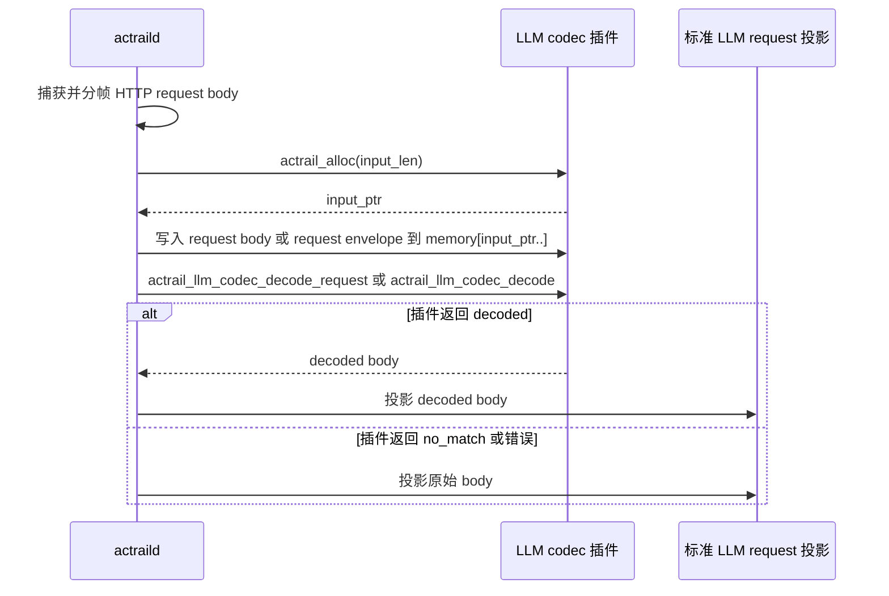
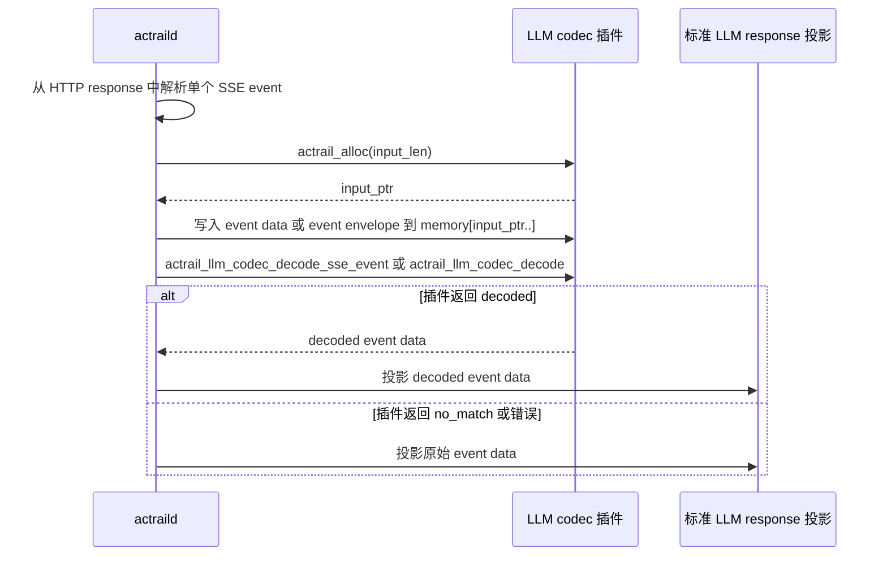
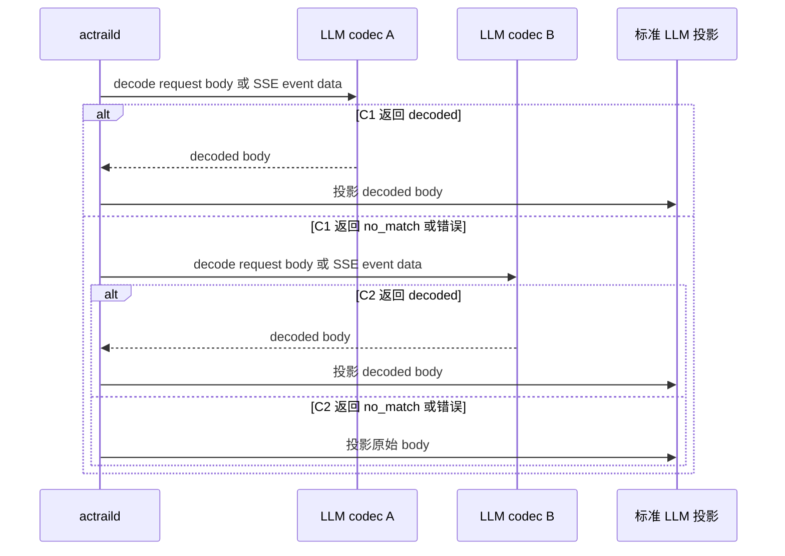

# LLM Codec ABI

本文说明 AcTrail LLM codec 插件的功能层 ABI。LLM codec 插件在 LLM 语义投影前被调用，把特定供应商或特定 agent 的非标准 request body 或 SSE event data 转换为 AcTrail 已支持的标准 LLM request 或 response event。

WASM core module 插件还需要遵守 [WASM Core Module ABI](wasm-core-module.zh.md) 中的 `memory`、`actrail_alloc` 和可选 `actrail_plugin_init` 约定。`llm-codec` 当前只支持 WASM core module，不支持 WIT component。

AcTrail 仍负责 TLS/plain HTTP payload 采集、HTTP/SSE 分帧、标准 LLM request/response 投影和存储。codec 插件只负责把自己识别的非标准 body 解码为标准 JSON body 或标准 SSE event data。

## 入口

### WASM Core Module

`llm-codec` 插件必须至少导出以下一个入口：

| 导出 | 输入 | 输出 |
| --- | --- | --- |
| `actrail_llm_codec_decode_request(ptr, len) -> i64` | 原始 HTTP request body bytes | packed output slice |
| `actrail_llm_codec_decode_sse_event(ptr, len) -> i64` | 单个 SSE event 的 `data` 字段 UTF-8 bytes | packed output slice |
| `actrail_llm_codec_decode(ptr, len) -> i64` | UTF-8 编码的 JSON envelope bytes | packed output slice |

`ptr` 和 `len` 指向 AcTrail 写入插件内存的输入数据。直接入口只接收对应 payload bytes；envelope 入口接收包含 HTTP 或 SSE 元数据的 JSON object。

插件同时导出直接入口和 envelope 入口时，AcTrail 优先调用直接入口。request 解码优先使用 `actrail_llm_codec_decode_request`；SSE event 解码优先使用 `actrail_llm_codec_decode_sse_event`。缺少对应直接入口时，AcTrail 调用 `actrail_llm_codec_decode`。

返回值 `i64` 是输出 slice 的 packed 形式：

```text
((ptr as u64) << 32) | (len as u64)
```

`ptr` 和 `len` 指向插件 memory 中的一段 UTF-8 JSON 输出。AcTrail 单次读取输出上限为 8 MiB。

## 调用流程：Request Body



## 调用流程：SSE Event



## 格式约定

LLM codec ABI 的解码语义一致，但同一个插件可以选择直接入口或 envelope 入口：

- 直接入口只传入 payload bytes。request 入口接收 HTTP request body 原文；SSE event 入口接收单个 event 的 `data` 字段，不包含 `data:` 前缀，也不包含其他 event line。
- envelope 入口传入 UTF-8 编码的 JSON object。request envelope 包含 method、authority、path 和 body；SSE event envelope 包含 event index、event type、id 和 data。

直接入口适合 body 自身已经足以严格识别格式的 codec。插件需要 method、authority、path、event type 或 event id 参与匹配时，使用 envelope 入口。

## 输入语义

### Request 直接输入

`actrail_llm_codec_decode_request(ptr, len)` 收到的是 HTTP request body 原文，不包含 method、authority、path 或 headers。插件只应读取 `memory[ptr, ptr + len)` 这一段字节，并自行判断该 body 是否属于自己支持的格式。

### SSE Event 直接输入

`actrail_llm_codec_decode_sse_event(ptr, len)` 收到的是单个 SSE event 的 `data` 字段 UTF-8 bytes。插件可以把供应商自定义 envelope 解包为 OpenAI-compatible 或 Anthropic-compatible SSE event data。

### JSON Envelope

`actrail_llm_codec_decode(ptr, len)` 收到的是一个 JSON object。`schema_version` 当前为 `"actrail.llm-codec.v0"`。

Request envelope 字段：

| 字段 | JSON 类型 | 必填 | 含义 |
| --- | --- | --- | --- |
| `schema_version` | string | 是 | 当前为 `"actrail.llm-codec.v0"`。 |
| `phase` | string | 是 | request 解码时为 `"request"`。 |
| `method` | string 或 null | 是 | HTTP method；缺失时为 null。 |
| `authority` | string 或 null | 是 | HTTP authority；缺失时为 null。 |
| `path` | string 或 null | 是 | HTTP path；缺失时为 null。 |
| `body` | byte array | 是 | HTTP request body 原始 bytes。 |

示例：

```json
{
  "schema_version": "actrail.llm-codec.v0",
  "phase": "request",
  "method": "POST",
  "authority": "api.example.com",
  "path": "/v1/messages",
  "body": [123, 125]
}
```

SSE event envelope 字段：

| 字段 | JSON 类型 | 必填 | 含义 |
| --- | --- | --- | --- |
| `schema_version` | string | 是 | 当前为 `"actrail.llm-codec.v0"`。 |
| `phase` | string | 是 | SSE event 解码时为 `"sse-event"`。 |
| `index` | number | 是 | 当前 HTTP response 内的 SSE event 序号。 |
| `event_type` | string 或 null | 是 | SSE `event` 字段；缺失时为 null。 |
| `id` | string 或 null | 是 | SSE `id` 字段；缺失时为 null。 |
| `data` | string | 是 | 单个 SSE event 的 `data` 字段。 |

示例：

```json
{
  "schema_version": "actrail.llm-codec.v0",
  "phase": "sse-event",
  "index": 0,
  "event_type": null,
  "id": null,
  "data": "{\"choices\":[]}"
}
```

## 输出语义

所有入口都返回同一种 UTF-8 JSON 输出。插件识别并成功解码输入时，返回 `decoded`；输入不属于该插件支持的格式时，返回 `no_match`。

`decoded` 输出字段：

| 字段 | JSON 类型 | 必填 | 含义 |
| --- | --- | --- | --- |
| `status` | string | 是 | 成功时为 `"decoded"`。 |
| `classifier_id` | string | 否 | 覆盖 `llm.request.classifier`；为空或缺失时 AcTrail 尝试从 decoded body 的标准 JSON schema 识别。 |
| `protocol_id` | string | 否 | 覆盖 request protocol。 |
| `provider_id` | string | 否 | 覆盖 `llm.response.provider`。 |
| `model` | string | 否 | 覆盖 request model；为空或缺失时 AcTrail 尝试从 decoded body 识别。 |
| `body` | byte array | 是 | 解码后的标准 LLM request JSON bytes、标准 SSE event data bytes，或 `[DONE]` 的 bytes。 |

Request 解码示例：

```json
{
  "status": "decoded",
  "classifier_id": "vendor-infer",
  "protocol_id": "vendor-infer",
  "model": "auto",
  "body": [123, 34, 109, 111, 100, 101, 108, 34, 58, 34, 97, 117, 116, 111, 34, 125]
}
```

SSE event 解码示例：

```json
{
  "status": "decoded",
  "provider_id": "vendor-infer",
  "body": [123, 34, 99, 104, 111, 105, 99, 101, 115, 34, 58, 91, 93, 125]
}
```

`body` 必须是 JSON byte array，每个元素是 `0..255` 的整数。request 解码结果会被解析为 JSON，再进入标准 LLM request 投影。SSE event 解码结果会先按 UTF-8 解析；文本等于 `[DONE]` 时作为流结束 marker，否则 AcTrail 尝试把它解析为标准 provider JSON event。

不匹配当前输入时，插件返回：

```json
{"status":"no_match"}
```

## 调用顺序

同一个 daemon 可以加载多个 `llm-codec` 插件。AcTrail 按加载顺序调用插件。第一个返回 `decoded` 的插件决定该 request body 或 SSE event 的 decoded body；后续插件不会再处理同一个输入。

插件返回 `no_match` 或调用失败时，AcTrail 继续调用后续 codec。所有 codec 都没有返回 `decoded` 时，AcTrail 使用原始 body 或 event data 进入既有投影逻辑。



## 失败语义

`llm-codec` 插件失败不能改变原始采集事实：

| 情况 | AcTrail 行为 |
| --- | --- |
| 插件未加载 | 原始 request/response 继续按标准投影处理。 |
| 插件返回 `no_match` | 继续下一个 codec；没有其他 codec 命中时使用原始 body 或 event data。 |
| 插件输出不是 JSON | 视为该插件本次调用失败，继续原路径。 |
| 插件输出 `decoded` 但 `body` 不是 byte array | 视为该插件本次调用失败，继续原路径。 |
| 插件 fuel 耗尽、trap 或返回非法 packed slice | 视为该插件本次调用失败，继续原路径。 |

插件作者应把“不是自己的格式”表达为 `no_match`。AcTrail 不会因为 codec 失败而删除、替换或清空原始 HTTP body。

## Manifest 约束

`llm-codec` 插件当前只支持 WASM core module 运行形态。manifest 需要满足以下约束：

| 字段 | 必需值或约束 |
| --- | --- |
| `general.role` | 必须为 `"llm-codec"`。 |
| `general.runtime` | 必须为 `"wasm"`。 |
| `runtime.wasm.abi` | 必须为 `"legacy-module"`。 |
| `role.observation-consumer` | 不能声明。 |
| `role.control-decider` | 不能声明。 |

`host.capabilities` 通常为空。codec 输入来自 AcTrail 已经捕获并正在投影的 HTTP/SSE 数据，不需要通过 `payload-read` hostcall 再读 payload。插件加载、授权、manifest 字段和配置文件说明见 [插件操作手册](../operator-manual.zh.md)。

## 实现注意事项

- 匹配条件要足够严格。优先同时检查 endpoint 特征、body 字符集、decoded JSON schema 或 SSE envelope schema，避免误解其他 agent 的流量。
- 大 body codec 要使用 O(n) 算法。`fuel_per_call` 是保护边界，插件不应依赖无限 fuel。
- response 解码按 SSE event 流式处理。插件只处理单个 event 的 `data` 字段，不需要等待整个 HTTP response 完成。
- 输出 decoded JSON bytes 时保留标准 provider schema，让 AcTrail 后续复用已有 `llm.request`、`llm.response`、`llm.call` 关联逻辑。
- 不需要解码的输入返回 `no_match`，不要返回空 decoded body。
