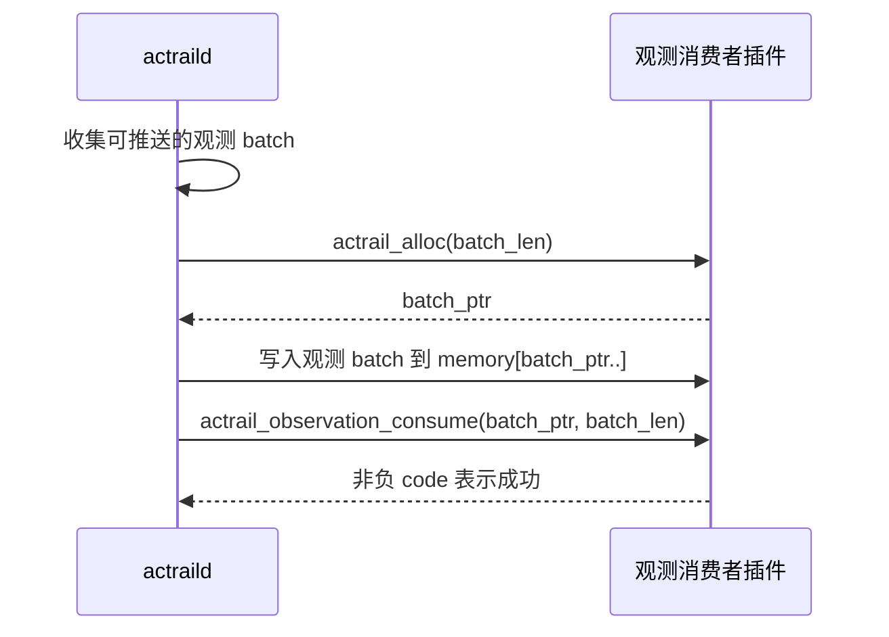
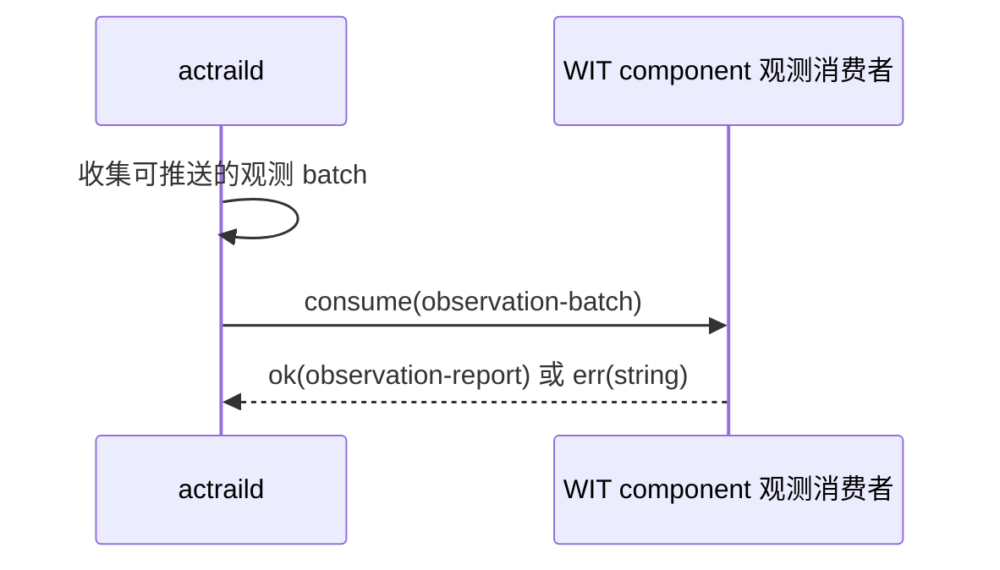

# 观测消费者 ABI

本文说明 AcTrail 观测消费者插件的功能层 ABI。观测消费者只消费 AcTrail 推送的观测 batch，不参与当前行为是否放行的同步决策。

WASM core module 插件还需要遵守 [WASM Core Module ABI](wasm-core-module.zh.md) 中的 `memory`、`actrail_alloc` 和可选 `actrail_plugin_init` 约定。WIT component 插件不需要直接实现这些底层导出，但观测消费语义相同。

## 入口

### WASM Core Module

| 导出 | 必需性 | 调用时机 |
| --- | --- | --- |
| `actrail_observation_consume(ptr, len) -> code` | 观测消费者必需 | AcTrail 向插件推送观测 batch 时调用。 |

`ptr` 和 `len` 指向 AcTrail 写入插件内存的观测 batch envelope。对 WASM core module，这个 envelope 是 **UTF-8 编码的 JSON 文本**，不是二进制结构体。`len` 表示 JSON 文本字节数，不是字符数。插件返回非负值表示本次调用成功；返回负值会被 AcTrail 视为插件运行错误。

### WIT Component

WIT package 中的 world 是 `observation-plugin`。运行时要求 component 导出以下 interface 和函数：

| 项 | 值 |
| --- | --- |
| Export interface | `actrail:plugin/observation-consumer@0.1.0` |
| Function | `consume` |

函数签名：

```wit
consume: func(batch: observation-batch) -> result<observation-report, string>
```

WIT component 不读取 WASM core module 的 JSON envelope。AcTrail 通过 component model 直接传入结构化 `observation-batch` record。返回 `ok(observation-report)` 表示成功；返回 `err(string)` 会被 AcTrail 视为插件运行错误。

## 调用流程：WASM Core Module



## 调用流程：WIT Component



## 输入语义

### WASM Core Module JSON Envelope

WASM core module 观测插件收到的 batch envelope 是一个 JSON object。当前字段如下：

| 字段 | JSON 类型 | 必填 | 含义 |
| --- | --- | --- | --- |
| `schema_version` | string | 是 | 当前为 `"actrail.observation.v0"`。 |
| `trace_id` | string | 是 | 当前 trace 标识。 |
| `semantic_action_count` | number | 是 | batch 中 semantic action 数量。 |
| `semantic_link_count` | number | 是 | batch 中 semantic link 数量。 |
| `payload_refs` | array | 是 | 可按授权读取的 payload 引用摘要。 |
| `actions` | array | 是 | 当前 batch 中的 action 摘要。 |

`payload_refs` 中的元素当前包含：

| 字段 | JSON 类型 | 含义 |
| --- | --- | --- |
| `id` | string | payload 引用标识。 |
| `trace_id` | string | payload 所属 trace。 |
| `captured_size` | number | 已捕获字节数。 |
| `original_size` | number | 原始字节数。 |
| `redaction` | string | 脱敏状态摘要。 |
| `truncation` | string | 截断状态摘要。 |

`actions` 中的元素当前包含：

| 字段 | JSON 类型 | 含义 |
| --- | --- | --- |
| `action_id` | string | action 标识。 |
| `kind` | string | action 类型摘要。 |
| `status` | string | action 状态摘要。 |
| `title` | string | action 标题或摘要。 |

### WIT Component Records

WIT component 观测插件收到的是结构化 `observation-batch` record：

| 字段 | WIT 类型 | 含义 |
| --- | --- | --- |
| `trace-id` | string | 当前 trace 标识。 |
| `families` | list<observation-event-family> | 本 batch 包含的事件族。 |
| `semantic-actions` | list<semantic-action-record> | semantic action 摘要列表。 |
| `payload-refs` | list<payload-ref> | 可按授权读取的 payload 引用。 |

`observation-report` 返回结构：

| 字段 | WIT 类型 | 含义 |
| --- | --- | --- |
| `observed-records` | u64 | 插件成功观察或处理的记录数。 |
| `dropped-records` | u64 | 插件主动报告丢弃的记录数。 |

插件如果需要读取 payload 内容，必须在 manifest 声明 `payload-read` capability，并在加载时获得对应 `--grant`。插件如果只需要 action 摘要，不需要额外 payload 授权。

## 与控制决策的区别

观测消费者是异步消费模型。它适合把观测数据写入文件、上报外部平台或做后处理。它不应该用于决定当前文件访问、命令执行或网络连接是否放行；这类同步治理逻辑属于 [控制决策 ABI](control-decider.zh.md)。
