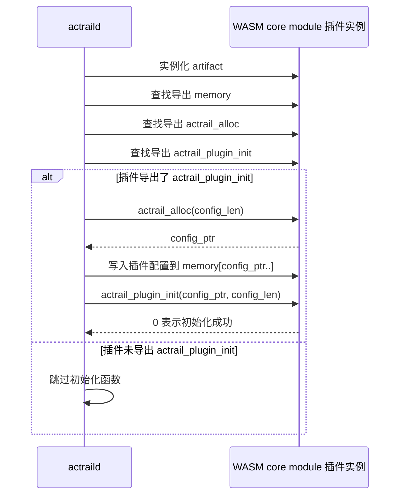
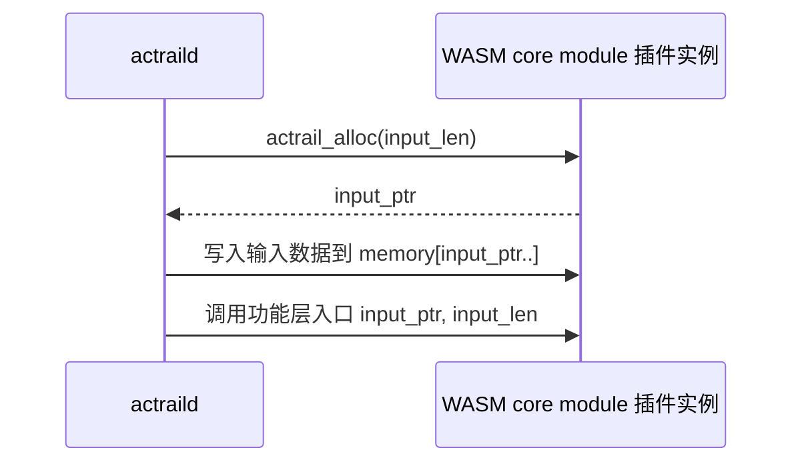

# WASM Core Module ABI

本文说明 AcTrail 对 WASM core module 插件的底层承载 ABI。这里的 core module 指普通 WebAssembly module，不是 WIT component。它通过导出函数、线性内存、整数返回码和 hostcall 与 AcTrail 通信。

插件作者如果使用 WIT component 编写插件，不需要直接实现本文中的导出函数。

本文只描述 WASM core module 如何被加载、如何提供内存、AcTrail 如何写入输入数据。观测消费者和控制决策的功能层入口分别见：

- [观测消费者 ABI](observation-consumer.zh.md)
- [控制决策 ABI](control-decider.zh.md)
- [LLM Codec ABI](llm-codec.zh.md)

## 导出约定

| 导出 | 必需性 | 调用时机 | 作用 |
| --- | --- | --- | --- |
| `memory` | 必需 | 加载插件实例时查找 | AcTrail 用这块线性内存写入初始化配置、观测数据或控制决策请求。 |
| `actrail_alloc(len) -> ptr` | 必需 | 每次 AcTrail 要写入数据前调用 | 插件返回一个内存偏移，AcTrail 随后把 `len` 字节写到该位置。 |
| `actrail_plugin_init(ptr, len) -> status` | 可选 | 插件实例加载后调用；插件没有导出该函数时跳过 | 初始化插件。`status = 0` 表示成功，非 0 表示加载失败。 |

`actrail_alloc` 不是业务函数，它只负责给 AcTrail 提供一段插件内存。真正处理观测数据的是 `actrail_observation_consume`，真正返回控制结论的是 `actrail_control_decide`。

## 加载阶段

加载具体插件用途时，AcTrail 还会按插件类型查找功能层入口：

- 观测消费者需要导出 `actrail_observation_consume`。
- 控制决策插件需要导出 `actrail_control_decide`。
- LLM codec 插件需要导出 `actrail_llm_codec_decode_request`、`actrail_llm_codec_decode_sse_event` 或 `actrail_llm_codec_decode` 中至少一个入口。

## 输入写入流程

无论是初始化配置、观测 batch，还是控制决策请求，AcTrail 写入插件输入数据的流程相同：

