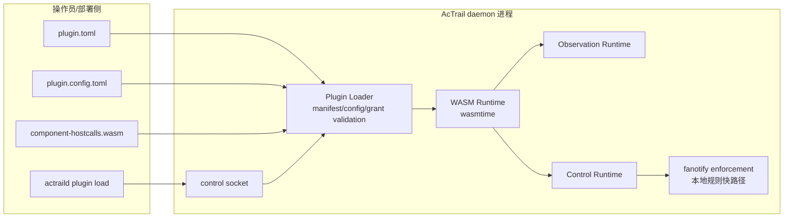
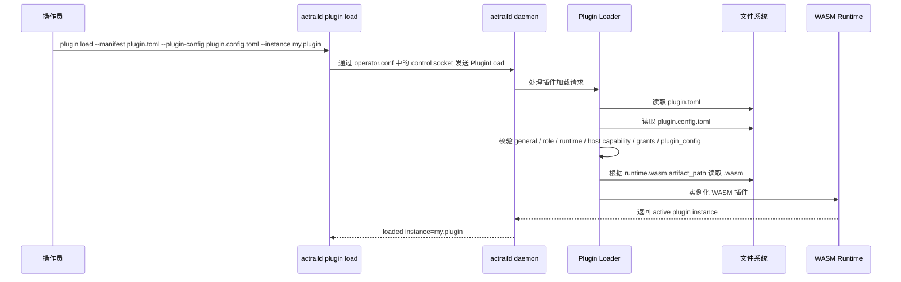
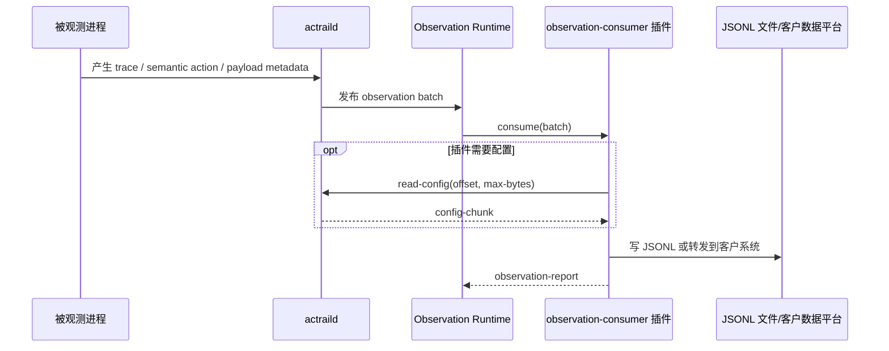
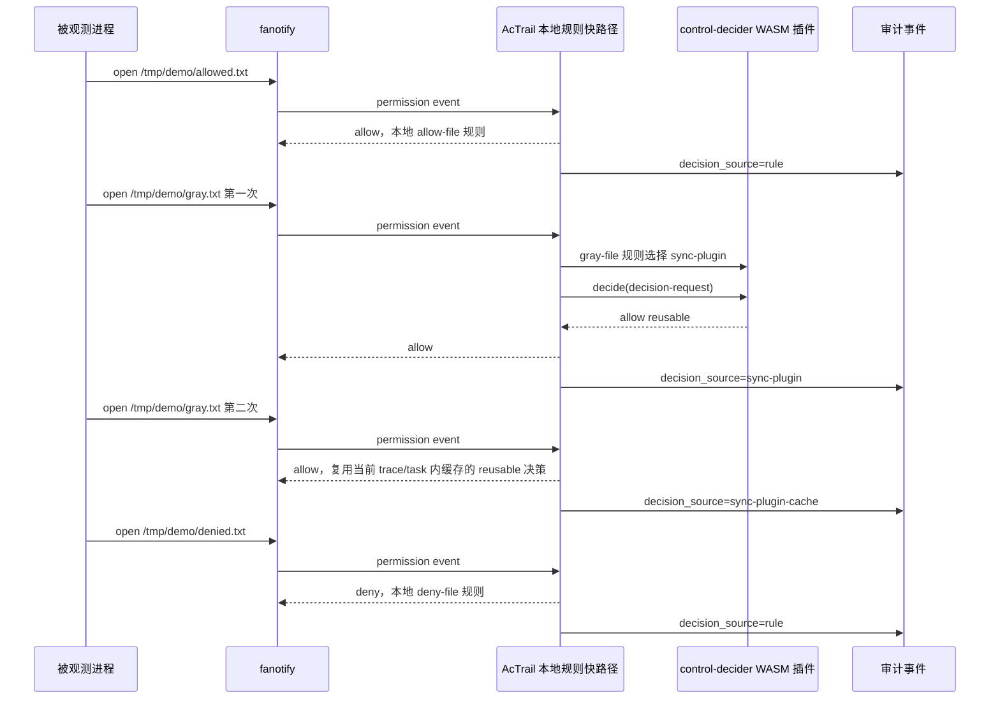
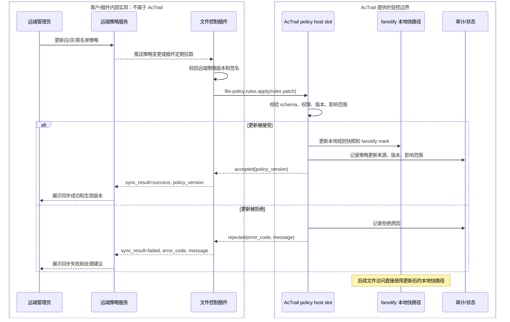

# AcTrail 插件系统操作手册

本文说明已经编译好的 `actraild`、`actrailctl`、`actrailviewer` 如何使用当前插件系统。

## 控制入口

插件生命周期管理入口在 `actraild plugin` 下：

```bash
target/release/actraild --config operator.conf plugin load ...
target/release/actraild --config operator.conf plugin unload ...
target/release/actraild --config operator.conf plugin list
target/release/actraild --config operator.conf plugin status --instance <id>
```

`actrailctl` 目前主要用于 trace 和 agent 控制，例如：

```bash
target/release/actrailctl --config operator.conf track-add --pid <pid> --name <name>
target/release/actrailctl --config operator.conf list-traces
```

`actrailviewer` 用于查看事件：

```bash
target/release/actrailviewer events --config operator.conf --trace-id <trace-id>
```

使用插件前需要先启动 daemon。涉及 fanotify 文件访问控制的场景通常需要 root：

```bash
sudo target/release/actraild --config operator.conf run
```

`actraild plugin ...` 命令会根据 `operator.conf` 中的 control socket 连接这个正在运行的 daemon。

## 运行模型总览

WASM 插件的“代码”是 `.wasm` 编译产物。它类似可分发包：插件作者用 Rust、C/C++、TinyGo 或其他能输出 WebAssembly Component Model 的语言编译出 `.wasm`，AcTrail 只加载这个编译产物，不加载源码。

一个典型插件部署目录：

```text
/opt/actrail/plugins/my-control-plugin/
  plugin.toml
  plugin.config.toml
  component-hostcalls.wasm
```

`plugin.toml` 中的 `runtime.wasm.artifact_path` 指向这个 `.wasm`：

```toml
[general]
runtime = "wasm"

[runtime.wasm]
artifact_path = "component-hostcalls.wasm"
abi = "wit-component"
```

`artifact_path` 可以是相对路径或绝对路径。相对路径按 manifest 文件所在目录解析。上面的例子会加载：

```text
/opt/actrail/plugins/my-control-plugin/component-hostcalls.wasm
```

整体结构：



插件加载流程：



## Manifest 基本格式

插件由一个 TOML manifest 声明：

```toml
[general]
id = "wasm.component-control"
api_version = "actrail.plugin.v1"
role = "control-decider"
runtime = "wasm"

[host]
capabilities = []

[runtime.wasm]
artifact_path = "component-control.wasm"
abi = "wit-component"

[runtime.wasm.resources]
fuel_per_call = 1000000
memory_max_bytes = 2097152

[role.control-decider.resources]
concurrency_limit = 1

[plugin_config]
format = "toml"
required = false
```

`[general]` 字段：

| 字段 | 类型 | 是否必填 | 取值/范围 | 说明 |
| --- | --- | --- | --- | --- |
| `id` | string | 是 | 非空字符串 | 插件 ID。内置 `otel-jsonl` 插件使用 `id = "otel-jsonl"`。 |
| `api_version` | string | 是 | 当前只支持 `actrail.plugin.v1` | manifest 协议版本。 |
| `role` | string enum | 是 | `observation-consumer`、`control-decider`、`llm-codec` | 插件角色。观测插件消费观测数据；控制插件参与治理决策；LLM codec 插件在标准 LLM 语义投影前解码非标准 request body 或 SSE event data。 |
| `runtime` | string enum | 是 | `builtin`、`wasm`、`native-dylib` | 插件运行时类型。当前 `native-dylib` 仍未启用。 |

`[host]` 字段：

| 字段 | 类型 | 是否必填 | 取值/范围 | 说明 |
| --- | --- | --- | --- | --- |
| `capabilities` | string array | 是 | 见下方 capability 表 | 插件声明需要的 AcTrail host 能力。 |

`[runtime.wasm]` 字段：

| 字段 | 类型 | 是否必填 | 取值/范围 | 默认值 | 说明 |
| --- | --- | --- | --- | --- | --- |
| `runtime.wasm.artifact_path` | string | `general.runtime = "wasm"` 时必填 | 非空路径；相对路径按 manifest 所在目录解析 | 无 | WASM artifact 路径。 |
| `abi` | string enum | 否 | `legacy-module`、`wit-component` | `legacy-module` | WASM ABI。WIT component 插件必须写 `wit-component`。普通控制插件使用 `control-plugin` world；需要 `plugin cmd` 的控制插件使用 `managed-control-plugin` world。 |

`[runtime.wasm.resources]` 字段：

| 字段 | 类型 | 是否必填 | 取值/范围 | 说明 |
| --- | --- | --- | --- | --- |
| `fuel_per_call` | u64 | 否 | 正整数 | 每次 WASM 调用的 fuel 预算。 |
| `memory_max_bytes` | u64 | 否 | 正整数 | WASM linear memory 上限。 |

`[role.observation-consumer.subscriptions]` 字段：

| 字段 | 类型 | 是否必填 | 取值/范围 | 说明 |
| --- | --- | --- | --- | --- |
| `event_families` | string array | 否 | `semantic-action`、`semantic-action-link`、`diagnostic`、`trace-lifecycle`、`resource-metric`、`payload-metadata` | 观测插件订阅的事件族。不能重复。未配置时使用默认观测事件族。 |

`[role.observation-consumer.resources]` 字段：

| 字段 | 类型 | 是否必填 | 取值/范围 | 说明 |
| --- | --- | --- | --- | --- |
| `queue_capacity` | u32 | 否 | 正整数 | 观测插件队列容量。 |

`[role.control-decider.resources]` 字段：

| 字段 | 类型 | 是否必填 | 取值/范围 | 说明 |
| --- | --- | --- | --- | --- |
| `concurrency_limit` | u32 | 否 | 正整数 | 控制插件实例级并发上限。 |

`llm-codec` 角色没有 `[role.llm-codec]` 配置表。它必须使用 `general.runtime = "wasm"` 和 `runtime.wasm.abi = "legacy-module"`，并且不能同时声明 `[role.observation-consumer]` 或 `[role.control-decider]`。功能层 ABI 见 [LLM Codec ABI](abi/llm-codec.zh.md)。

`[hostcall_limits.*]` 字段：

| 字段 | 类型 | 是否必填 | 取值/范围 | 说明 |
| --- | --- | --- | --- | --- |
| `hostcall_limits.env.name_max_bytes` | u32 | 否 | 正整数 | `env-read` 环境变量名最大字节数。 |
| `hostcall_limits.env.value_max_bytes` | u32 | 否 | 正整数 | `env-read` 返回值最大字节数。 |
| `hostcall_limits.payload.segment_max_count` | u32 | 否 | 正整数 | 单批观测保留给插件读取的 payload segment 数量上限。 |
| `hostcall_limits.payload.ref_max_bytes` | u32 | 否 | 正整数 | `read-payload` ref 最大字节数。 |
| `hostcall_limits.payload.read_max_bytes` | u32 | 否 | 正整数 | 单次 `read-payload` 最大读取字节数。 |
| `hostcall_limits.context.ref_max_bytes` | u32 | 否 | 正整数 | `query-context` context ref 最大字节数。 |
| `hostcall_limits.context.query_max_bytes` | u32 | 否 | 正整数 | `query-context` query 最大字节数。 |
| `hostcall_limits.context.read_max_bytes` | u32 | 否 | 正整数 | 单次 `query-context` 返回最大字节数。 |
| `hostcall_limits.file_policy.context_ref_max_bytes` | u32 | 否 | 正整数 | `file-access.current-match-get` context ref 最大字节数。 |
| `hostcall_limits.file_policy.query_max_bytes` | u32 | 否 | 正整数 | `file-access.current-match-get` query 最大字节数。 |
| `hostcall_limits.file_policy.read_max_bytes` | u32 | 否 | 正整数 | `file-access.current-match-get` 返回值，以及 core module `file_policy_rules_validate/apply` 二进制请求和响应最大字节数。 |
| `hostcall_limits.plugin_config.read_max_bytes` | u32 | 否 | 正整数 | 单次 `read-config` 最大读取字节数。 |
| `hostcall_limits.plugin_command.argv_max_count` | u32 | 否 | 正整数 | `actraild plugin cmd` 转发给插件的 argv 数量上限。 |
| `hostcall_limits.plugin_command.arg_max_bytes` | u32 | 否 | 正整数 | `actraild plugin cmd` 单个 argv 最大字节数。 |
| `hostcall_limits.plugin_command.output_max_bytes` | u32 | 否 | 正整数 | 插件管理命令 stdout + stderr 最大字节数。 |
| `hostcall_limits.plugin_command.timeout_ms` | u64 | 否 | 正整数 | 插件管理命令单次调用的 wall-clock 超时，默认 `30000`。 |

`[plugin_config]` 字段：

| 字段 | 类型 | 是否必填 | 取值/范围 | 说明 |
| --- | --- | --- | --- | --- |
| `format` | string | 是 | 当前支持 `toml` | `--plugin-config` 文件格式。 |
| `schema_ref` | string | 否 | schema 文件路径；相对路径按 manifest 所在目录解析 | 提供时会用 JSON Schema 校验插件配置。传了 `--plugin-config` 且 `schema_ref` 为空字符串会失败。 |
| `required` | bool | 是 | `true` 或 `false` | 为 `true` 时，加载插件必须传 `--plugin-config`。 |

`[manifest_policy]` 字段：

| 字段 | 类型 | 是否必填 | 取值/范围 | 默认值 | 说明 |
| --- | --- | --- | --- | --- | --- |
| `unused_runtime_sections` | string enum | 否 | `deny`、`warn`、`ignore` | `deny` | manifest 同时声明未被 `general.runtime` 选中的 runtime section 时的处理策略。`warn` 会加载选中的 runtime 并在 load 返回中报告 warning。 |

capability 取值：

| capability | 需要的 `--grant` | 当前支持范围 |
| --- | --- | --- |
| `payload-read` | `--grant payload-read` 或 `--grant payload-read:source=<source>` | 观测插件读取 payload。`source` 当前支持 `syscall`、`tls-user-space`、`stdio`。 |
| `env-read` | `--grant env-read:NAME` | 读取指定环境变量名。 |
| `context-query` | `--grant context-query` | 控制插件读取当前待决策项的最小上下文。 |
| `file-access.current-match-get` | `--grant file-access.current-match-get` | 可选能力。控制插件读取当前匹配的 graylist rule 视图，不是本次 allow/deny 决策的必需接口。 |
| `file-policy.rules.read` | `--grant file-policy.rules.read` | 分页读取 AcTrail 当前维护的文件访问快路径规则。 |
| `file-policy.rules.match-dry-run` | `--grant file-policy.rules.match-dry-run` | 对指定 path/op 执行 dry-run，查看当前会命中 allow、deny、gray 还是 default；不触发真实访问控制。 |
| `file-policy.rules.apply` | `--grant file-policy.rules.apply:kind=<allow|deny|gray>,path=<绝对路径或/**范围>` | 高级策略同步能力。用于插件主动更新 AcTrail 本地快路径策略，不是 gray 文件本次访问决策的常规接口。 |
| `network-egress` | 当前无可用 grant | manifest 中存在该 capability，但 host slot 还未实现。 |

`actraild plugin load` 参数：

| 参数 | 类型 | 是否必填 | 说明 |
| --- | --- | --- | --- |
| `--manifest PATH` | path | 是 | 插件 manifest 路径。 |
| `--plugin-config PATH` | path | 否 | 插件自己的配置文件。manifest `[plugin_config].required = true` 时必填。 |
| `--instance ID` | string | 是 | 插件实例 ID。必须非空；同一 daemon 内不能重复。 |
| `--grant VALUE` | string，可重复 | 否 | 授予 host 能力。必须与 manifest `capabilities` 匹配。 |
| `--persist` | flag | 否 | 将该插件实例写入 AcTrail 管理的持久化注册表，daemon 重启后自动恢复。推荐优先使用 `operator.conf` 里的 `[plugins.startup]` 表达固定启动清单。 |

插件声明了 capability 但加载时没有对应 `--grant`，会加载失败。加载时授予了插件没有声明的能力，也会加载失败。

`actraild plugin cmd` 参数：

| 参数 | 类型 | 是否必填 | 说明 |
| --- | --- | --- | --- |
| `--instance ID` | string | 是 | 接收管理命令的已加载插件实例。 |
| `-- PLUGIN_ARG...` | string list | 是 | `--` 后的参数原样转发给插件，由插件解释子命令语义。 |

示例：

```bash
actraild --config operator.conf plugin cmd --instance file-policy.demo -- rule list
actraild --config operator.conf plugin cmd --instance file-policy.demo -- rule upsert allow /tmp/a.txt --priority 10
```

`plugin cmd` 是管理面低频入口，不在 fanotify 文件访问热路径内。AcTrail 只负责实例定位、输入输出限制、超时和错误返回；插件自己的 CLI 子命令由插件实现。

## 启动时加载插件

daemon 默认不加载任何内置观测插件。需要随 daemon 启动自动挂载的插件写入 `operator.conf`：

```toml
[plugins.startup]
enabled = true
failure_policy = "fail-fast"

[[plugins.startup.load]]
instance = "live-otel"
enabled = true
failure_policy = "continue"
manifest = "/etc/actrail/plugins/otel-jsonl/plugin.toml"
plugin_config = "/etc/actrail/plugins/otel-jsonl/config.toml"
host_grants = []

[[plugins.startup.load]]
instance = "gray-file-policy"
enabled = true
manifest = "/etc/actrail/plugins/gray-file-policy/plugin.toml"
plugin_config = "/etc/actrail/plugins/gray-file-policy/config.toml"
host_grants = ["context-query", "file-access.current-match-get"]
```

字段说明：

| 字段 | 类型 | 默认值 | 说明 |
| --- | --- | --- | --- |
| `plugins.startup.enabled` | bool | `false` | 是否启用启动加载清单。默认 daemon 不加载插件。 |
| `plugins.startup.failure_policy` | string enum | `fail-fast` | 全局失败策略，取值 `fail-fast` 或 `continue`。 |
| `plugins.startup.load[].instance` | string | 无 | 插件实例 ID；同一 daemon 内不能重复。 |
| `plugins.startup.load[].enabled` | bool | `true` | 是否加载该条目。 |
| `plugins.startup.load[].failure_policy` | string enum 或空 | 继承全局策略 | 单个插件的失败策略覆盖。 |
| `plugins.startup.load[].manifest` | path | 无 | 插件 manifest 路径。 |
| `plugins.startup.load[].plugin_config` | path 或空字符串 | 空 | 插件自己的配置文件；manifest 要求配置时必填。 |
| `plugins.startup.load[].host_grants` | string array | `[]` | 授予插件的 host capability，语义与 `actraild plugin load --grant` 一致。 |

启动清单不在 operator 配置里重复声明插件角色。AcTrail 读取 manifest 后按 `role` 挂到对应内部插槽：`observation-consumer` 进入观测消费插槽，`control-decider` 进入控制决策插槽，`llm-codec` 进入 LLM payload 解码插槽。

失败策略：

| 策略 | 行为 |
| --- | --- |
| `fail-fast` | 插件加载失败则 daemon 启动失败。适合治理控制插件。 |
| `continue` | 打印错误并继续启动 daemon。适合可选观测导出插件。 |

`[export.runtime]` 是兼容实时导出入口，默认关闭。配置观测导出时优先使用 `[plugins.startup]` 或运行后执行 `actraild plugin load`，让配置形态直接反映“观测消费者是插件实例”的内部模型。

## 插件自己的配置

插件业务配置不写入 `operator.conf`。加载插件时通过 `--plugin-config` 传入：

```bash
target/release/actraild --config operator.conf plugin load \
  --manifest my-plugin/plugin.toml \
  --plugin-config my-plugin/config.toml \
  --instance my.instance
```

WIT component 插件通过以下 hostcall 读取自己的配置：

```wit
read-config(offset: u64, max-bytes: u64) -> config-chunk
```

AcTrail 在插件加载时读取并校验配置。运行时配置是插件按需读取的，不会被 AcTrail 塞进每一批观测数据，也不会塞进每一次 fanotify 文件访问请求。

## 场景：动态加载 LLM codec 插件

这个场景用于把某个非标准 LLM wire payload 解码为 AcTrail 已支持的标准 request 或 SSE event。插件加载前，AcTrail 仍会保留原始 HTTP payload；插件加载后，命中的 request body 或 SSE event data 会先经过 codec，再进入标准 `llm.request` / `llm.response` 语义投影。

manifest 示例：

```toml
[general]
id = "vendor.llm-codec"
api_version = "actrail.plugin.v1"
role = "llm-codec"
runtime = "wasm"

[host]
capabilities = []

[runtime.wasm]
artifact_path = "vendor-codec.wasm"
abi = "legacy-module"

[runtime.wasm.resources]
fuel_per_call = 50000000
memory_max_bytes = 67108864

[plugin_config]
format = "toml"
schema_ref = ""
required = false
```

加载插件：

```bash
target/release/actraild --config operator.conf plugin load \
  --manifest vendor-codec/plugin.toml \
  --instance vendor.llm-codec
```

查看插件状态：

```bash
target/release/actraild --config operator.conf plugin status \
  --instance vendor.llm-codec
```

重点状态字段：

```text
purpose=llm-codec
runtime=wasm
state=active
last_error=none
```

`llm-codec` 插件不需要 host grant。它只能处理 AcTrail 已经捕获并正在投影的 HTTP request body 或 SSE event data，不能主动读取其他 payload，也不能参与 fanotify 文件访问治理。

失败回退语义：

| 情况 | 行为 |
| --- | --- |
| 没有加载 codec 插件 | 使用原始 HTTP/SSE body 进入标准投影。 |
| codec 返回 `no_match` | 继续调用后续 codec；没有 codec 命中时使用原始 body。 |
| codec trap、fuel 耗尽或输出非法 JSON | 本次 codec 调用失败，AcTrail 继续原路径，不删除原始 payload。 |

功能层输入输出格式见 [LLM Codec ABI](abi/llm-codec.zh.md)。

可复制的最小 no-op 示例见 [examples/plugins/wasm-legacy/llm-codec-noop](../../examples/plugins/wasm-legacy/llm-codec-noop/README.zh.md)。

## 场景一：动态加载 OTEL JSONL 观测插件

这个场景用于把观测数据输出为 JSONL 文件，同时通过插件生命周期管理，而不是只依赖启动时的 exporter 配置。

manifest 示例：

```toml
[general]
id = "otel-jsonl"
api_version = "actrail.plugin.v1"
role = "observation-consumer"
runtime = "builtin"

[host]
capabilities = []

[plugin_config]
format = "toml"
schema_ref = "otel-jsonl.plugin-config.v1"
required = true
```

插件配置示例：

```toml
path = "/tmp/actrail/live-spans.otlp.jsonl"
overwrite_enabled = true
queue_capacity = 128
flush_every_spans = 1
```

加载插件：

```bash
target/release/actraild --config operator.conf plugin load \
  --manifest otel-jsonl.plugin.toml \
  --plugin-config otel-jsonl.config.toml \
  --instance dynamic.otel-jsonl
```

查看插件列表：

```bash
target/release/actraild --config operator.conf plugin list
```

查看插件状态：

```bash
target/release/actraild --config operator.conf plugin status \
  --instance dynamic.otel-jsonl
```

重点状态字段：

```text
purpose=observation-consumer
runtime=builtin
state=active
observed_records=<number>
dropped_records=<number>
last_error=none
```

观测插件消费流程：



卸载插件：

```bash
target/release/actraild --config operator.conf plugin unload \
  --instance dynamic.otel-jsonl
```

如果希望 daemon 重启后自动恢复插件，优先把它写入 `[plugins.startup]`。运行时注册也可以在加载时加 `--persist`：

```bash
target/release/actraild --config operator.conf plugin load \
  --manifest otel-jsonl.plugin.toml \
  --plugin-config otel-jsonl.config.toml \
  --instance dynamic.otel-jsonl \
  --persist
```

卸载并删除持久化记录：

```bash
target/release/actraild --config operator.conf plugin unload \
  --instance dynamic.otel-jsonl \
  --persist
```

## 场景二：WASM 控制插件处理灰名单文件访问

这个场景用于文件访问治理：

- 白名单命中：AcTrail 本地 fanotify 快路径直接 allow。
- 黑名单命中：AcTrail 本地 fanotify 快路径直接 deny。
- 灰名单命中：只有规则明确写了 `sync-plugin` 时才进入 WASM 控制插件。

规则文件示例：

```text
allow-file allow open /tmp/demo/allowed.txt
gray-file gray sync-plugin wasm.component-control timeout-ms 5000 concurrency 1 fallback deny open /tmp/demo/gray.txt
deny-file deny open /tmp/demo/denied.txt
```

加载 WIT component 控制插件：

```bash
sudo target/release/actraild --config operator.conf plugin load \
  --manifest component-control.plugin.toml \
  --instance wasm.component-control
```

预期流程：

1. 第一次访问 `/tmp/demo/gray.txt` 命中 `gray-file`，进入 WASM 控制插件。
2. AcTrail 把当前待决策项的最小字段传给插件。
3. 插件返回本次决策结果：`allow` 或 `deny`。
4. 插件同时返回复用范围：`once` 或 `reusable`。
5. 如果返回 `reusable`，AcTrail 在当前 trace/task 范围内缓存这个决策；后续同一范围内命中同一规则时直接复用缓存结果。

这个主流程不需要 `file-access.current-match-get` 或 `file-policy.rules.apply`。插件只要根据 AcTrail 传入的当前待决策项就能判断，就不需要任何额外 grant。

如果插件确实需要知道当前匹配规则的细节，可以额外声明 `file-access.current-match-get` 并在加载时授予：

```bash
sudo target/release/actraild --config operator.conf plugin load \
  --manifest component-control.plugin.toml \
  --grant file-access.current-match-get \
  --instance wasm.component-control
```

`file-access.current-match-get` 只用于读取当前匹配规则视图，例如 rule id、fallback、timeout、path 等。它不是“读取被访问文件”，也不是灰名单判断的必需接口。

查看插件状态：

```bash
target/release/actraild --config operator.conf plugin status \
  --instance wasm.component-control
```

如果 gray 决策返回 `reusable` 后被缓存复用，后续同一 trace/task 范围内的同规则访问不会继续增加插件的 `observed_records`。

查看 trace：

```bash
target/release/actrailctl --config operator.conf list-traces
```

查看事件：

```bash
target/release/actrailviewer events \
  --config operator.conf \
  --trace-id 1
```

典型事件形态：

```text
gray-file          decision_source=sync-plugin
gray-file          decision_source=sync-plugin-cache
deny-file          decision_source=rule
```

这说明第一次 gray 访问走了插件，后续同范围访问复用了插件已返回的 reusable 决策。

灰名单控制流程：



## 场景三：远端规则刷新后同步 AcTrail 快路径

`file-policy.rules.apply` 适合这个场景：某个文件控制插件连接了客户的远端策略服务。管理员在远端服务中刷新了白名单、灰名单或黑名单后，插件需要把新的策略结果同步给 AcTrail，让 fanotify 本地快路径尽快使用新规则，避免本地快路径继续按过期规则放行或拒绝。

这个流程和“碰到 gray 文件后询问 control-decider 插件”不是一回事：

- gray 文件本次访问决策：插件返回 `allow/deny` 和 `once/reusable`。
- 远端规则刷新同步：插件主动把策略变化提交给 AcTrail，让后续访问走更新后的本地快路径。

`file-policy.rules.apply` 是批量规则 patch 接口，支持 `upsert/delete/enable/disable`，按 `partial` 或 `AON` 应用 allow/deny/gray 规则。它不依赖 gray 文件访问的单次决策上下文。插件如果需要同步后读回确认，可以额外申请 `file-policy.rules.read`；如果需要检查某个 path/op 会命中哪条快路径规则，可以额外申请 `file-policy.rules.match-dry-run`。

远端规则同步的目标流程需要有结果回报闭环：插件不能只把更新写给 AcTrail，还要把 AcTrail 的接受/拒绝结果逐层回报给远端策略服务，最终让管理员看到本次同步是否成功、失败原因和生效版本。

边界上要特别注意：远端管理员、远端策略服务、插件如何连接远端服务、插件如何拉取/接收策略、插件如何向远端回报结果，都属于客户插件自己的内部实现，不属于 AcTrail 本身。AcTrail 只提供受控的本地 policy host slot、校验、审计和 fanotify 快路径更新。

目标流程可以表示为：



下图展示远端策略同步流程。该流程和 graylist 单次访问决策流程分离。

## 命令速查

加载插件：

```bash
actraild --config operator.conf plugin load \
  --manifest plugin.toml \
  --plugin-config plugin.config.toml \
  --instance my.instance
```

如果插件声明了 host capability，再按需追加对应授权：

```bash
actraild --config operator.conf plugin load \
  --manifest plugin.toml \
  --instance my.instance \
  --grant context-query
```

列出活跃插件：

```bash
actraild --config operator.conf plugin list
```

查看一个插件：

```bash
actraild --config operator.conf plugin status --instance my.instance
```

卸载插件：

```bash
actraild --config operator.conf plugin unload --instance my.instance
```

持久加载插件：

```bash
actraild --config operator.conf plugin load \
  --manifest plugin.toml \
  --instance my.instance \
  --persist
```

卸载并删除持久化记录：

```bash
actraild --config operator.conf plugin unload \
  --instance my.instance \
  --persist
```

## 当前能力边界

当前已经实现：

- built-in `otel-jsonl`、WASM observation、WIT component observation 插件；
- 用于 fanotify 灰名单决策的 WASM / WIT component control 插件；
- 受限 command-execution 控制主体：显式 `exec <absolute-path>` 规则命中后，在继续前同步询问 control-decider；
- 受限 network-action 控制主体：显式 TCP `connect <ip:port>` 规则命中后，在继续前同步询问 control-decider；
- 插件自有配置 `read-config`，观测侧 `env-read` / `payload-read`，控制侧 `context-query` / `file-access.current-match-get` / `file-policy.rules.read` / `file-policy.rules.match-dry-run` / 受限 `file-policy.rules.apply`；
- 通过 `[plugins.startup]` 配置 daemon 启动时加载的插件清单；
- 通过 `--persist` 持久化运行时加载的插件实例。

当前还不是完整能力：

- native dynamic library 插件；
- 插件 host slot 形式的 network egress 能力；
- 任意全局 file-policy 管理；
- 更宽范围的 context 查询和 file-policy 查询。

command-execution / network-action 控制主体当前使用方式：

- 命令控制：启用 `[command_control]`，规则格式为 `<rule-id> sync-plugin <instance> timeout-ms <ms> concurrency <n> fallback <allow|deny> exec <absolute-path>`。
- 网络控制：启用 `[network_control]`，规则格式为 `<rule-id> sync-plugin <instance> timeout-ms <ms> concurrency <n> fallback <allow|deny> connect <ip:port>`。
- 只有规则命中的当前动作会进入 WASM control-decider；未命中动作继续原有路径。
- `deny` 在 seccomp notification 继续前返回 `EPERM`，因此目标命令或目标 TCP connect 不会执行。
