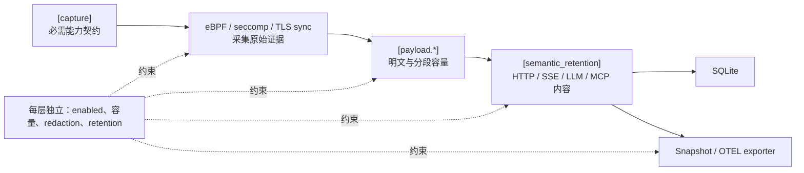

# 采集与内容保留配置参考

> 本文说明采集能力、payload、语义保留和主动治理配置之间的关系。

采集配置分为能力契约、证据采集、语义保留和输出边界。各层有独立的 enable、容量和内容策略；打开上层不会自动放宽下层边界。

## `[capture]`

`profile_name` 标识配置意图；`capabilities` 是每条 trace 必须满足的能力契约。当前 full-monitor 模板包含 process lifecycle/exec、file、mmap、network、IPC、stdio、TLS/socket plaintext、HTTP/HTTP2、resource metrics，以及文件和命令治理能力。

Capability 保留在 required 列表、但提供该能力的 collector 被关闭时，配置或启动会失败。选择性能力应使用模板支持的 opportunistic/disabled 机制；拼写错误或字段缺失不能作为隐式降级手段。

## `[ebpf]`

`enabled` 控制主机 eBPF collector；map entry、ring buffer 和 path byte 上限约束内核与 daemon 资源。`file_path_capture_enabled` 决定是否保留路径事件。`[ebpf.ipc_lineage]` 关闭后不能继续把 IPC capability 声明为 required。

`preflight_link_teardown_workers` 有效范围为 `1..=16`，当前默认 `4`；worker 会在 readiness 前全部 join，不会跳过 preflight 或遗留 hook。

## `[payload.tls]`

当前默认启用 `tls-sync`，provider/source/resolver/library 为 `auto`，runtime library path 为 `auto`，event socket 为 `/run/actrail/tls-sync.sock`。主要边界：

- `max_segment_bytes`：单个 inline segment 上限；
- `max_operation_bytes`：一次 operation 可读取上限；
- `ring_buffer_bytes`、`pending_operation_max_entries`：运行中容量；
- `retention_max_bytes_per_trace`：每 trace 持久化上限；
- `redaction_policy`：写入前的内容 redaction，当前默认 `disabled`；
- `java_agent_enabled`：仅 Java JSSE workload 需要，默认 `false`。

TLS sync 必须使用 `actrailctl launch`。resolver 无法为实际 binary 生成完整 plan 时不能回退为“已捕获 TLS 明文”。

## `[payload.socket]`、`[payload.stdio]` 与 `[payload.mcp]`

Socket 默认使用 `bpf-copy-seccomp-fallback`，并监听 `write`、`writev`、`sendto`、`sendmsg`。超过 inline cap 的 operation 需要 user-read fallback；vectored syscall 的内容也依赖该路径。Stdio 的 stdin/stdout/stderr 分别有 capture 和 storage mode；当前模板会完整保留 stdin、丢弃 stdout body、仅保留 stderr metadata。MCP 配置限制 parse buffer 与候选状态容量。

三类 payload 的 ring buffer、pending state、每 trace retention 与 redaction 均独立。调高其中一层不会自动扩大其他层。

## `[semantic_retention]`

当前默认 `content_owner = "highest_consumed"`：内容被更高语义层消费后，低层只保留摘要、计数、transport metadata 与 evidence reference，避免重复持有同一 body。

| 层 | 当前默认重点 |
| --- | --- |
| `l0_llm_call` | 启用；request `canonical_blocks`；request body export `none`；response `assembled_provider` |
| `l0_mcp_call` | request/response `canonical_json` |
| `l1_sse` | 保留 stream summary，不保留 event content |
| `l2_http` | 保留 message summary、header metadata 和 body text |
| `l3_http2_frame` | 保留 frame summary，不保留 DATA content |
| `l4_payload` | 当前关闭 body retention，只保留 stats |

Capacity exhaustion、明确 truncation 或 partial operation 只隔离受影响的 direction/stream，并应产生 diagnostic；在重新观察到可信 message boundary 前不能把后续字节错误关联为完整请求。

## 治理配置

`[enforcement]`、`[command_control]` 和 `[network_control]` 会改变工作负载行为，不只是采集。当前生成配置中文件和命令控制启用、默认决策为 `allow`，网络控制关闭。部署必须审查规则文件、default/failure decision、gray timeout/fallback、审计和 capability 组合。
