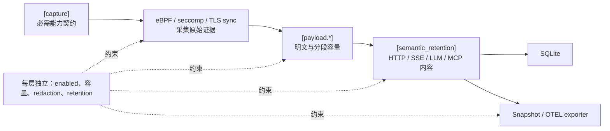

# 采集与内容保留配置参考

> 本文说明采集能力、payload、语义保留和主动治理配置之间的关系。

采集配置分为能力契约、证据采集、语义保留和输出边界。各层有独立的 enable、容量和内容策略；打开上层不会自动放宽下层边界。

## `[capture]`

`profile_name` 标识配置意图；`capabilities` 是每条 trace 必须满足的能力契约。当前 full-monitor 模板包含 process lifecycle/exec、file、mmap、network、stdio、TLS/socket plaintext、HTTP/HTTP2、resource metrics，以及 fanotify 文件治理能力。普通 IPC 的 `ipc-pipe-fifo`、`ipc-unix-socket` 默认不请求，P/C 等配置也不请求；MCP 专属通道关联独立于这两个能力。命令治理和 seccomp-notify 默认关闭，必须显式启用。

`agent_descendant_observation_depth` 控制 Agent 被识别后新建后代的详细采集深度。默认 `-1` 表示不限制；`0` 表示 Agent 保持详细采集、其未来后代仅保留生命周期；正数表示继续详细采集对应层数的未来后代。识别前已经存在的进程保持完整采集，生命周期和治理不受该选项影响。

Capability 保留在 required 列表、但提供该能力的 collector 被关闭时，配置或启动会失败。选择性能力应使用模板支持的 opportunistic/disabled 机制；拼写错误或字段缺失不能作为隐式降级手段。

## `[ebpf]`

`enabled` 控制主机 eBPF collector；map entry、ring buffer 和 path byte 上限约束内核与 daemon 资源。`file_path_capture_enabled` 允许采集文件路径；实际上传和路径状态维护还要求采集计划请求文件能力。`[ebpf.ipc_lineage]` 提供 MCP stdio 端点关联所需的采集许可与容量限制。

`diagnostics_summary_interval_ms` 控制采集丢失诊断的汇总周期，默认 `10000` 毫秒，必须大于零。窗口从首次发现新增失败开始计时，到期只保存和导出一条共享的 `event_transport_loss` 诊断（`trace_id = None`），包含各类新增计数；没有新增失败时不产生诊断。perf 丢失、内核传输与身份计数、stdio 组装丢失、文件 I/O 摘要失败使用同一窗口。错误详情按固定类别保留窗口内首条样例，不逐事件缓存。发现丢失后，活动 trace 立即标记为 `degraded`；已经降级的 trace 不重复写状态。正常停机在 exporter 关闭前补发最后一个非空窗口。

共享 FD 上下文上传由文件与 MCP stdio 的有效需求共同决定。基础 IPC 按自身 capability 使用内核 FD 分类，独立于 `ebpf.ipc_lineage.enabled`。成功 open 的实际 inode 类型决定 FIFO 分类；`ipc-pipe-fifo` 包含所需 open 位点，因此文件能力关闭时仍可观测命名 FIFO。FIFO I/O 只随 IPC 消费需求上报，IPC 关闭时不回退为普通文件读写。文件路径已知时可用于展示 FIFO 的 peer；文件路径未采集时使用 PID/FD 展示坐标，坐标不作为跨进程通道身份。用户态不执行路径 `stat` 补判。要求 MCP stdio 投影而关闭 lineage 许可时启动失败，详见 [MCP stdio 配置依赖](../../architecture/components/mcp-stdio-observation.md#配置依赖)。需求在共享 runtime 初始化时计算；空闲 runtime 的需求改变时重新加载。

主机 eBPF 预检实际加载并挂载程序，校验所需能力。预检成功的共享 runtime 保持挂载，事件 consumer 持续运行；trace 创建和结束维护进程跟踪状态，不触发预检挂钩的卸载或重新激活。没有观测目标时，业务事件由现有跟踪状态过滤；保持挂载仍有 hook 执行和 map 查询开销。

新 trace 的能力请求与当前 runtime 兼容时直接复用。无活动 trace 且计划不兼容时会释放并重新加载 runtime；已有活动 trace 且缺少必需能力时明确报错。预检多个不同计划时只保留最后一个 runtime。共享 runtime 在替换或 daemon 关闭时释放程序、挂钩和 consumer。

共享计划决定程序挂载和上传范围；用户态根据绑定 trace 的实际 capability 决定文件与 MCP 各自的上下文消费者。没有文件消费者的 trace 不读取 cwd，不初始化、继承或维护文件路径状态。复用包含文件能力的 runtime 时仍可能收到共享程序上传的上下文，这些记录在状态入口退出。需求直接来自已有绑定，不另存状态副本。

文件上下文中的 `fcntl` 只采集有消费者的命令：文件或 MCP stdio 需要 FD 复制结果，MCP stdio 还需要 `F_SETFD`。`F_GETFD`、`F_GETFL`、`F_SETFL` 不上传文件上下文。ioctl 的 FD 标志事实仅在有效 MCP 消费者存在时挂载和采集。内核每个 FD 保存类别与复用身份，只有网络连接维护共享对象引用计数；exec 清理读取实际内核文件身份，不维护独立 CLOEXEC 缓存。

`fcntl`、`close` 和共享可写 `mmap` 共用一个按线程索引的内核 pending map，容量使用 `ebpf.pending_operation_max_entries`。参数与进程身份只保存一次，系统调用返回后上传 128 字节完成记录，用户态直接应用。线程退出或上传失败均清理对应 pending 项。`close` 保留失败结果；文件 `mmap` 仅采集成功且带有 `PROT_WRITE`、`MAP_SHARED` 的映射，包含匿名共享映射。TLS 可执行映射使用独立的 VMA 采集路径。

文件路径状态保存词法归一化后的绝对 cwd 和 FD 路径，相对路径解析复用这些基址。待完成调用用一条记录保存系统调用与进程身份。`openat2` 入口使用已有的 384 字节单路径格式，出口上传 128 字节结果头。

仅请求 `fs-mmap` 且开启文件路径采集时，也会加载并校验 open、目录/FD 上下文及必要 FD 生命周期程序，以维持映射的文件归属。基于显式目录 FD 的相对路径操作返回 `EBADF` 时，输出原始相对路径并标记 `unresolved_relative`；绝对路径按自身解析。两目录 FD 操作无法从 `EBADF` 判断哪一端无效，两侧依赖显式目录 FD 的相对路径均保持未解析。

## `[payload.tls]`

当前默认启用 `tls-sync`，provider/source/resolver/library 为 `auto`，runtime library path 为 `auto`，event socket 为 `/run/actrail/tls-sync.sock`。主要边界：

TLS-sync 事件发送端通过环境变量 `TLS_PAYLOAD_SYNC_EVENT_TIMEOUT_MS` 配置等待预算，默认 `100` 毫秒，必须为正整数且可表示为运行时期限；无效值在 native runtime 初始化时拒绝。该环境变量应在启动被观测命令前设置。连接在发送线程内完成；每个发送批次共享一个绝对期限，部分写入或中断重试不重置期限。退出排空使用独立的总体期限，到期后不再等待发送线程。队列满时丢弃新事件；连接或发送失败时停用当前进程的事件通道，避免半帧后继续写入。传输失败或队列丢失由发送线程尽力输出一条本地汇总诊断，不逐事件输出；`unconfirmed_events` 包含丢弃项及未完成发送批次，不能当作 daemon 精确丢失计数。通道故障时无法保证该诊断到达 daemon。

TLS-sync 任务进程内的动态探针计划查询通过环境变量 `TLS_PAYLOAD_SYNC_PLAN_TIMEOUT_MS` 配置单次查询预算，默认 `100` 毫秒，必须为正整数且可表示为运行时期限；在启动被观测命令前设置，无效值在 native runtime 初始化时拒绝。连接、请求发送及完整响应读取共用一个绝对期限，部分读写及中断重试不重置期限。查询超时、连接或响应读取/解码失败时，按该二进制无探针点处理，并写入现有进程内计划缓存；同一缓存项不重复查询，业务继续运行。此时相关 TLS 采集会缺失，不逐查询输出告警。`bpf-copy` 不注入该 runtime，也不执行此查询；其启动探针发现和 daemon 侧动态发现由各自配置控制。

- `max_segment_bytes`：单个 inline segment 上限；
- `max_operation_bytes`：一次 operation 可读取上限；
- `sync_max_frame_bytes`：TLS sync IPC 单帧上限，默认 `33554432`（32 MiB，包含 8 字节帧头）；必须容纳 operation 内容及事件元数据，也约束运行时 plan 响应。接收端在读取帧头后检查长度，异常帧只关闭对应连接；
- `ring_buffer_bytes`、`pending_operation_max_entries`：运行中容量；
- `dynamic_discovery_capacity`：`bpf-copy` resolver 中待分析对象和已完成结果的单表总容量，同时限制 direct 分析任务队列，默认 `128`，必须大于 `0`；相同文件版本的待分析请求合并，容量耗尽影响本次发现；
- `direct_startup_discovery_enabled`：默认 `true`，仅作用于 `bpf-copy`；控制 `actrailctl launch` 放行前对启动命令和已配置 agent 命令的探针发现与挂载。关闭后允许启动时没有探针，运行中发现仍由下一项独立控制；
- `direct_dynamic_discovery_enabled`：默认 `true`，仅作用于 `bpf-copy`；控制运行中 exec 和可执行文件映射触发的对象发现与补挂。关闭时在打开 procfs 对象前跳过发现，不创建动态分析队列；已安装探针仍可采集，映射事实仍会被消费。这不是关闭所有 TLS 事件采集的开关；
- `retention_max_bytes_per_trace`：每 trace 持久化上限；
- `redaction_policy`：写入前的内容 redaction，当前默认 `disabled`；
- `java_agent_enabled`：仅 Java JSSE workload 需要，默认 `false`。

TLS sync 必须使用 `actrailctl launch`。resolver 无法为实际 binary 生成完整 plan 时不能回退为“已捕获 TLS 明文”。

`capture_backend = "bpf-copy"` 使用 uprobe/uretprobe 直接采集，无 TLS runtime 注入，不要求 TLS seccomp notify。通过 `actrailctl launch` 在放行程序前解析并挂载已知目标及可解析依赖，支持 direct OpenSSL/Rustls/BoringSSL 点位；运行中可根据 exec 和文件映射事实发现新 executable/共享库。上述两个发现开关相互独立，关闭任一项都可能减少覆盖；短进程可能在动态挂载前退出。同 trace 后代命中已挂文件探针时仍可采集。

该后端要求 ring-buffer 制品及主机 eBPF 可用。TLS 能力就绪表示实际 ring map、必要 BPF 程序与配置 map 已准备好；具体文件覆盖由成功挂载决定。无法生成适用 plan 的对象允许无初始探针启动，原因使用控制协议枚举码，由 ctl 展示。

当前 TLS direct 每次最多复制一个 chunk，上限为 `min(max_operation_bytes, 65535)` 字节；`max_segment_bytes` 参与配置校验，但当前 direct 复制函数不以它切分或限制正文。事件含固定 65536 字节正文区。超限、丢失及尚未安装探针均可能影响协议覆盖；该后端不保证完整采集。`seccomp-user-read` 和 `bpf-copy-seccomp-fallback` 仍要求 seccomp notify。

TLS sync IPC 使用二进制长度帧：`AT` 魔数、版本 `1`、消息类型各占固定字段，随后为小端 `u32` 正文长度；事件正文直接传输原始字节。payload、decision、summary 与 plan 查询/响应由消息类型分派。daemon 增量接收半帧和连续多帧，共用读取缓冲区。

## `[payload.socket]`、`[payload.stdio]` 与 `[payload.mcp]`

本节帮助部署者选择 socket 明文采集后端，并理解两种模式的完整性保证。Socket 监听 `write`、`writev`、`sendto`、`sendmsg`，由 `payload.socket.capture_backend` 选择采集路径：

- `bpf-copy`（默认，性能/证据模式）：仅依赖 eBPF，不要求 seccomp notify 或 `actrailctl launch`。每次 operation 最多抓取前导的一个 `max_segment_bytes` segment（默认 4095 字节；`writev`/`sendmsg` 取第一个非空 iovec 的头部）。超出部分标记为 payload `PolicyLimited`；可信 HTTP 路由仍可生成不伪造正文的 `llm.request`，其 status 为 `success`、completeness 为 `capture_limited`，并可与完整 response 关联用于性能剖析。这是该模式的预期结果，不产生截断错误 diagnostic。
- `bpf-copy-seccomp-fallback`（完整采集，需显式启用）：要求 `[seccomp_notify] enabled = true`，workload 必须通过能安装 seccomp listener 的路径启动（例如 `actrailctl launch` 或容器 seccomp profile）。该模式下 BPF 只产生 operation 完成元数据（completion/sequence）；需要内容字节的 operation 由 daemon 在 seccomp notify 上读取并切分，完整上限为 `max_operation_bytes`，适合需要完整 HTTP/LLM 消息的观测。读取失败、缺口或不完整 operation 标记为 payload `Truncated` 和 semantic `partial`，属于异常并产生 diagnostic。未启用 seccomp notify 时配置校验会直接失败，不会静默降级。

三类 payload 的 ring buffer、pending state、每 trace retention 与 redaction 均独立。调高其中一层不会自动扩大其他层。

`retention_max_bytes_per_trace` 由持久化后端执行。SQLite 按 TLS、socket、stdio
分别统计每个 trace 实际保存的正文 bytes；组装后的 payload 继承原始 source，计入同一额度。
超过额度的 segment 保存元数据和空正文，`storage_omission` 整数编码为 `1`
（retention limit；`0` 表示未由此额度省略）。采集长度、完成状态与采集截断标记保持原始事实，
在线协议分析与动作关联继续处理。重复 segment 替换按旧、新实际字节差额计算。

SQLite 的计数 cache 从持久化行派生，只在该后端连接及其共享句柄内维护。
启动时使用 `control.active_trace_max` 作为 cache 的 trace 容量；此值仅影响命中率，
不限制可持久化的 trace 数，也不改变正文额度。cache 淘汰后从数据库重新统计，
回滚或提交结果不确定时清空，trace 清理时失效对应项。NoOp 后端不保存正文，也不维护额度计数。

`payload.stdio.enabled=true` 允许 daemon 按下游需求启用 stdio，`false` 强制关闭。实际采集还要求已请求 `stdio-chunk`，并且满足以下至少一个消费者条件：

- MCP：`semantic_retention.projection_enabled=true`、`payload.mcp.enabled=true` 且 `capture_stdin=true`。
- L4：`semantic_retention.l4_payload.enabled=true`，且至少一个启用采集的方向，其 storage mode 为 `full` 或 `metadata-only`。

`payload.mcp.enabled` 默认 `false`，L4 默认关闭，因此刷新默认配置后 stdio 实际不采集。需要 MCP 识别时显式设置 `payload.mcp.enabled=true`；stdio 的默认按需许可会随有效消费者启用采集。

没有有效消费者时，stdio 采集关闭，有效采集计划移除 `stdio-chunk`，后续组装和重排没有 stdio 输入。配置文件中的 `true` 保留按需启用的含义；有效值在 daemon 启动构造采集服务时计算。

Stdio 的 stdin/stdout/stderr 分别有 capture 和 storage mode；当前模板分别使用 `full`、`drop`、`metadata-only`，实际原始留存还受 L4 总开关控制。MCP 配置限制 parse buffer 与候选状态容量；关闭 MCP 会停止专属端点关联、bundle 和生命周期诊断。

## `[semantic_retention]`

NoOp 存储不准备纯落盘事件字段，也不执行记录批次的持久化事务和存储克隆。已配置的语义分析与有效在线导出继续运行；不能以不落盘代替关闭分析。文件事件被摘要接管后，不再预先构造不会输出的独立修改动作。

`projection_enabled` 默认 `true`。设为 `false` 时，停止进程、命令、文件、HTTP、LLM、MCP、工具和治理事件的语义动作及关联投影，同时关闭相应正文组装、投影诊断和结束时输出。进程身份注册、trace 生命周期及原始事件记录继续运行；payload 采集、应用协议事件解析和原始 payload 保留由各自配置控制。该开关在 daemon 启动时生效。

关闭投影要求 `capture.agent_descendant_observation_depth = -1`。其他深度值依赖语义 agent 识别来设置采集范围，两者冲突时 daemon 启动失败。

当前默认 `content_owner = "highest_consumed"`：内容被更高语义层消费后，低层只保留摘要、计数、transport metadata 与 evidence reference，避免重复持有同一 body。

| 层 | 当前默认重点 |
| --- | --- |
| `l0_llm_call` | 启用；request `canonical_blocks`；request body export `none`；response `assembled_provider` |
| `l0_mcp_call` | request/response `canonical_json` |
| `l1_sse` | 保留 stream summary，不保留 event content |
| `l2_http` | 保留 message summary、header metadata 和 body text |
| `l3_http2_frame` | 保留 frame summary，不保留 DATA content |
| `l4_payload` | 当前关闭 body retention，只保留 stats |

`semantic_retention.l0_llm_call.tool_results_enabled` 默认 `true`，控制 `llm.tool_result` 动作及其关联的投影。设置为 `false` 后，在收集工具结果之前退出该投影；请求内容、响应工具声明和进程/文件采集分别由各自开关控制。

工具结果内容导出由 `tool_result_content_export` 控制，默认 `none`，此时不为结果内容计算或输出 `content_bytes`。设置为 `canonical_json` 时，结果带精确规范化长度；正文超过 `tool_result_content_export_max_bytes`（默认131072字节）时省略正文并标记 `too_large`。开启该导出要求 `tool_results_enabled=true`，冲突配置在启动时失败。

当 LLM 请求内容为 `none`，且工具结果投影、请求体导出和 trajectory 均关闭时，请求解析只生成 provider 分类、模型和后台请求分类所需的事实。已有 codec 仍优先执行；JSON 的 Unicode、数字范围、递归深度及尾随数据校验继续生效。HTTP1 的 POST、JSON Content-Type 和已知 LLM 路由也可提供请求识别证据。选择字段解析仍消费完整消息；后台分类需要的文本可能暂存到消息最终角色确定，转义文本仍需解码。报文完整性及时间戳沿用传输层证据。

响应的正文、工具声明和 usage 开关分别传入 provider 解析器，在相应内容构建前判断。响应识别、chunk 和完成证据独立于保留的字符串。

Responses、Anthropic和Chat的SSE显式完成、失败和不完整终态沿同一解析状态传递。`llm.response.done=true` 表示已观察到协议终止，失败不会被后续普通完成标记覆盖。完整采集的 provider 失败记录为 `error/partial`；限采沿用 `capture_limited` 完整性规则。没有 provider 终态的传输截断仍为 `done=false`。通用 error 事件仅在真实协议事件已确认 provider 后处理，HTTP Content-Type 和请求关联本身不构成响应识别证据。

Capacity exhaustion、明确 `Truncated` 或 partial operation 只隔离受影响的 direction/stream，并产生 diagnostic；在重新观察到可信 message boundary 前不能把后续字节错误关联为完整请求。`PolicyLimited` 同样隔离缺失字节，但作为性能模式的预期边界静默恢复。

## 治理配置

`[enforcement]`、`[command_control]` 和 `[network_control]` 会改变工作负载行为，不只是采集。当前生成配置保留 fanotify 文件控制，但 seccomp syscall 列表为空，命令控制和网络控制关闭。需要同步治理时，部署必须显式启用 seccomp-notify 及对应控制能力，并审查规则文件、default/failure decision、gray timeout/fallback、审计和 capability 组合。
