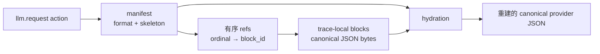

# LLM request canonical blocks

> 本文说明如何读取、重建和导出以 canonical blocks 保存的 LLM request body。

## 保留模式

`[semantic_retention.l0_llm_call].request_content` 支持：

| 值 | 语义 |
| --- | --- |
| `none` | 不保留 request body 内容，只保留 transport/link metadata |
| `shape` | 保留 shape、请求正文尺寸、model 与 transport metadata，但不可重建 body |
| `canonical_blocks` | 通过 manifest、refs 和 trace-local reusable blocks 保存可重建的 canonical provider JSON |

非 JSON body 只能保留为 `shape`。`canonical_blocks` 重建 canonical JSON：对象 key 按字典序排序，数组顺序保持，去除无意义空白。原始 HTTP 空白和 object key order 不保留。在线存储由 skeleton、refs 和块组成，不再为整请求摘要或长度元数据额外生成 canonical JSON 副本，也不生成整请求 hash。

缺 block 或 skeleton 非法是读取错误，不得作为 silent partial success 返回。独立的完整 JSON 表示按显式读取或正文导出需要生成。存储仍需构建和编码 skeleton、块；未抽取为块的未知字段留在 skeleton 中，特殊正文形状的 skeleton 可能包含完整正文。

## 存储关系

每个 `llm.request` action 最多关联一个 manifest：



```text
llm_request_manifests(action_id, trace_id, format_version, skeleton_json)
  -> llm_request_block_refs(manifest_id, ordinal, block_id)
  -> llm_request_blocks(block_id, trace_id, block_hash,
                        uncompressed_bytes, encoded_bytes)
```

Skeleton 是保留原 JSON 结构的模板；它在内容原位置放置 ordinal placeholder（按 `0, 1, 2...` 编号的占位符），指向 reusable block。Hydration 是按 ordinal 将 block 放回 placeholder、重建 canonical JSON 的过程。

例如：

```json
{"messages":[{"$actrail_llm_block":0}],"model":"deepseek-v4-flash"}
```

Block 只在同一 trace 内按 canonical block hash 去重，不能跨 trace 去重，也不能把跨 trace 内容相等性作为公开能力。`BlockAccumulator` 是当前唯一块身份生成入口，负责规范化并生成内容 hash；相同 `(trace_id, block_hash)` 必须代表不可变的相同 bytes。

存储以该身份的唯一索引为依据：已有块只查询 `block_id` 和字节长度，新块通过 `INSERT ... RETURNING block_id` 取得 ID；引用复用本次内容写入取得的 ID。该临时映射在一次内容写入结束后释放。查询与插入使用现有 recording 写事务。

每次内容写入必须提供引用涉及的全部唯一块；缺块、重复提供同一身份或长度冲突会报错。存储不读回完整 BLOB 逐字节比较；读取也不生成整请求 hash。相同 hash、相同长度但不同 bytes 的身份冲突属于 producer 违反不可变身份约定，不能把在线写入或显式读取宣称为内容哈希审计。

## Version 2 block boundaries

- 每个顶层 `tools[]` item 是 block；
- message envelope 保留在 skeleton，`content` 按 content item 规则拆分；
- string content，以及已知 typed text item 的 `text` scalar 使用 scalar text value 作为 block；
- `tool_result`/`tool-result` 的 `content` value 是 block，其余字段保留在 skeleton；
- 未知 content item 可作为 whole-item block；
- 顶层 `input` message 使用相同规则，其他 `input` 与 `prompt` value 保留为 block。

Hydration 必须递归替换原位置 placeholder，并重现完整 canonical provider JSON。

## Action 与导出

`semantic_actions.attributes` 保留 model、byte counts、HTTP/stream metadata、payload provenance、manifest metadata 与可用的 trajectory metadata；不得包含 `llm.request.payload_text`。

action 与统计的请求尺寸使用 `llm.request.payload_bytes`：正常消息来自 HTTP body 长度，限采识别可能采用声明长度。该值与 canonical JSON 长度不同。内容 API 的 `canonical_body_bytes` 只在按需重建时计算，表示截断前的 canonical JSON 长度；manifest 不持有该字段。

默认 action tree、JSON 与 OTEL 不内联重建的 request body。OTEL egress request body 必须同时满足：

1. `request_content = "canonical_blocks"`；
2. `request_body_export = "canonical_json"`；
3. OTEL exporter/plugin 使用 `attribute_mode = "full"`。

启用正文导出时，采集端从已解析内容执行有界序列化；每次写入均检查 `request_body_export_max_bytes`，越界即停止并省略整份导出正文。导出关闭时不执行整请求序列化。

完整内容只通过有界显式读取返回：

```text
GET /api/traces/{trace_id}/actions/{action_id}/content/llm-request?max_bytes=N
```

状态必须区分 `available`、`shape_only`、`truncated`、`unavailable` 和 `corrupt`。超过 `request_body_export_max_bytes` 时，body 整体省略并标记 `too_large`，不能截断后伪装为完整 JSON。

## Purge 与隐私

删除 trace 时必须在同一 retention path 删除 manifest、refs 和 blocks。Block hash 可以被常见 prompt 或 tool schema 反查；公开 API 和 export 默认不应暴露 block 列表或 hash。
