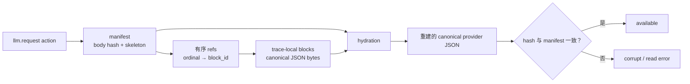

# LLM request canonical blocks

> 本文说明如何读取、重建和导出以 canonical blocks 保存的 LLM request body。

## 保留模式

`[semantic_retention.l0_llm_call].request_content` 支持：

| 值 | 语义 |
| --- | --- |
| `none` | 不保留 request body 内容，只保留 transport/link metadata |
| `shape` | 保留 shape、size、hash、model 与 transport metadata，但不可重建 body |
| `canonical_blocks` | 通过 manifest、refs 和 trace-local reusable blocks 保存可重建的 canonical provider JSON |

非 JSON body 只能保留为 `shape`。`canonical_blocks` 重建的是 canonical JSON，不是原始 HTTP bytes：对象 key 按字典序排序，数组顺序保持，去除无意义空白，再对 canonical UTF-8 bytes 计算 hash。原始空白和 object key order 不保留。

缺 block、hash 不匹配或 skeleton 非法是读取错误，不得作为 silent partial success 返回。

## 存储关系

每个 `llm.request` action 最多关联一个 manifest：



```text
llm_request_manifests(action_id, trace_id, format_version,
                      canonical_body_hash, canonical_body_bytes, skeleton_json)
  -> llm_request_block_refs(manifest_id, ordinal, block_id)
  -> llm_request_blocks(block_id, trace_id, block_hash,
                        uncompressed_bytes, encoded_bytes)
```

Skeleton 是保留原 JSON 结构的模板；它在内容原位置放置 ordinal placeholder（按 `0, 1, 2...` 编号的占位符），指向 reusable block。Hydration 是按 ordinal 将 block 放回 placeholder、重建 canonical JSON 的过程。

例如：

```json
{"messages":[{"$actrail_llm_block":0}],"model":"deepseek-v4-flash"}
```

Block 只在同一 trace 内按 canonical block hash 去重，不能跨 trace 去重，也不能把跨 trace 内容相等性作为公开能力。相同 `(trace_id, block_hash)` 的存储 bytes 必须完全一致；同一 hash 对应不同 bytes 是 hash collision 或 canonicalization mismatch，读取必须失败。

## Version 2 block boundaries

- 每个顶层 `tools[]` item 是 block；
- message envelope 保留在 skeleton，`content` 按 content item 规则拆分；
- string content，以及已知 typed text item 的 `text` scalar 使用 scalar text value 作为 block；
- `tool_result`/`tool-result` 的 `content` value 是 block，其余字段保留在 skeleton；
- 未知 content item 可作为 whole-item block；
- 顶层 `input` message 使用相同规则，其他 `input` 与 `prompt` value 保留为 block。

Hydration 必须递归替换原位置 placeholder，并重现完整 canonical provider JSON。

## Action 与导出

`semantic_actions.attributes` 保留 model、byte counts、HTTP/stream metadata、payload provenance、manifest metadata 与可用的 trajectory metadata；不得包含 `llm.request.payload_text`。

默认 action tree、JSON 与 OTEL 不内联重建的 request body。OTEL egress request body 必须同时满足：

1. `request_content = "canonical_blocks"`；
2. `request_body_export = "canonical_json"`；
3. OTEL exporter/plugin 使用 `attribute_mode = "full"`。

完整内容只通过有界显式读取返回：

```text
GET /api/traces/{trace_id}/actions/{action_id}/content/llm-request?max_bytes=N
```

状态必须区分 `available`、`shape_only`、`truncated`、`unavailable` 和 `corrupt`。超过 `request_body_export_max_bytes` 时，body 整体省略并标记 `too_large`，不能截断后伪装为完整 JSON。

## Purge 与隐私

删除 trace 时必须在同一 retention path 删除 manifest、refs 和 blocks。Block hash 可以被常见 prompt 或 tool schema 反查；公开 API 和 export 默认不应暴露 block 列表或 hash。
