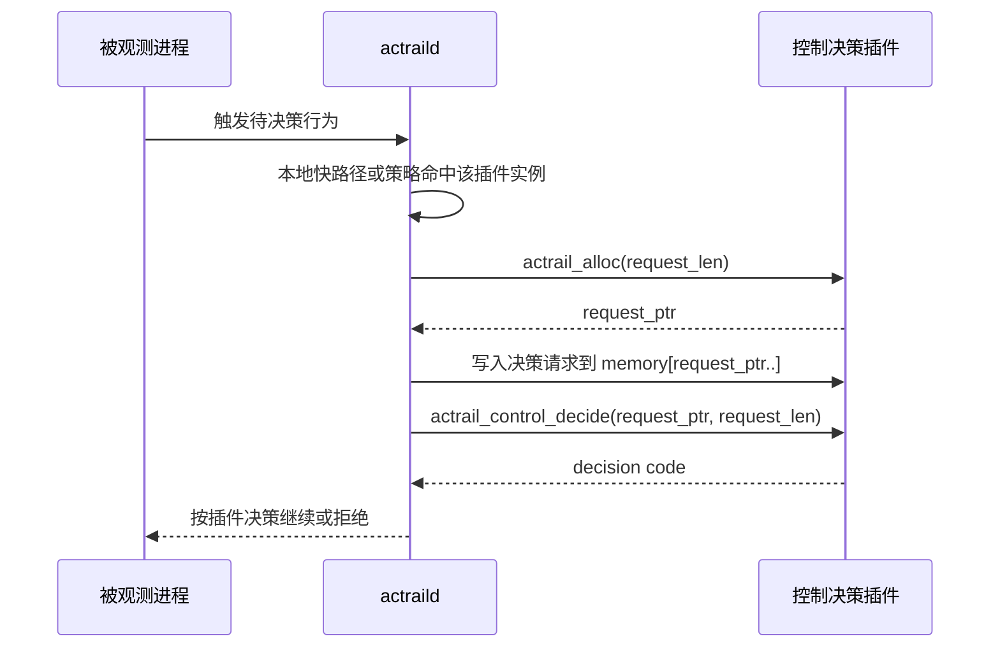
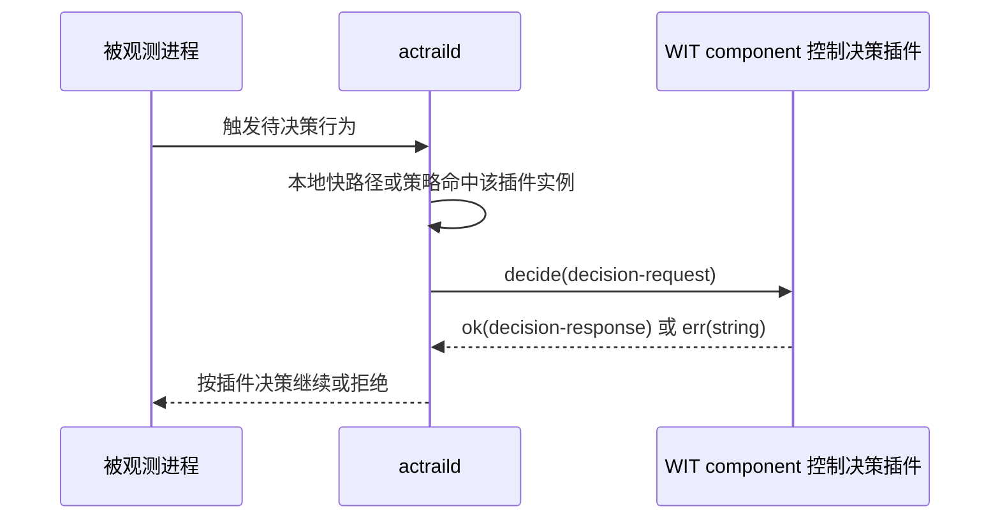
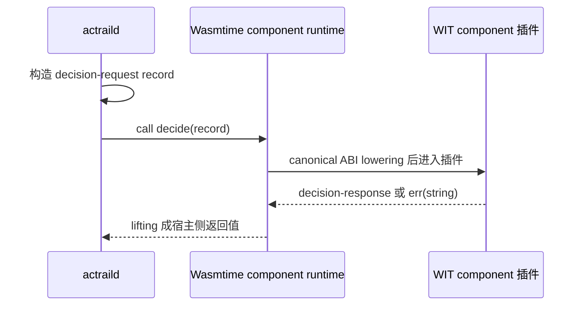

# 控制决策 ABI

> 本文定义插件作者实现同步文件访问、命令执行或网络连接允许/拒绝决策所需的 ABI。

本文说明 AcTrail 控制决策插件的功能层 ABI。控制决策插件在文件访问、命令执行或网络连接等待决策行为命中策略后被调用，返回允许或拒绝。

WASM core module 插件还需要遵守 [WASM Core Module ABI](wasm-core-module.md) 中的 `memory`、`actrail_alloc` 和可选 `actrail_plugin_init` 约定。WIT component 插件不需要直接实现这些底层导出，但控制决策语义相同。

## 入口

### WASM Core Module

| 导出 | 必需性 | 调用时机 |
| --- | --- | --- |
| `actrail_control_decide(ptr, len) -> code` | 控制决策插件必需 | 文件访问、命令执行或网络连接请求命中该插件实例时调用。 |

`ptr` 和 `len` 指向 AcTrail 写入插件内存的控制决策 request envelope。

对 WASM core module，request envelope 是 **UTF-8 编码的 JSON 文本**，不是二进制结构体。`len` 表示 JSON 文本的字节数，不是字符数；插件只应读取 `memory[ptr, ptr + len)` 这一段字节，然后按 UTF-8 JSON 解析。

### WIT Component

普通控制插件使用 WIT world `control-plugin`。运行时要求 component 导出以下 interface 和函数：

| 项 | 值 |
| --- | --- |
| Export interface | `actrail:plugin/control-decider@0.4.0` |
| Function | `decide` |

函数签名：

```wit
decide: func(request: decision-request) -> result<decision-response, string>
```

WIT component 不读取 WASM core module 的 JSON envelope。AcTrail 通过 component model 直接传入结构化 `decision-request` record。返回 `ok(decision-response)` 表示插件给出控制结论；返回 `err(string)` 会被 AcTrail 视为插件运行错误。

需要动态发布网络规则的 component 使用 `managed-network-control-plugin` world。它在管理命令和运行时配置接口之外导入独立的 `actrail:plugin/network-control-host@0.4.0`；普通控制插件不会因此获得网络策略写权限。

## 调用流程：WASM Core Module



## 调用流程：WIT Component



AcTrail 只把需要插件参与的行为送进插件。命令和网络控制都先做本地规则查找，allow/deny 在 daemon 内直接完成；只有 gray 规则才调用目标决策插件。文件访问控制先由 fanotify 和黑白灰名单快路径筛选，只有需要插件决策的灰名单请求才进入插件。动态策略 publisher 自身不参与 gray 决策。

## 格式约定

控制决策 ABI 的语义字段一致，但不同运行形态使用不同的承载 ABI：

- WASM core module 只有线性内存和整数函数入口。AcTrail 先调用插件导出的 `actrail_alloc`，把 UTF-8 JSON envelope 写入插件 memory，再调用 `actrail_control_decide(ptr, len)`。插件需要自己解析 JSON。
- WIT component 有 Component Model 类型系统。AcTrail 通过 Wasmtime component API 调用插件导出的 `decide`，把同一类决策语义组装成 WIT `decision-request` record 传入。插件看到的是语言绑定生成的结构体或 record，不需要解析 JSON。

WASM core module JSON envelope 的短 key 是 ABI 的一部分，不是给人阅读的展示字段。插件必须按字段表解析，不应把 key 展开为长字段名，也不应依赖未列出的字段。

以下值是稳定 ABI 常量，Rust 插件可以从 `actrail_plugin_abi` 读取：

| 用途 | Rust 常量 | 当前值 |
| --- | --- | --- |
| 当前决策上下文 | `actrail_plugin_abi::control::context::CURRENT_DECISION` | `c` |
| 当前文件策略上下文 | `actrail_plugin_abi::control::context::CURRENT_FILE_POLICY` | `f` |
| 当前命令执行上下文 | `actrail_plugin_abi::control::context::CURRENT_COMMAND_EXECUTION` | `c` |
| 当前网络动作上下文 | `actrail_plugin_abi::control::context::CURRENT_NETWORK_ACTION` | `c` |
| 决策摘要查询 | `actrail_plugin_abi::control::query::DECISION_SUMMARY` | `decision-summary.v1` |
| 命中文件策略查询 | `actrail_plugin_abi::control::query::MATCHED_RULE` | `matched-rule.v1` |
| 命令执行上下文查询 | `actrail_plugin_abi::control::query::COMMAND_EXECUTION_CONTEXT` | `command-execution.v1` |
| 网络动作上下文查询 | `actrail_plugin_abi::control::query::NETWORK_ACTION_CONTEXT` | `network-action.v1` |

AcTrail 只接受这些短 token 和 query 名称，不接受长字段 token。

## 性能约束

控制决策会阻塞被观测行为。AcTrail 的调用原则是先走本地快路径，再在必要时进入插件：

- 文件访问先由 fanotify 和本地黑白灰名单筛选；白名单和黑名单不需要调用插件。
- 灰名单或显式命中某个插件实例的策略才会调用控制决策插件。
- 网络 connect 热路径先查询规范化 `SocketAddr` 精确索引，仅在未命中时查询 `IpAddr` 全端口索引；没有规则时直接采用 `network_control.default_decision`，不会进入 WASM，也不会遍历规则。
- 网络 gray 调用从 seccomp 事件循环延后到有界 worker；全局 pending、每规则并发和目标实例并发任一达到上限时立即使用规则 fallback。
- 插件需要额外上下文时，应通过已授权 hostcall 按需查询，不应要求 AcTrail 在每次请求里主动携带完整上下文。
- 可复用结论应通过 `reusable` 返回，让 AcTrail 在当前 trace/task 范围内减少重复调用。

## 输入语义

### WASM Core Module JSON Envelope

WASM core module 控制插件收到的 request envelope 是一个 JSON object。当前字段如下：

| 字段路径 | JSON 类型 | 必填 | 含义 |
| --- | --- | --- | --- |
| `v` | number | 是 | envelope 数字版本，当前为 `1`。 |
| `id` | string | 是 | 当前决策请求标识；不透明字符串。 |
| `tr` | string | 是 | 当前 trace 标识；插件不应假设固定字节长度。 |
| `s` | number | 是 | `1=file-access`、`2=command-execution`、`3=network-action`。 |
| `a` | object | 是 | 发起行为的进程身份。 |
| `a.pid` | number | 是 | 进程 pid。 |
| `a.tid` | number 或 null | 是 | task id。 |
| `a.gen` | number | 是 | 进程身份 generation。 |
| `a.ns` | string 或 null | 是 | pid namespace。 |
| `op` | string | 是 | 待决策操作摘要，例如文件访问、命令执行或网络连接。 |
| `t` | string | 是 | 待访问目标摘要。 |
| `ctx` | string 或 null | 是 | 可选上下文引用；`"c"` 表示当前决策上下文。 |

### JSON 示例

以下示例展示当前 WASM core module JSON envelope 的形状。示例值用于说明字段格式，不代表稳定 id 生成规则。

命令执行控制：

```json
{
  "v": 1,
  "id": "deny-id:018f-example",
  "tr": "018f-example",
  "s": 2,
  "a": { "pid": 1234, "tid": 42, "gen": 7, "ns": "pid:[4026531836]" },
  "op": "execve",
  "t": "path=/usr/bin/id argv=id -u",
  "ctx": "c"
}
```

文件访问控制：

```json
{
  "v": 1,
  "id": "gray-secrets:018f-example",
  "tr": "018f-example",
  "s": 1,
  "a": { "pid": 1234, "tid": 42, "gen": 7, "ns": "pid:[4026531836]" },
  "op": "open",
  "t": "/etc/secret.conf",
  "ctx": "c"
}
```

网络连接控制：

```json
{
  "v": 1,
  "id": "deny-egress:018f-example",
  "tr": "018f-example",
  "s": 3,
  "a": { "pid": 1234, "tid": 42, "gen": 7, "ns": "pid:[4026531836]" },
  "op": "connect",
  "t": "remote=203.0.113.10:443 family=ipv4 fd=5",
  "ctx": "c"
}
```

上面的 JSON 示例用于说明字段类型和形状；实际字符串内容由当前 AcTrail 运行路径生成，插件应把 `id`、`tr`、`op`、`t`、`ctx` 当作不透明值处理，除非对应字段的格式在更高层文档中另有稳定约定。

### WIT Component Record

WIT component 控制插件收到的是结构化 `decision-request` record，不是 JSON 文本。actraild 调用插件时，会在宿主侧把内部决策请求填入 WIT record，然后通过 Wasmtime component API 调用插件导出的 `decide` 函数；Wasmtime 按 Component Model canonical ABI 完成参数 lowering/lifting。插件作者只需要处理语言绑定生成的结构体或 record。



字段名使用 WIT 风格：

| 字段路径 | WIT 类型 | 含义 |
| --- | --- | --- |
| `decision-id` | string | 当前决策请求标识。 |
| `trace-id` | string | 当前 trace 标识。 |
| `task-id` | option<string> | 当前保留为 none。 |
| `subject` | enum | `file-access`、`command-execution`、`network-action`。 |
| `actor-process-identity` | actor-process-identity | 发起行为的结构化进程身份。 |
| `actor-process-identity.pid` | u32 | 进程 pid。 |
| `actor-process-identity.task-id` | option<u32> | task id。 |
| `actor-process-identity.generation` | u64 | 进程身份 generation。 |
| `actor-process-identity.namespace` | option<string> | pid namespace。 |
| `operation` | string | 待决策操作摘要。 |
| `target-summary` | string | 待访问目标摘要。 |
| `context-ref` | option<string> | 可选上下文引用。 |

`decision-response` 返回结构：

| 字段路径 | WIT 类型 | 含义 |
| --- | --- | --- |
| `verdict` | control-verdict | `allow` 或 `deny`。 |
| `scope` | decision-scope | `once` 或 `reusable`。 |
| `reason-code` | option<string> | 可选机器可读原因码。 |
| `reason-message` | option<string> | 可选人类可读原因说明。 |

### WIT Component Hostcall Record

WIT component 控制插件通过 hostcall 查询当前决策上下文和文件策略视图时，返回的是 WIT record，不是 `key=value` 文本，也不是 JSON。

`query-context(context-ref: string, query: string)` 当前只接受 `context-ref = "c"` 和 `query = "decision-summary.v1"`，返回 `decision-summary`：

| 字段路径 | WIT 类型 | 含义 |
| --- | --- | --- |
| `subject` | control-subject | 当前待决策对象类型。 |
| `operation` | string | 当前操作。 |
| `target-summary` | string | 当前目标摘要，变长。 |
| `decision-id` | string | 当前决策 id，变长。 |
| `trace-id` | string | 当前 trace id，变长。 |
| `actor-process-identity` | string | 发起行为的进程身份摘要。 |

`file-access.current-match-get(context-ref: string, query: string)` 当前只接受 `context-ref = "f"` 和 `query = "matched-rule.v1"`，返回 `file-policy-view`：

| 字段路径 | WIT 类型 | 含义 |
| --- | --- | --- |
| `rule-id` | string | 命中的策略规则 id，变长。 |
| `decision` | string | 命中规则决策，例如 `gray`。 |
| `operation` | string | 命中操作。 |
| `path` | string | 当前文件路径，变长。 |
| `plugin-instance` | option<string> | 关联插件实例。 |
| `timeout-ms` | option<u64> | 灰名单插件决策超时。 |
| `concurrency-limit` | option<u32> | 插件并发限制。 |
| `fallback` | option<string> | 超时或错误 fallback。 |

策略批量更新使用独立的文件策略规则接口。插件需要声明并获得 `file-policy.rules.apply:kind=<allow|deny|gray>,path=<absolute-scope>` grant，然后调用规则更新接口。

WASM core module 入口：

| hostcall | ABI |
| --- | --- |
| `file_policy_rules_version_get() -> i64` | 成功返回当前 revision；负数为错误码。 |
| `file_policy_rules_list(filter_ptr, filter_len, cursor_ptr, cursor_len, limit, out, max) -> i64` | `filter` 使用紧凑二进制过滤条件，`cursor` 为空表示第一页；成功返回规则列表写入字节数。 |
| `file_policy_rules_match_dry_run(ptr, len, out, max) -> i64` | `ptr,len` 指向紧凑二进制 dry-run 请求；成功返回匹配结果写入字节数。 |
| `file_policy_rules_validate(ptr, len, out, max) -> i64` | `ptr,len` 指向紧凑二进制 patch；成功返回结果写入字节数。 |
| `file_policy_rules_apply(ptr, len, out, max) -> i64` | 同 validate，但会应用 patch。 |

WIT component 入口：

| hostcall | WIT 类型 |
| --- | --- |
| `file-policy-rules-version-get()` | `result<u64, string>` |
| `file-policy-rules-list(filter, cursor, limit)` | `result<file-policy-list-result, string>` |
| `file-policy-rules-match-dry-run(request)` | `result<file-policy-match-dry-run-result, string>` |
| `file-policy-rules-validate(request)` | `result<file-policy-apply-result, string>` |
| `file-policy-rules-apply(request)` | `result<file-policy-apply-result, string>` |

命令 gray 决策的公共 `decision-request` 只携带紧凑摘要。`target-summary` 用于展示和诊断，不是稳定策略输入，插件不得依赖其文本格式解析 argv。需要完整命令上下文的插件应声明并获得 `command-execution.current-context-query`，然后查询 `context-ref = "c"`、`query = "command-execution.v1"`。

返回的 `command-execution-context` 字段如下：

| 字段 | WIT 类型 | 含义 |
| --- | --- | --- |
| `syscall` | string | `execve` 或 `execveat`。 |
| `requested-path` | string | tracee 原始请求路径。 |
| `resolved-path` | string | tracee namespace 内词法规范化后的绝对路径。 |
| `argv` | list<string> | 在配置的数量、单参数和总字节上限内完整复制的 argv。 |
| `execveat-dirfd` | option<s32> | `execveat` dirfd；`execve` 为 none。 |
| `execveat-flags` | option<u64> | `execveat` flags；`execve` 为 none。 |

argv 超过任一限制时，daemon 直接使用 `command_control.failure_decision`，不会调用插件。WIT component 使用结构化 record；WASM core module 的 `command_execution_current_context_query` 使用版本化长度前缀二进制响应，以避免 JSON 转义放大。

动态命令路由使用以下 grants：

| grant | 能力 |
| --- | --- |
| `command-policy.rules.read` | 读取当前合并规则及 revision。 |
| `command-policy.rules.match-dry-run` | 按精确 executable 与请求 args 查询实际命中 owner、决策和 revision。 |
| `command-policy.rules.validate` | 校验一批 AON patch，不修改路由。 |
| `command-policy.rules.apply:kind=<allow\|deny\|gray>,path=<absolute-path-or-/**-scope>` | 只允许发布指定决策类型和 executable 范围。 |

每个 apply request 包含 `base-revision`、`mutation-id`、可选 `reason` 和 `upsert/delete` items。规则 draft/view 的 `args: option<list<string>>` 匹配 `argv[1..]`：none 表示任意参数，空 list 表示无额外参数，只有最后一个 `"*"` 可匹配任意剩余参数。dry-run request 必须同时提交 `executable` 和实际 `args: list<string>`。revision 不匹配、任一规则非法、grant 越权或 gray target 不可用时整批 rejected。

WASM core module 入口使用版本 2 的长度前缀二进制请求/响应：

| hostcall | ABI |
| --- | --- |
| `command_policy_rules_version_get() -> i64` | 成功返回当前 revision；负数为错误码。 |
| `command_policy_rules_list(filter_ptr, filter_len, cursor_ptr, cursor_len, limit, out, max) -> i64` | 列出规则并返回写入字节数。 |
| `command_policy_rules_match_dry_run(ptr, len, out, max) -> i64` | 查询 executable 与 args 的合并命中结果。 |
| `command_policy_rules_validate(ptr, len, out, max) -> i64` | AON 校验 patch。 |
| `command_policy_rules_apply(ptr, len, out, max) -> i64` | AON 应用 patch。 |

WIT component 入口：

| hostcall | WIT 类型 |
| --- | --- |
| `command-execution-current-context-query(context-ref, query)` | `result<command-execution-context, string>` |
| `command-policy-rules-version-get()` | `result<u64, string>` |
| `command-policy-rules-list(filter, cursor, limit)` | `result<command-policy-list-result, string>` |
| `command-policy-rules-match-dry-run(request)` | `result<command-policy-match-dry-run-result, string>` |
| `command-policy-rules-validate(request)` | `result<command-policy-apply-result, string>` |
| `command-policy-rules-apply(request)` | `result<command-policy-apply-result, string>` |

### 网络动作上下文与动态网络路由

网络 gray 决策的 `target-summary` 仍然只用于展示和诊断，插件不得解析该字符串作为稳定策略输入。需要结构化目标的 WIT component 必须声明并获得 `network-action.current-context-query`，然后通过 `network-control-host.network-action-current-context-query("c", "network-action.v1")` 查询：

| 字段 | WIT 类型 | 含义 |
| --- | --- | --- |
| `syscall` | string | 当前为 `connect`。 |
| `fd` | u64 | tracee 传入 `connect(2)` 的 fd。 |
| `address-family` | string | `ipv4` 或 `ipv6`。 |
| `remote-address` | string | 不含端口的规范化数字 IP。 |
| `remote-port` | u16 | 远端端口。 |
| `ipv6-scope-id` | u32 | `sockaddr_in6.sin6_scope_id`；非 IPv6 或未设置时为 0。 |

动态网络策略使用独立 grants：

| grant | 能力 |
| --- | --- |
| `network-action.current-context-query` | 仅在当前网络 gray 决策期间读取结构化 connect 上下文。 |
| `network-policy.rules.read` | 读取当前静态与动态 owner 合并后的规则及 revision。 |
| `network-policy.rules.match-dry-run` | 对一个精确数字 endpoint 查询实际命中 owner、决策和 revision。 |
| `network-policy.rules.validate` | 校验一批 AON patch，不修改路由。 |
| `network-policy.rules.apply:kind=<allow\|deny\|gray>,remote=<*\|numeric-ip:port\|numeric-ip:*>` | 只允许发布指定决策类型和远端范围；IPv6 使用 `[ip]:port` 或 `[ip]:*`。 |

`network-policy-apply-request` 包含精确 `base-revision`、`mutation-id`、可选 `reason` 和 `upsert/delete` items。每条动态 rule draft 使用 `remote` 表达精确数字 IPv4/IPv6 endpoint 或单 IP 全端口 selector；实际规则不接受裸 `*`。grant 的 `*` 覆盖全部 selector，`IP:*` 覆盖同 IP 的全端口和精确 endpoint，精确 grant 只覆盖自身。规则不提供 priority；同一 `IP:*` 与该 IP 的任何精确 endpoint 视为重叠，静态精确规则或任意动态 owner 间的重复/重叠会使整批请求 rejected。gray 规则还必须同时提供非自身的活动 `gray-target`、正数 `timeout-ms`、正数 `concurrency-limit` 和 `allow|deny` fallback。allow/deny 规则不得携带这些 gray 字段。

`network-control-host` 的 WIT component 入口如下；这些入口不向 WASM core module 提供，声明网络策略管理能力的 core module 会在加载时失败。只做 gray 决策且需要结构化网络上下文的 component 使用最小 `network-control-plugin` world；同时提供管理命令和运行时配置的策略 publisher 使用 `managed-network-control-plugin`：

| hostcall | WIT 类型 |
| --- | --- |
| `network-action-current-context-query(context-ref, query)` | `result<network-action-context, string>` |
| `network-policy-rules-version-get()` | `result<u64, string>` |
| `network-policy-rules-list(filter, cursor, limit)` | `result<network-policy-list-result, string>` |
| `network-policy-rules-match-dry-run(request)` | `result<network-policy-match-dry-run-result, string>` |
| `network-policy-rules-validate(request)` | `result<network-policy-apply-result, string>` |
| `network-policy-rules-apply(request)` | `result<network-policy-apply-result, string>` |

v1 网络控制的准确边界是 `AF_INET`/`AF_INET6` 的 `connect(2)`，即“INET connect 控制”，不是完整 egress firewall，也不能据此断言 transport 是 TCP。规则 selector 由数字 IP 与精确端口或全端口 `*` 组成；端口不支持任意区间。IPv6 scope ID 只进入 gray 决策上下文和审计，不参与 v1 本地规则匹配。审计中的 `remote` 保留实际 `IP:port`，命中规则时 `policy_remote_scope` 记录精确或 `IP:*` selector。它不解析域名、不做 DNS 或反向 DNS、不支持 CIDR、TLS SNI 和代理后的最终目标，也不覆盖 `sendto(2)`、AF_UNIX、继承或预先建立的连接、未安装 seccomp listener 的 attach 流程以及非 `SYS_connect` 的异步 I/O 路径。

需要支持 `actraild plugin cmd` 的控制插件使用 WIT world `managed-control-plugin`。它在 `control-plugin` 的基础上额外导出管理命令入口：

| export | WIT 类型 |
| --- | --- |
| `management-command.handle-command(request)` | `result<plugin-command-result, string>` |

该入口由 `actraild plugin cmd --instance <id> -- <plugin args...>` 调用，属于低频管理面，不参与文件或命令执行热路径。AcTrail 只转发 argv 并限制输入输出大小；插件自己解释子命令。

网络策略 publisher 使用 `managed-network-control-plugin`，导出同样的 `control-decider`、`management-command` 和 `runtime-config`，并额外导入 `network-control-host`。官方 `wasm.network-policy-dynamic` 的 `decide` 会明确返回错误，因为该实例只负责发布本地路由，gray 规则必须指向另一个活动 control-decider。

## 控制决策返回码

WASM core module 控制插件通过 `i64` 返回码表达决策：

| 返回码 | 含义 |
| --- | --- |
| `1` | 允许一次。 |
| `2` | 允许并可复用。 |
| `-1` | 拒绝一次。 |
| `-2` | 拒绝并可复用。 |

其他返回码会被 AcTrail 视为插件运行错误。

## `once` 与 `reusable`

`once` 结果只作用于当前待决策请求。`reusable` 结果允许 AcTrail 在当前 task/trace 内复用该决策，减少重复调用插件的开销。

灰名单文件访问的超时 fallback 由文件规则配置决定；命令 gray 的超时和 fallback 由 `[command_control.gray]` 配置；网络 gray 的 timeout、并发上限和 fallback 属于每条网络规则。网络 reusable 缓存键包含 trace、进程 generation、owner/rule revision 和远端 endpoint，规则更新或 owner 卸载会清空相关缓存；gray target 在决策前或决策期间卸载时固定拒绝，不使用可放行的规则 fallback。耗时较长的逻辑应限制在明确需要同步决策的 gray 路径上，避免拖慢普通快路径。
