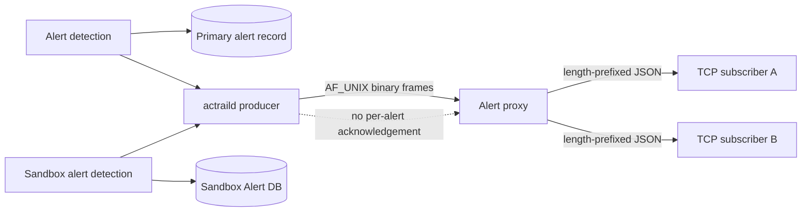

# Alert proxy wire protocol

> 本文定义兼容 daemon producer、alert proxy 与 TCP subscriber 实现所需的协议、认证和故障边界。

This reference defines the daemon-to-proxy protocol and the proxy-to-subscriber protocol. A **producer** is the daemon connection that forwards alerts to the proxy; a **subscriber** is an authenticated TCP client that selects alert topics. A **frame** is one length-delimited protocol message. Implementations must reject malformed frames locally without propagating the failure into unrelated collection or subscriber paths.



The storage records and proxy broadcast are independent delivery paths. Failure after a producer write can lose the broadcast copy without removing the primary Storage record or an independently committed Sandbox Alert DB record.

## Daemon to proxy

The ingress transport is a persistent `AF_UNIX` stream. Both processes must use the same configured socket path. The proxy accepts one active producer at a time.

Each frame begins with this header:

```text
magic       4 bytes  "ATAP"
version     1 byte   2
message     1 byte
reserved    2 bytes  0
length      4 bytes  big-endian u32
payload     length bytes
```

The daemon send limit must not exceed the proxy receive limit.

| Code | Message | Direction |
| --- | --- | --- |
| `0x01` | `ProducerHello` | daemon → proxy |
| `0x02` | `ProducerWelcome` | proxy → daemon |
| `0x03` | `ProducerReject` | proxy → daemon |
| `0x10` | `ForwardAlert` | daemon → proxy |
| `0x20` | `Heartbeat` | daemon → proxy |
| `0x21` | `HeartbeatAck` | proxy → daemon |

### Producer handshake

After connecting, the daemon sends `ProducerHello` with a big-endian `u32 daemon_pid`. The proxy requires this value to equal `SO_PEERCRED.pid` and validates the configured UID and GID allowlists. Socket parent, ownership, and mode are configured and applied during proxy startup.

After protocol, peer credential, the complete readiness gate, and producer-slot checks pass, the proxy returns an empty `ProducerWelcome`. The connection is not an active producer before that response. A second producer receives `ProducerReject` and is closed. Its payload is `u16 code_length` followed by UTF-8 error-code bytes.

### ForwardAlert payload

`ForwardAlert` does not carry an external message ID or labels. Its payload is encoded in this order:

```text
detected_at_ms       u64 big-endian
severity             u8: 1=info, 2=warning, 3=critical
source_kind          u8: 1=trace, 2=sandbox
source               variant payload
category_length      u16 big-endian
category             UTF-8 bytes
has_description      u8: 0 or 1
description_length   u16 big-endian, when present
description          UTF-8 bytes, when present
extras_length        u32 big-endian
extras               UTF-8 JSON object bytes
```

Trace source:

```text
trace_id_length      u16 big-endian
trace_id             UTF-8 bytes
```

Sandbox source:

```text
gateway_id           u32 big-endian, non-zero
sb_id                u32 big-endian, non-zero
guest_boot_id        16 raw bytes, non-zero
has_process          u8: 0 or 1
pid                  u32 big-endian, when present and non-zero
start_time_ticks     u64 big-endian, when present and non-zero
executable_name      16 raw bytes, when present
```

The source variants are mutually exclusive. A sandbox source does not encode a trace ID. Configured limits for trace ID, category, description, and extras must fit their protocol length fields. The proxy validates UTF-8, severity, presence flags, field lengths, the 13-digit detection timestamp, and that `extras` is a JSON object.

### Producer heartbeat and failure behavior

The daemon sends `Heartbeat` at the configured producer heartbeat interval even while alerts are flowing. Its payload is a big-endian `u64 nonce`; the proxy returns the same nonce in `HeartbeatAck`.

Only one heartbeat may be outstanding. The acknowledgement timeout starts when that heartbeat is sent, and the next heartbeat is sent only after the matching acknowledgement. `Heartbeat` is never passed to the broadcaster. Write failure, EOF, HUP, an invalid acknowledgement, or acknowledgement timeout sets both the requested and effective daemon-link state to disabled. Other frames do not satisfy or extend the heartbeat deadline.

Any valid producer frame refreshes producer activity. When the producer idle timeout expires, the proxy releases the producer slot. Producer idle timeout must exceed both heartbeat interval and acknowledgement timeout.

The protocol has no per-alert acknowledgement. A frame written before the proxy exits may be lost before broadcast. This does not affect the primary Storage alert record or an independently committed Sandbox Alert DB record.

## Proxy to subscriber

The subscriber listener uses TCP. Each message is a four-byte big-endian JSON length followed by UTF-8 JSON. Receivers must not rely on individual `read` boundaries.

The proxy does not provide built-in TLS. Loopback is the default bind scope. Protected internal networks must explicitly permit insecure remote binding; untrusted networks must terminate TLS before the proxy.

The first message must be a handshake. An unhandshaken connection cannot subscribe or receive alerts.

### Subscriber handshake

Request:

```json
{
  "action": "handshake",
  "version": "v1",
  "auth": { "token": "jwt_xxx" },
  "client_id": "hostname-001"
}
```

Success response:

```json
{
  "status": "success",
  "session_id": "sess_abc123",
  "heartbeat_interval": 30
}
```

In v1, `auth.token` is an opaque bearer token. The proxy compares equal-length values using a byte-wise XOR accumulator; it does not hash the token or claim JWT signature, issuer, audience, or expiry validation. Empty token sets, empty tokens, and deployment placeholder tokens fail startup. Tokens must never be logged.

`client_id` must be non-empty and within its configured maximum length. `session_id` identifies the connection only for the lifetime of the proxy process.

### Subscription

Request:

```json
{
  "id": "req_001",
  "action": "subscribe",
  "topics": ["oom.killed"],
  "filter": {
    "severity": ["critical", "warning"],
    "tags": {}
  }
}
```

Accepted response:

```json
{
  "id": "req_001",
  "status": "accepted",
  "subscribed_topics": ["oom.killed"]
}
```

A new subscription atomically replaces the session subscription. The response returns exactly the accepted topics and must not add other topics. Topics are validated for non-empty value, length, count, and allowed characters; the proxy does not maintain a static category catalog. Every syntactically valid topic is accepted and returned unchanged. Topics match the alert `cat` field exactly. An empty topic list subscribes to nothing.

Severity values match `s` exactly. An empty list disables severity filtering. A non-empty list can contain `info`, `warning`, and `critical` at most once each. `filter.tags` is reserved and v1 accepts only an empty object; a future version may match it against alert `labels`.

### Alert push

```json
{
  "id": "550e8400-e29b-41d4-a716-446655440000",
  "ts": 1755912345678,
  "source": { "trid": "trace-id" },
  "s": "critical",
  "cat": "oom.killed",
  "description": "Guest OOM kill count increased",
  "labels": {},
  "extras": {}
}
```

`ts` is detection time, not proxy receive or send time. `extras` must be a JSON object, and product-specific fields belong there rather than in the top-level envelope.

Sandbox source:

```json
{
  "sandbox": {
    "gateway_id": 7,
    "sb_id": 3,
    "boot_id": "550e8400-e29b-41d4-a716-446655440000",
    "process": {
      "pid": 123,
      "start_time_ticks": 456,
      "executable_name_hex": "7869616f6f0000000000000000000000"
    }
  }
}
```

Resource-level sandbox alerts omit `process`.

### Subscriber heartbeat

The proxy sends a ping at the configured interval even while alerts are flowing. Only one ping may be outstanding:

```json
{ "action": "ping", "nonce": 42, "ts": 1755912345678 }
```

The subscriber echoes the nonce and timestamp:

```json
{ "action": "pong", "nonce": 42, "ts": 1755912345678 }
```

Any valid inbound frame refreshes peer activity, but only a matching pong satisfies the outstanding ping deadline. A pong without an outstanding ping or with a different nonce is a protocol error. Subscribe and other valid frames do not clear or extend that deadline. A pong timeout or peer idle timeout closes only that subscriber session. Peer idle timeout must exceed heartbeat interval.

### Errors

Handshake, authentication, and subscription semantic errors return an error and close the connection:

```json
{
  "status": "error",
  "id": "req_001",
  "code": "invalid_subscription",
  "message": "subscription topics are invalid"
}
```

Invalid frame headers, lengths, UTF-8, or JSON cause immediate connection closure.

Subscription errors echo the request `id`; handshake errors omit `id`. The error `message` must not
contain tokens, internal paths, or other secrets.
