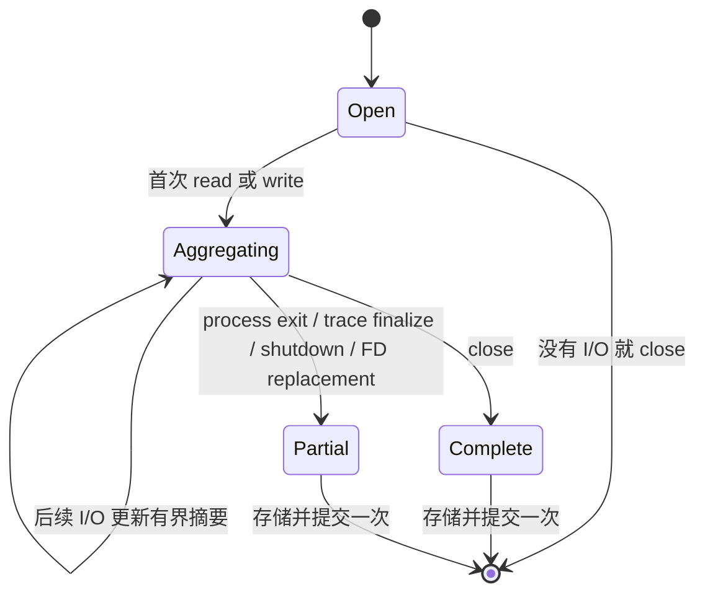

# File I/O 终态动作

> 本文定义将 file read/write 聚合为每个生命周期一个有界终态动作的规范。

Owner: file 语义投影器与导出运行时
Scope: File I/O action 的有界聚合与终态导出

`SemanticAction` 是 AcTrail 对一次有意义操作的存储与导出表示。one-shot action 创建时即为终态；聚合 File I/O 在显式生命周期边界前只保留有界内部状态，边界到达后才构造、持久化并提交一次正式 action。

FD 是 Linux file descriptor。capacity eviction 不是生命周期边界，因此不出现在图中，也不能生成终态 action。

同一次 open/close 生命周期内，read 与 write 分别形成 `file.read` 和 `file.write`。close 是正常边界；process exit、trace finalization、graceful shutdown 或 FD replacement 把已有状态收口为 Partial，但不得伪造 close evidence。另一个 action 的开始只有通过同一 aggregation scope 的显式 transition rule 才能关闭当前 aggregate。

默认摘要必须为 O(1)，包含 open、first I/O、last I/O、close、总字节数、操作次数和错误次数。只有一次 I/O 时只引用该事件一次。任一失败 I/O 都使终态为 Error，后续成功不得覆盖。

同一底层事实只有一种语义表示。summary 接管后禁止再输出对应 detailed action；未关联 I/O 只有自身语义完整时才可生成 one-shot action。

持久化与异步导出是相互独立的 best-effort outcome，不要求原子一致。queue 满时丢弃新 export record，不替换已排队记录。持久化、admission、encoding 和 delivery 失败必须产生结构化诊断与计数。

active aggregate 和 export queue 必须有界。capacity eviction 不是生命周期边界，不得伪造 Partial；被淘汰 handle 在真实边界前不得降级为 per-I/O 输出。
