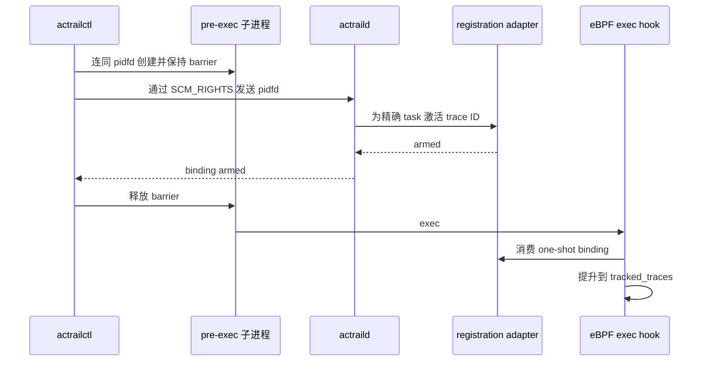

# Launch trace 注册流程

> 本文定义新启动子进程在首次 exec 前完成无竞态 trace 绑定的必需行为。

Status: Accepted
Owner: 控制面与 eBPF 身份跟踪
Scope: `actrailctl launch` 在子进程首次 exec 前的注册

已有进程的 attach 不在本规范范围内。pidfd 是 Linux 内核中稳定指向一个进程的 handle，即使数字 PID 被复用也不会改变目标；pre-exec barrier 在 daemon 确认注册前阻止子进程进入 `execve` 或 `execveat`。

## 公共生命周期

1. launcher 创建子进程和 pidfd，并让子进程停在 pre-exec barrier。
2. launcher 通过 `SCM_RIGHTS` 把 pidfd 传给 `actraild`。
3. daemon 鉴权、分配 trace ID，并为 pidfd 精确指向的 task 激活所选 registration adapter。
4. daemon 回复 `binding armed` 后，launcher 才能释放子进程进入 exec。
5. exec hook 在继续正常 exec 采集前，把 one-shot registration 提升到 `tracked_traces`。

`SCM_RIGHTS` 是 Unix socket 在进程间传递已打开文件描述符的机制。图中的 acknowledgement 顺序是强制约束。公共流程禁止退回只用数字 PID 注册；`clone3(CLONE_PIDFD)` 返回 `ENOSYS` 时，可用 `clone(CLONE_PIDFD | SIGCHLD)` 仅替代创建 syscall，其余 barrier、校验和 acknowledgement 保持不变。

## Task-storage 适配器

支持 BPF task storage 时，daemon 先向 pidfd 对应 task 写入 trace ID，再增加共享 `pending_count`，然后回复。未跟踪的 exec 只有在 `pending_count` 非零时才查询 task storage；命中后必须依次更新 `tracked_traces`、删除 task-storage value、原子减少 `pending_count`。后续热路径只查询 `tracked_traces`。

## Linux 5.10 适配器

Linux 5.10 缺少 BPF task storage 及 helper。其 adapter 只能把 exec 前 one-shot handoff 替换为 PID-generation HASH，同时保留 pidfd 身份、barrier、armed acknowledgement 和提升后的跟踪行为。daemon 与 eBPF 必须通过 host PID 加 generation 证明写入者和领取者是同一进程；单一 module 拥有 adapter、map、异常事件和共享 `pending_count`。

每个 release 在构建时只选择一对匹配的 userspace/eBPF adapter，不得运行时携带两套机制。无法原子取得 pidfd、校验目标、激活 registration 或维持 counter/map 一致性时，本次 launch 必须失败，禁止把未注册子进程当成成功放行。
