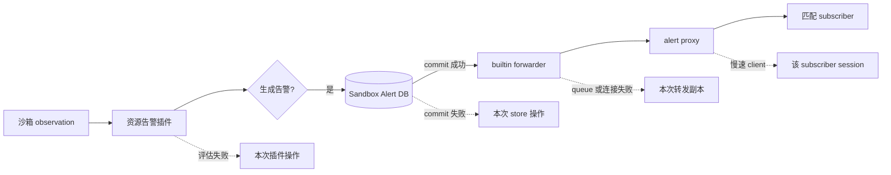

# 告警交付隔离

> 本文定义告警评估、持久化、转发和 subscriber session 的故障隔离边界。

Status: Implemented
Owner: 沙箱告警服务与告警转发插件
Scope: 告警评估、持久化和外部交付的故障边界

实线表示成功通路，虚线表示最大故障域；任何虚线都不能返回 observation ingest。

沙箱资源告警按 `(gateway-id, sb-id)` 使用有界状态评估，这对 ID 标识一个 live gateway 与 sandbox session。阈值由插件拥有，可通过支持的在线配置路径更新；source-state capacity 是启动配置，禁止在线修改。

资源插件产生 OOM victim、可用内存过低、区间 CPU 过高以及区间 read/write bytes 过高等 typed alert，不生成 JSON、trace 或 semantic action。

只有成功写入独立 Sandbox Alert DB 后，告警才可交给外部 forwarder。alert store、forwarding queue、proxy 或 subscriber 的失败不得上报为手侧 observation consume 失败。

转发必须非阻塞且有界。disable 或连接失败使当前 connection generation 失效；旧 generation 的 queued record 禁止在后续重连发送。subscriber filter 和 queue pressure 按 subscriber 隔离，慢 subscriber 不得延迟其他 subscriber 或 producer。

启动配置、鉴权材料、必需 bind 和必需初始连接在启动时失败。运行期 protocol error、断连、timeout、queue 满和单个 consumer 失败保持局部，并输出显式诊断或计数。
