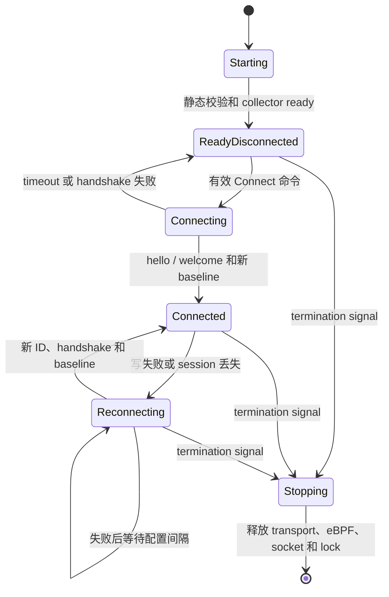

# 执行隔离生命周期

> 本文定义隔离通路的启动 ready、session identity、发布、重连和关闭行为。

Status: Implemented
Owner: `actrail-sb`、`actrail-vsock-gateway` 与 `GatewayIngestRuntime`
Scope: startup、session、publication、reconnect 与 shutdown

状态模型分别作用于每个 Guest session。`ReadyDisconnected` 表示 collector 已运行而 publication gate 关闭。

只有 `Connected` 接纳新 observation。两个断连状态仍持续采集，但在 publication boundary 立即丢弃 observation。

## 启动

每个进程在宣布 ready 前必须校验静态配置、容量、必需内核能力、bind address 以及必需 store 或 plugin。缺失 tracepoint 或 endpoint 无效时不得换用其他 collector 或 transport 冒充成功。

`actrail-sb daemon` 可在没有 VSOCK session 时 ready；它必须在制作 Guest snapshot 前初始化采集，snapshot 中不得包含 live data session。`actrail-sb connect` 只是 Guest-local control 操作，不加载 eBPF，也不拥有数据连接。

## Session 身份

daemon 在有效 gateway hello 后分配非零 `gateway-id`；gateway 在有效 SB hello 后分配非零 `sb-id`。二者只是 live connection 范围的 transport-session ID，断连即失效，重连获得新 ID。daemon source key 为 `(gateway-id, sb-id)`，不得转换成脑侧 identity。

每个 SB sender session 的 observation sequence 从 1 开始。持久化 evidence 使用独立 ingest epoch，禁止从复用的 connection ID 推断连续性。

## 发布与重连

完整 hello/welcome 后 connection gate 才能打开。关闭期间采集继续，但 observation 不入队、不存储、不重放。新 session 必须先建立新 baseline 和 sequence boundary。

所有 queue 和 per-connection quota 都必须有界。慢速或失败下游不得阻塞采集；SB quota 失败只关闭该 session。gateway upstream 失败使当前连接失效，保留 listener，并按配置间隔重连。daemon connection、plugin 或 store 失败局限在对应 component。

Heartbeat 是空闲活性 frame，不要求回复。任一有效 observation frame 都刷新活性。duplicate hello、invalid frame、非空 heartbeat 或超长 payload 只关闭违规连接。

## 关闭

shutdown 先关闭 control admission 和 publication，再停止 collector 并释放 transport、eBPF、local socket 和 instance lock。pending observation 可以丢弃；shutdown 不得发起 reconnect 或无限等待 queue 排空。
