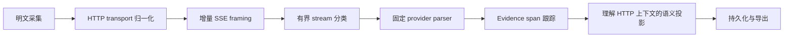

# 流式解析器

> 本文定义 HTTP、SSE、provider、evidence 和语义投影的职责边界。

Owner: HTTP 与 LLM 语义投影流水线
Scope: 增量 HTTP/SSE/provider 解析与 stream finalization

## 必需流水线

每条箭头都是一条所有权边界。SSE（Server-Sent Events）是 HTTP response body 中以空行分隔的事件。`SemanticAction` 是 AcTrail 对有意义的 agent 或进程动作进行存储和导出的表示。任何层都不得解析上游协议拥有的 framing；HTTP header、HTTP/1 chunk 语法和 HTTP/2 frame 禁止直接进入 SSE framer。只有持有已确认 HTTP exchange context 的 projector 才可生成 `SemanticAction`。

## 增量所有权

- connection router 按 trace、process、connection 和 direction 隔离状态；HTTP/2 再加入 `stream_id`。
- HTTP/1 decoder 只保留未完整 header 或 chunk boundary，并在 transport boundary 已知后释放 wire message。
- HTTP/2 decoder 最多保留一个未完整 frame tail，按 stream ID 解复用完整 DATA frame，禁止把 partial frame 当成未知应用数据。
- SSE framer 只扫描新增后缀，只输出以空行终止的完整事件，最多保留未完整事件状态。
- provider 确认后，由单个 parser object 持有该 stream 的有界语义 aggregate，不保留全部 raw event。
- evidence tracking 使用单调、有界 span，不复制完整 payload。

每层处理输入字节的摊销复杂度必须为线性。connection、stream、header、frame tail、pending event、aggregate、tool call 和 evidence span 的上限必须可配置并在启动时校验。

## 分类

分类状态只有 `Undetermined` 与 `ConfirmedLlm`。ping、comment 或 metadata 不能证明它是普通 SSE。soft sniff budget 只限制初期识别工作；达到预算不得丢弃事件或永久定类，后续完整事件仍可确认 provider。确认后固定 parser，不得对每个事件重新运行 provider registry。

## 收口

provider 完成且 HTTP boundary 完整时生成 terminal success。trace close、capture gap、truncation、硬 buffer limit、protocol mismatch 或 reset 都进入同一个 per-stream finalizer。

已确认的 LLM stream 若包含有效内容，异常结束时生成 partial/error response 及其 call 关系；否则只生成 compact diagnostic。诊断不得包含 payload body、header 或 token 正文。finalization 与下游写失败只影响当前 logical stream。
