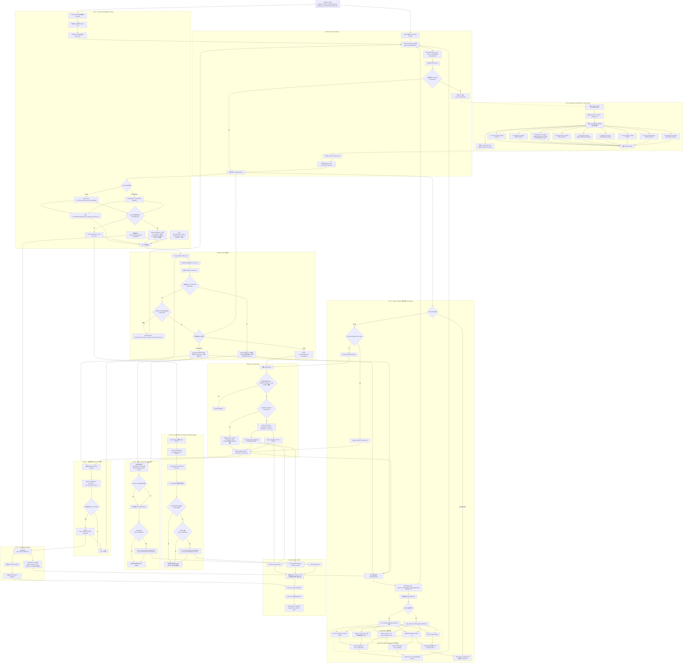

# TLS 采集流程

```mermaid
flowchart TD
  CONFIG["operator config: payload_tls_capture_backend=tls-sync; payload_tls_source/resolver/library=auto"] --> DAEMON["actraild 启动 tls-sync plan resolver"]

  subgraph FAST["fast::resolve(binary, provider=auto, source=auto)"]
    FAST_IN["输入 binary path 或 executable name"]
    FAST_ELF["解析 entry ELF、build-id、architecture"]
    FAST_CANDIDATES["同级 resolver 候选；数字只表示尝试顺序"]
    FAST_R1["1. rustls executable symbol resolver"]
    FAST_R2["2. OpenSSL executable symbol resolver"]
    FAST_R3["3. BoringSSL executable symbol-map resolver；仅显式 BoringSSL provider"]
    FAST_R4["4. OpenSSL direct shared-library resolver"]
    FAST_R5["5. BoringSSL shared-library symbol-map resolver"]
    FAST_R6["6. OpenSSL recursive shared-library resolver"]
    FAST_R7["7. Go executable pclntab resolver"]
    FAST_R8["8. rustls executable byte-pattern resolver"]
    FAST_R9["9. BoringSSL executable byte-pattern resolver"]
    FAST_PLAN["返回 ProbePointPlan"]
    FAST_NONE["返回 no supported TLS payload probe points found"]

    FAST_IN --> FAST_ELF
    FAST_ELF --> FAST_CANDIDATES
    FAST_CANDIDATES --> FAST_R1
    FAST_CANDIDATES --> FAST_R2
    FAST_CANDIDATES --> FAST_R3
    FAST_CANDIDATES --> FAST_R4
    FAST_CANDIDATES --> FAST_R5
    FAST_CANDIDATES --> FAST_R6
    FAST_CANDIDATES --> FAST_R7
    FAST_CANDIDATES --> FAST_R8
    FAST_CANDIDATES --> FAST_R9
    FAST_R1 --> FAST_PLAN
    FAST_R2 --> FAST_PLAN
    FAST_R3 --> FAST_PLAN
    FAST_R4 --> FAST_PLAN
    FAST_R5 --> FAST_PLAN
    FAST_R6 --> FAST_PLAN
    FAST_R7 --> FAST_PLAN
    FAST_R8 --> FAST_PLAN
    FAST_R9 --> FAST_PLAN
    FAST_CANDIDATES --> FAST_NONE
  end

  subgraph PLAN_STORE["daemon binary plan storage"]
    STORE_REQ["TlsSyncPlanResolver 收到 plan lookup 或 prewarm"]
    STORE_KEY["按 canonical path、size、mtime、build-id 构造 BinaryPlanKey"]
    STORE_GET["BinaryPlanStore::get"]
    STORE_HIT{"缓存命中 Found 或 Unsupported"}
    STORE_RESOLVE["未命中：调用 fast::resolve(binary)"]
    STORE_VALIDATE["validate_native_backend_plan"]
    STORE_PUT["BinaryPlanStore::put Found 或 Unsupported"]
    STORE_RETURN["返回 PlanLookupResponse"]

    DAEMON --> STORE_REQ
    STORE_REQ --> STORE_KEY
    STORE_KEY --> STORE_GET
    STORE_GET --> STORE_HIT
    STORE_HIT -->|"是"| STORE_RETURN
    STORE_HIT -->|"否"| STORE_RESOLVE
    STORE_RESOLVE -.-> FAST_IN
    FAST_PLAN -.-> STORE_VALIDATE
    FAST_NONE -.-> STORE_PUT
    STORE_VALIDATE --> STORE_PUT
    STORE_PUT --> STORE_RETURN
  end

  subgraph LAUNCH["入口 A：actrailctl launch 初始 command"]
    LAUNCH_IN["actrailctl launch 接收初始 command"]
    LAUNCH_TRACE["创建 trace 并登记 launch root"]
    LAUNCH_LOOKUP["对 initial command 提交 plan lookup"]
    LAUNCH_RESULT{"plan lookup 结果"}
    LAUNCH_BUNDLE["Found：写入 TLS_PAYLOAD_SYNC_PLAN_BUNDLE"]
    LAUNCH_NO_PLAN["Unsupported：bundle 不含 initial plan"]
    LAUNCH_PRELOAD["注入 LD_PRELOAD=libactrail_tls_payload_probe_sync.so"]
    LAUNCH_AUDIT_DECIDE{"bundle 中是否存在 executable plan"}
    LAUNCH_AUDIT_ON["无 executable plan：注入 LD_AUDIT"]
    LAUNCH_AUDIT_OFF["有 executable plan：不注入 LD_AUDIT，避免 DT_NEEDED binding 与 inline hook 重复"]
    LAUNCH_TLS_ENV["注入 TLS_PAYLOAD_SYNC_* event socket、trace id、redaction、limits"]
    LAUNCH_JAVA_ENV["按配置注入 JAVA_TOOL_OPTIONS javaagent"]
    LAUNCH_EXEC["exec 初始进程"]

    LAUNCH_IN --> LAUNCH_TRACE
    LAUNCH_TRACE --> LAUNCH_LOOKUP
    LAUNCH_LOOKUP --> STORE_REQ
    STORE_RETURN --> LAUNCH_RESULT
    LAUNCH_RESULT -->|"Found"| LAUNCH_BUNDLE
    LAUNCH_RESULT -->|"Unsupported"| LAUNCH_NO_PLAN
    LAUNCH_BUNDLE --> LAUNCH_PRELOAD
    LAUNCH_NO_PLAN --> LAUNCH_PRELOAD
    LAUNCH_BUNDLE --> LAUNCH_AUDIT_DECIDE
    LAUNCH_NO_PLAN --> LAUNCH_AUDIT_DECIDE
    LAUNCH_AUDIT_DECIDE -->|"否"| LAUNCH_AUDIT_ON
    LAUNCH_AUDIT_DECIDE -->|"是"| LAUNCH_AUDIT_OFF
    LAUNCH_PRELOAD --> LAUNCH_EXEC
    LAUNCH_AUDIT_ON --> LAUNCH_EXEC
    LAUNCH_AUDIT_OFF --> LAUNCH_EXEC
    LAUNCH_TLS_ENV --> LAUNCH_EXEC
    LAUNCH_JAVA_ENV --> LAUNCH_EXEC
  end

  CONFIG --> LAUNCH_IN

  subgraph RUNTIME_INIT["preload runtime 初始化"]
    INIT_START[".init_array 进入 runtime::init"]
    INIT_CONFIG["RuntimeConfigFactory::from_env"]
    INIT_FLUSH["注册 atexit flush event client"]
    INIT_AUDIT_NS{"当前是否 LD_AUDIT audit namespace"}
    INIT_AUDIT_ONLY["audit namespace：只保留 binding 回调与配置，不安装 initial inline hook"]
    INIT_BUNDLE{"当前 executable 是否匹配 bundle plan"}
    INIT_DAEMON_LOOKUP["无 bundle plan：lookup_daemon_plan_for_current_process(current_exe)"]
    INIT_PLAN{"当前进程 plan 结果"}
    INIT_INSTALL["Found：install_plan(current executable)"]
    INIT_NO_PLAN["Unsupported 或无 socket：保留 runtime hooks，等待动态入口"]

    LAUNCH_EXEC --> INIT_START
    INIT_START --> INIT_CONFIG
    INIT_CONFIG --> INIT_FLUSH
    INIT_FLUSH --> INIT_AUDIT_NS
    INIT_AUDIT_NS -->|"是"| INIT_AUDIT_ONLY
    INIT_AUDIT_NS -->|"否"| INIT_BUNDLE
    INIT_BUNDLE -->|"有"| INIT_PLAN
    INIT_BUNDLE -->|"没有"| INIT_DAEMON_LOOKUP
    INIT_DAEMON_LOOKUP --> STORE_REQ
    STORE_RETURN --> INIT_PLAN
    INIT_PLAN -->|"Found"| INIT_INSTALL
    INIT_PLAN -->|"Unsupported"| INIT_NO_PLAN
  end

  subgraph INSTALL["install_plan / register plan"]
    INSTALL_IN["接收 RuntimePlan"]
    INSTALL_DUP{"是否已被同 binary、OpenSSL interpose、rustls singleton 覆盖"}
    INSTALL_SKIP["DuplicateSkipped"]
    INSTALL_OPENSSL_SHARED{"provider=openssl 且 target!=binary"}
    INSTALL_REGISTER["注册 OpenSSL shared-library plan；由 interpose/binding wrapper 捕获"]
    INSTALL_INLINE["native inline hook：OpenSSL executable、BoringSSL、rustls、Go"]
    INSTALL_RUSTLS["rustls plaintext symbols 或 byte-pattern hooks"]
    INSTALL_SSL["SSL_read/write/ex inline hooks"]
    INSTALL_STATE["记录 installed_binaries / ssl_binary / rustls_binary"]

    INIT_INSTALL --> INSTALL_IN
    INSTALL_IN --> INSTALL_DUP
    INSTALL_DUP -->|"是"| INSTALL_SKIP
    INSTALL_DUP -->|"否"| INSTALL_OPENSSL_SHARED
    INSTALL_OPENSSL_SHARED -->|"是"| INSTALL_REGISTER
    INSTALL_OPENSSL_SHARED -->|"否"| INSTALL_INLINE
    INSTALL_INLINE --> INSTALL_RUSTLS
    INSTALL_INLINE --> INSTALL_SSL
    INSTALL_REGISTER --> INSTALL_STATE
    INSTALL_RUSTLS --> INSTALL_STATE
    INSTALL_SSL --> INSTALL_STATE
  end

  subgraph AUDIT_BINDING["入口 B：DT_NEEDED / LD_AUDIT per-binding wrapper"]
    AUDIT_LOAD["dynamic linker 加载 audit library"]
    AUDIT_VERSION["la_version 标记 audit namespace 并 retry initialize"]
    AUDIT_OBJOPEN["la_objopen 标记 runtime 自身 cookie"]
    AUDIT_SYMBIND["la_symbind64 观察符号绑定"]
    AUDIT_OWN{"defcook/refcook 是否 runtime 自身"}
    AUDIT_SYMBOL{"symbol 是否 SSL_read/write/ex"}
    AUDIT_WRAPPER["get_or_create_bound_wrapper(kind, real_sym, BindingSource::Audit)"]
    AUDIT_RETURN["返回真实符号或 bound wrapper 给动态链接器"]

    LAUNCH_AUDIT_ON --> AUDIT_LOAD
    AUDIT_LOAD --> AUDIT_VERSION
    AUDIT_VERSION --> AUDIT_OBJOPEN
    AUDIT_OBJOPEN --> AUDIT_SYMBIND
    AUDIT_SYMBIND --> AUDIT_OWN
    AUDIT_OWN -->|"是"| AUDIT_RETURN
    AUDIT_OWN -->|"否"| AUDIT_SYMBOL
    AUDIT_SYMBOL -->|"是"| AUDIT_WRAPPER
    AUDIT_SYMBOL -->|"否"| AUDIT_RETURN
    AUDIT_WRAPPER --> AUDIT_RETURN
  end

  subgraph RESOLVER_BINDING["入口 C：dlsym / dlvsym bound wrapper"]
    RESOLVER_CALL["目标进程调用 dlsym(handle, symbol) 或 dlvsym(handle, symbol, version)"]
    RESOLVER_GUARD{"resolver guard 是否已进入"}
    RESOLVER_REAL["调用真实 libc dlsym/dlvsym"]
    RESOLVER_SYMBOL{"symbol 是否 SSL_read/write/ex"}
    RESOLVER_WRAPPER["get_or_create_bound_wrapper(kind, real_sym, BindingSource::Resolver)"]
    RESOLVER_RETURN["返回真实符号或 bound wrapper"]

    INIT_AUDIT_ONLY --> RESOLVER_CALL
    INIT_NO_PLAN --> RESOLVER_CALL
    INSTALL_STATE --> RESOLVER_CALL
    RESOLVER_CALL --> RESOLVER_GUARD
    RESOLVER_GUARD -->|"是"| RESOLVER_REAL
    RESOLVER_GUARD -->|"否"| RESOLVER_REAL
    RESOLVER_REAL --> RESOLVER_SYMBOL
    RESOLVER_SYMBOL -->|"是"| RESOLVER_WRAPPER
    RESOLVER_SYMBOL -->|"否"| RESOLVER_RETURN
    RESOLVER_WRAPPER --> RESOLVER_RETURN
  end

  subgraph DLOPEN_SCAN["入口 D：dlopen / dlmopen 动态加载 native library"]
    DLOPEN_CALL["目标进程调用 dlopen/dlmopen"]
    DLOPEN_PREFETCH["真实 dlopen 前：prefetch_runtime_plan_for_binary(requested absolute .so)"]
    DLOPEN_REAL["调用真实 dlopen/dlmopen"]
    DLOPEN_SUCCESS{"handle 是否非空"}
    DLOPEN_SCAN_DIRECT["scan_requested_library(requested path)"]
    DLOPEN_SCAN_MAPS["scan_loaded_tls_libraries(/proc/self/maps)"]

    subgraph LIB_KIND["loaded library 载体分类"]
      LIB_OPENSSL["libssl.so / OpenSSL shared object"]
      LIB_PYSSL["Python _ssl extension；通常继续映射 libssl.so"]
      LIB_TCNATIVE["libnetty_tcnative_*.so；Netty JNI native carrier"]
      LIB_JNI["其他 JNI/JNA/native addon .so"]
      LIB_OTHER["非 TLS shared object"]
    end

    subgraph PROVIDER_KIND["loaded library 内部 TLS provider / 符号形态"]
      PROVIDER_OPENSSL["provider=OpenSSL；SSL_read/write/ex"]
      PROVIDER_BORINGSSL["provider=BoringSSL；SSL_read/write"]
      PROVIDER_UNKNOWN["provider 未识别或无 TLS plaintext symbol"]
    end

    LIB_LOOKUP["runtime_plan_for_binary(loaded library)"]
    LIB_PLAN{"plan lookup 结果"}
    LIB_BINDING{"dynamic_binding_covers_plan"}
    LIB_REGISTER["register_dynamic_binding_plan"]
    LIB_INSTALL["install_plan(loaded library)"]
    LIB_UNSUPPORTED["Unsupported：该 library 不采集 TLS plaintext"]

    INIT_AUDIT_ONLY --> DLOPEN_CALL
    INIT_NO_PLAN --> DLOPEN_CALL
    INSTALL_STATE --> DLOPEN_CALL
    DLOPEN_CALL --> DLOPEN_PREFETCH
    DLOPEN_PREFETCH --> STORE_REQ
    DLOPEN_PREFETCH --> DLOPEN_REAL
    DLOPEN_REAL --> DLOPEN_SUCCESS
    DLOPEN_SUCCESS -->|"是"| DLOPEN_SCAN_DIRECT
    DLOPEN_SUCCESS -->|"是"| DLOPEN_SCAN_MAPS
    DLOPEN_SCAN_DIRECT --> LIB_OPENSSL
    DLOPEN_SCAN_DIRECT --> LIB_TCNATIVE
    DLOPEN_SCAN_DIRECT --> LIB_JNI
    DLOPEN_SCAN_DIRECT --> LIB_OTHER
    DLOPEN_SCAN_MAPS --> LIB_OPENSSL
    DLOPEN_SCAN_MAPS --> LIB_PYSSL
    DLOPEN_SCAN_MAPS --> LIB_TCNATIVE
    DLOPEN_SCAN_MAPS --> LIB_JNI
    DLOPEN_SCAN_MAPS --> LIB_OTHER
    LIB_OPENSSL --> PROVIDER_OPENSSL
    LIB_PYSSL --> PROVIDER_OPENSSL
    LIB_TCNATIVE --> PROVIDER_BORINGSSL
    LIB_JNI --> PROVIDER_OPENSSL
    LIB_JNI --> PROVIDER_BORINGSSL
    LIB_JNI --> PROVIDER_UNKNOWN
    LIB_OTHER --> PROVIDER_UNKNOWN
    PROVIDER_OPENSSL --> LIB_LOOKUP
    PROVIDER_BORINGSSL --> LIB_LOOKUP
    PROVIDER_UNKNOWN --> LIB_UNSUPPORTED
    LIB_LOOKUP --> STORE_REQ
    STORE_RETURN --> LIB_PLAN
    LIB_PLAN -->|"Found"| LIB_BINDING
    LIB_PLAN -->|"Unsupported"| LIB_UNSUPPORTED
    LIB_BINDING -->|"是"| LIB_REGISTER
    LIB_BINDING -->|"否"| LIB_INSTALL
    LIB_INSTALL --> INSTALL_IN
    LIB_REGISTER --> INSTALL_STATE
  end

  subgraph CHILD_EXEC["入口 E：已监控进程 fork/exec 子进程"]
    CHILD_EXECVE["父进程 execve/execveat interpose"]
    CHILD_NATIVE_ENV["合并 LD_PRELOAD、LD_AUDIT、TLS_PAYLOAD_SYNC_*"]
    CHILD_JAVA_CHECK{"子进程是否 Java command"}
    CHILD_JAVA_ENV["合并 JAVA_TOOL_OPTIONS javaagent"]
    CHILD_EXEC_CALL["exec 子进程"]

    INIT_NO_PLAN --> CHILD_EXECVE
    INSTALL_STATE --> CHILD_EXECVE
    CHILD_EXECVE --> CHILD_NATIVE_ENV
    CHILD_NATIVE_ENV --> CHILD_JAVA_CHECK
    CHILD_JAVA_CHECK -->|"是"| CHILD_JAVA_ENV
    CHILD_JAVA_CHECK -->|"否"| CHILD_EXEC_CALL
    CHILD_JAVA_ENV --> CHILD_EXEC_CALL
    CHILD_EXEC_CALL --> INIT_START
  end

  subgraph JAVA_JSSE["入口 F：Java JSSE javaagent"]
    JAVA_LOAD["JVM 读取 JAVA_TOOL_OPTIONS"]
    JAVA_AGENT["加载 AcTrail Java agent"]
    JAVA_JSSE_HOOK["拦截 JSSE plaintext read/write"]
    JAVA_NATIVE["Java native TLS 仍走 libnetty_tcnative / JNI / dlopen / DT_NEEDED 路径"]

    LAUNCH_JAVA_ENV --> JAVA_LOAD
    CHILD_JAVA_ENV --> JAVA_LOAD
    JAVA_LOAD --> JAVA_AGENT
    JAVA_AGENT --> JAVA_JSSE_HOOK
    JAVA_LOAD --> JAVA_NATIVE
    JAVA_NATIVE --> DLOPEN_CALL
  end

  subgraph CAPTURE["payload capture 与上报"]
    CAPTURE_INLINE["inline hook replacement"]
    CAPTURE_INTERPOSE["LD_PRELOAD OpenSSL interpose symbol"]
    CAPTURE_BOUND["bound wrapper slot"]
    CAPTURE_REAL["调用真实 TLS function；按返回结果记录方向和长度"]
    CAPTURE_SEGMENT["写入 TLS payload segment"]
    CAPTURE_SOCKET["Unix socket 发送到 daemon"]
    CAPTURE_STORAGE["daemon persist payload / application / semantic action"]

    INSTALL_SSL --> CAPTURE_INLINE
    INSTALL_RUSTLS --> CAPTURE_INLINE
    INSTALL_REGISTER --> CAPTURE_INTERPOSE
    AUDIT_WRAPPER --> CAPTURE_BOUND
    RESOLVER_WRAPPER --> CAPTURE_BOUND
    JAVA_JSSE_HOOK --> CAPTURE_SEGMENT
    CAPTURE_INLINE --> CAPTURE_REAL
    CAPTURE_INTERPOSE --> CAPTURE_REAL
    CAPTURE_BOUND --> CAPTURE_REAL
    CAPTURE_REAL --> CAPTURE_SEGMENT
    CAPTURE_SEGMENT --> CAPTURE_SOCKET
    CAPTURE_SOCKET --> CAPTURE_STORAGE
  end
```
