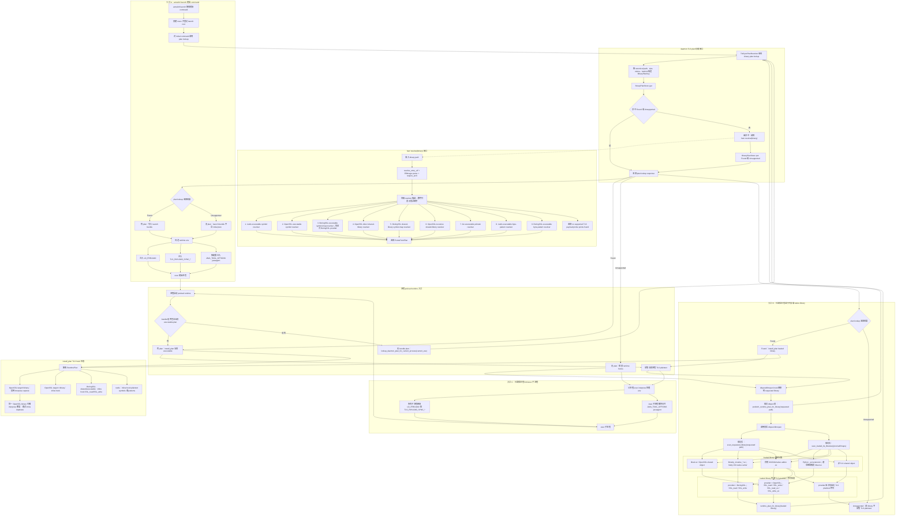

```mermaid
flowchart TD
  subgraph FAST["fast::resolve(binary) 接口"]
    FAST_IN["输入 binary path"]
    FAST_ELF["resolve_entry_elf + ElfImage::parse + require_arch"]
    FAST_TRY["同级 resolver 候选；数字只表示尝试顺序"]

    FAST_IN --> FAST_ELF
    FAST_ELF --> FAST_TRY

    FAST_TRY --> FAST_R1["1. rustls executable symbol resolver"]
    FAST_TRY --> FAST_R2["2. OpenSSL executable symbol resolver"]
    FAST_TRY --> FAST_R3["3. BoringSSL executable symbol-map resolver；仅显式 BoringSSL provider"]
    FAST_TRY --> FAST_R4["4. OpenSSL direct shared-library resolver"]
    FAST_TRY --> FAST_R5["5. BoringSSL shared-library symbol-map resolver"]
    FAST_TRY --> FAST_R6["6. OpenSSL recursive shared-library resolver"]
    FAST_TRY --> FAST_R7["7. Go executable pclntab resolver"]
    FAST_TRY --> FAST_R8["8. rustls executable byte-pattern resolver"]
    FAST_TRY --> FAST_R9["9. BoringSSL executable byte-pattern resolver"]

    FAST_R1 --> FAST_PLAN["返回 ProbePointPlan"]
    FAST_R2 --> FAST_PLAN
    FAST_R3 --> FAST_PLAN
    FAST_R4 --> FAST_PLAN
    FAST_R5 --> FAST_PLAN
    FAST_R6 --> FAST_PLAN
    FAST_R7 --> FAST_PLAN
    FAST_R8 --> FAST_PLAN
    FAST_R9 --> FAST_PLAN
    FAST_TRY --> FAST_NONE["返回 no supported TLS payload probe points found"]
  end

  subgraph PLAN_STORE["daemon TLS plan 存储接口"]
    STORE_REQ["TlsSyncPlanResolver 收到 binary plan lookup"]
    STORE_KEY["按 canonical path、size、mtime、build-id 构造 BinaryPlanKey"]
    STORE_GET["BinaryPlanStore::get"]
    STORE_HIT{"命中 Found 或 Unsupported"}
    STORE_RESOLVE["未命中：调用 fast::resolve(binary)"]
    STORE_PUT["BinaryPlanStore::put Found 或 Unsupported"]
    STORE_RETURN["返回 plan lookup response"]

    STORE_REQ --> STORE_KEY
    STORE_KEY --> STORE_GET
    STORE_GET --> STORE_HIT
    STORE_HIT -->|"是"| STORE_RETURN
    STORE_HIT -->|"否"| STORE_RESOLVE
    STORE_RESOLVE -.-> FAST_IN
    STORE_RESOLVE --> STORE_PUT
    STORE_PUT --> STORE_RETURN
  end

  subgraph LAUNCH["入口 A：actrailctl launch 初始 command"]
    LAUNCH_IN["actrailctl launch 接收初始 command"]
    LAUNCH_TRACE["创建 trace 并登记 launch root"]
    LAUNCH_CALL["对 initial command 调用 plan lookup"]
    LAUNCH_RETURN{"plan lookup 返回结果"}
    LAUNCH_BUNDLE["有 plan：写入 launch bundle"]
    LAUNCH_EMPTY["无 plan：launch bundle 不含 initial plan"]
    LAUNCH_ENV["构造 runtime env"]
    LAUNCH_PRELOAD["注入 LD_PRELOAD"]
    LAUNCH_TLS_ENV["注入 TLS_PAYLOAD_SYNC_*"]
    LAUNCH_JAVA_ENV["按配置注入 JAVA_TOOL_OPTIONS javaagent"]
    LAUNCH_EXEC["exec 初始进程"]

    LAUNCH_IN --> LAUNCH_TRACE
    LAUNCH_TRACE --> LAUNCH_CALL
    LAUNCH_CALL --> STORE_REQ
    STORE_RETURN --> LAUNCH_RETURN
    LAUNCH_RETURN -->|"Found"| LAUNCH_BUNDLE
    LAUNCH_RETURN -->|"Unsupported"| LAUNCH_EMPTY
    LAUNCH_BUNDLE --> LAUNCH_ENV
    LAUNCH_EMPTY --> LAUNCH_ENV
    LAUNCH_ENV --> LAUNCH_PRELOAD
    LAUNCH_ENV --> LAUNCH_TLS_ENV
    LAUNCH_ENV --> LAUNCH_JAVA_ENV
    LAUNCH_PRELOAD --> LAUNCH_EXEC
    LAUNCH_TLS_ENV --> LAUNCH_EXEC
    LAUNCH_JAVA_ENV --> LAUNCH_EXEC
  end

  subgraph RUNTIME["进程 preload runtime 入口"]
    PROC_START["进程启动 preload runtime"]
    PROC_BUNDLE{"bundle 是否包含当前 executable plan"}
    PROC_LOOKUP["无 bundle plan：lookup_daemon_plan_for_current_process(current_exe)"]
    PROC_INSTALL["有 plan：install_plan 当前 executable"]
    PROC_NO_PLAN["无 plan：保留 runtime hooks"]
    PROC_CAPTURE["采集当前进程 TLS plaintext"]

    PROC_START --> PROC_BUNDLE
    PROC_BUNDLE -->|"有"| PROC_INSTALL
    PROC_BUNDLE -->|"没有"| PROC_LOOKUP
    PROC_LOOKUP --> STORE_REQ
    STORE_RETURN -->|"Found"| PROC_INSTALL
    STORE_RETURN -->|"Unsupported"| PROC_NO_PLAN
    PROC_INSTALL --> PROC_CAPTURE
  end

  LAUNCH_EXEC --> PROC_START

  subgraph LOADED_LIB["入口 B：已监控进程运行中加载 native library"]
    DLOPEN_HOOK["dlopen/dlmopen hook 观察到 requested library"]
    DLOPEN_PREFETCH["成功 dlopen 前：prefetch_runtime_plan_for_binary(requested path)"]
    DLOPEN_REAL["调用真实 dlopen/dlmopen"]
    DLOPEN_SCAN_DIRECT["成功后：scan_requested_library(requested path)"]
    DLOPEN_SCAN_MAPS["成功后：scan_loaded_tls_libraries(/proc/self/maps)"]

    subgraph LIB_KIND["loaded library 载体分类"]
      LIB_OPENSSL["libssl.so / OpenSSL shared object"]
      LIB_PYSSL["Python _ssl extension；通常继续触发 libssl.so"]
      LIB_TCNATIVE["libnetty_tcnative_*.so；Netty JNI native carrier"]
      LIB_JNI["其他 JNI/JNA/native addon .so"]
      LIB_OTHER["非 TLS shared object"]
    end

    subgraph TLS_PROVIDER_KIND["loaded library 内部 TLS provider / 符号形态"]
      PROVIDER_OPENSSL["provider = OpenSSL；SSL_read / SSL_write / SSL_read_ex / SSL_write_ex"]
      PROVIDER_BORINGSSL["provider = BoringSSL；SSL_read / SSL_write"]
      PROVIDER_UNKNOWN["provider 未识别或无 TLS plaintext 符号"]
    end

    LIB_LOOKUP["runtime_plan_for_binary(loaded library)"]
    LIB_RETURN{"plan lookup 返回结果"}
    LIB_INSTALL["Found：install_plan loaded library"]
    LIB_NO_PLAN["Unsupported：该 library 不采集 TLS plaintext"]

    DLOPEN_HOOK --> DLOPEN_PREFETCH
    DLOPEN_PREFETCH --> STORE_REQ
    DLOPEN_PREFETCH --> DLOPEN_REAL
    DLOPEN_REAL --> DLOPEN_SCAN_DIRECT
    DLOPEN_REAL --> DLOPEN_SCAN_MAPS
    DLOPEN_SCAN_DIRECT --> LIB_OPENSSL
    DLOPEN_SCAN_DIRECT --> LIB_TCNATIVE
    DLOPEN_SCAN_DIRECT --> LIB_JNI
    DLOPEN_SCAN_DIRECT --> LIB_OTHER
    DLOPEN_SCAN_MAPS --> LIB_OPENSSL
    DLOPEN_SCAN_MAPS --> LIB_PYSSL
    DLOPEN_SCAN_MAPS --> LIB_TCNATIVE
    DLOPEN_SCAN_MAPS --> LIB_JNI
    DLOPEN_SCAN_MAPS --> LIB_OTHER

    LIB_OPENSSL --> PROVIDER_OPENSSL
    LIB_PYSSL --> PROVIDER_OPENSSL
    LIB_TCNATIVE --> PROVIDER_BORINGSSL
    LIB_JNI --> PROVIDER_OPENSSL
    LIB_JNI --> PROVIDER_BORINGSSL
    LIB_JNI --> PROVIDER_UNKNOWN
    LIB_OTHER --> PROVIDER_UNKNOWN

    PROVIDER_OPENSSL --> LIB_LOOKUP
    PROVIDER_BORINGSSL --> LIB_LOOKUP
    PROVIDER_UNKNOWN --> LIB_NO_PLAN
    LIB_LOOKUP --> STORE_REQ
    STORE_RETURN --> LIB_RETURN
    LIB_RETURN -->|"Found"| LIB_INSTALL
    LIB_RETURN -->|"Unsupported"| LIB_NO_PLAN
    LIB_INSTALL --> PROC_CAPTURE
  end

  PROC_CAPTURE --> DLOPEN_HOOK
  PROC_NO_PLAN --> DLOPEN_HOOK

  subgraph INSTALL["install_plan TLS hook 状态"]
    INSTALL_IN["接收 RuntimePlan"]
    INSTALL_OPENSSL_INTERPOSE["OpenSSL target!=binary：启用 interpose capture"]
    INSTALL_OPENSSL_INLINE["OpenSSL target==binary：inline hook"]
    INSTALL_OPENSSL_DUP["同一 OpenSSL binary 已被 interpose 覆盖：跳过 inline duplicate"]
    INSTALL_BORINGSSL_INLINE["BoringSSL shared/executable：inline hook SSL_read/SSL_write"]
    INSTALL_RUSTLS_INLINE["rustls：inline hook plaintext symbols 或 patterns"]

    INSTALL_IN --> INSTALL_OPENSSL_INTERPOSE
    INSTALL_IN --> INSTALL_OPENSSL_INLINE
    INSTALL_OPENSSL_INTERPOSE --> INSTALL_OPENSSL_DUP
    INSTALL_IN --> INSTALL_BORINGSSL_INLINE
    INSTALL_IN --> INSTALL_RUSTLS_INLINE
  end

  PROC_INSTALL --> INSTALL_IN
  LIB_INSTALL --> INSTALL_IN

  subgraph CHILD_EXEC["入口 C：已监控进程 fork/exec 子进程"]
    CHILD_WRAP["父进程 exec interpose 处理 env"]
    CHILD_NATIVE_ENV["所有子进程继承 LD_PRELOAD 和 TLS_PAYLOAD_SYNC_*"]
    CHILD_JAVA_ENV["Java 子进程额外合并 JAVA_TOOL_OPTIONS javaagent"]
    CHILD_EXEC_CALL["exec 子进程"]

    CHILD_WRAP --> CHILD_NATIVE_ENV
    CHILD_WRAP --> CHILD_JAVA_ENV
    CHILD_NATIVE_ENV --> CHILD_EXEC_CALL
    CHILD_JAVA_ENV --> CHILD_EXEC_CALL
  end

  PROC_CAPTURE --> CHILD_WRAP
  PROC_NO_PLAN --> CHILD_WRAP
  CHILD_EXEC_CALL --> PROC_START
```
