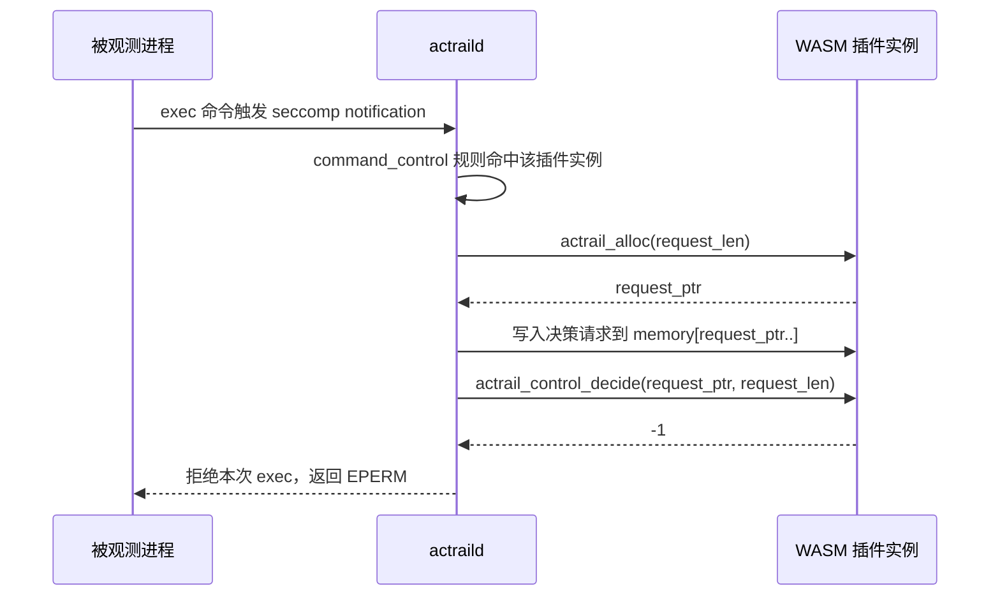

# WASM Core Module 命令拒绝插件

类别：WASM core module 控制决策插件。

这个示例用于命令执行控制。当 `[command_control]` 规则精确命中某个 `exec <absolute-path>` 目标时，daemon 会在继续 seccomp notification 前调用插件。该示例返回拒绝决策，使目标命令收到 `EPERM`。

文件：

- `plugin.toml`：插件 manifest。
- `deny-command.wat`：WebAssembly Text artifact。

## 本示例调用流程

WASM core module 的通用导出和输入写入流程见 [WASM Core Module ABI](../../../../docs/plugins/abi/wasm-core-module.zh.md)。控制决策插件的功能层入口和返回码见 [控制决策 ABI](../../../../docs/plugins/abi/control-decider.zh.md)。

这个示例只展示命令执行命中插件后的拒绝流程：

`actrail_alloc` 不是业务决策函数，它只是给 AcTrail 提供一段插件内存。真正决定是否允许命令执行的是 `actrail_control_decide`。
