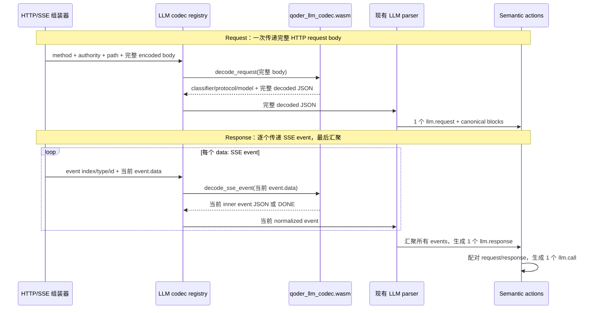

# Qoder LLM Codec 插件示例

这个示例演示 Qoder LLM codec 插件如何把 Qoder CLI 的网络数据转换为 AcTrail 的 LLM 语义动作：

- 未加载插件时，真实 `qodercli` 调用不会产生 Qoder codec 提供的 `llm.request` 和 `llm.response`；
- 加载插件后，同样的调用会产生 `llm.request` 和 `llm.response`；
- 可以通过 `actrailviewer` 查看模型、提示词和响应内容。

## 数据转换流程



各阶段的数据粒度如下：

| 阶段 | 收到的数据 | 发出的数据 | 粒度 |
| --- | --- | --- | --- |
| HTTP request 组装 | 多个 TLS plaintext payload | method、authority、path、完整 body | 每个 HTTP request 一次 |
| `decode_request` | Qoder 编码后的完整 body | 解码后的完整 JSON，以及 classifier/protocol/model | 每个 HTTP request 一次 |
| Request parser | 完整解码 JSON | `llm.request` 与 canonical content blocks | 每个 LLM request 一次 |
| SSE parser | HTTP response byte stream | `event.data` | 每个 SSE event 一次 |
| `decode_sse_event` | 单个 Qoder 外层 event data | 单个内层 JSON event 或 `[DONE]` | 局部增量，不是完整 response |
| Response parser | 一组按顺序到达的内层 events | 聚合后的 content、reasoning、tool calls、usage | 每个完整 LLM response 一次 |
| Call linker | 一个 request action 和一个 response action | `llm.call` 及两个 links | 每次 LLM 调用一次 |

### Request 示例

HTTP 组装器先得到完整请求。下例省略 headers，body 仍是 Qoder 的自定义编码，
此时不能按普通 JSON 解析：

```text
POST /algo/api/v2/service/pro/sse/agent_chat_generation?... HTTP/1.1
Host: api3.qoder.sh
Content-Type: application/json

LuEp&JHg^PYf&DOLIGodbN*dM#S%rDxK^...（完整 Qoder encoded body）
```

codec registry 在核心侧知道 method、authority、path 和完整 body；当前 Qoder
WASM 插件的专用 `decode_request` export 实际只接收完整 body：

```text
decode_request(
  b"LuEp&JHg^PYf&DOLIGodbN*dM#S%rDxK^..."
)
```

插件恢复分段顺序并使用 Qoder alphabet 解码。得到的不是 HTTP chunk，也不是
单个 message，而是完整的 Qoder request JSON。简化、脱敏后的形状类似：

```json
{
  "model_config": {
    "key": "custom_model",
    "format": "openai"
  },
  "custom_model": {
    "provider": "deepseek",
    "model": "deepseek-v4-flash-pg",
    "parameters": {
      "api_key": "<redacted>"
    }
  },
  "messages": [
    {
      "role": "user",
      "content": "Reply with exactly \"A123\" and nothing else."
    }
  ]
}
```

WASM ABI 不能直接返回 Rust struct，所以插件先返回一个 codec envelope；
`body` 是上述完整 JSON 的字节数组：

```json
{
  "status": "decoded",
  "classifier_id": "qoder-infer",
  "protocol_id": "qoder-infer",
  "model": "auto",
  "body": [123, 34, 109, 111, 100, 101, 108, 95, 99, 111, 110, 102, 105, 103]
}
```

为避免示例变成数万项数组，这里只展示了 `body` 的前 14 个字节；真实返回值
包含完整 decoded JSON 的全部字节。

WASM host 把 `body` 字节数组还原为完整 JSON bytes，再交给现有 request
parser。parser 最终生成一个 `llm.request`；action attributes 只保存摘要字段，
完整解码 JSON 按现有 canonical content blocks 保存：

```text
llm.request
├── llm.request.classifier_id = qoder-infer
├── llm.request.protocol_id   = qoder-infer
├── llm.request.model         = auto
├── llm.request.content_state = canonical_blocks
└── canonical manifest/blocks = 可精确重建完整 decoded request
```

### Response 示例

Response 不是先汇聚成完整 JSON 再调用插件。HTTP SSE parser 每解析出一个
`data:` event，就把当前 event 单独交给 codec。Qoder 外层 event 类似：

```text
data: {"statusCodeValue":200,"body":"{\"choices\":[{\"delta\":{\"reasoning_content\":\"thinking\"}}]}"}

data: {"statusCodeValue":200,"body":"{\"choices\":[{\"delta\":{\"content\":\"A123\"}}]}"}

data: {"statusCodeValue":200,"body":"{\"choices\":[],\"usage\":{\"prompt_tokens\":10,\"completion_tokens\":2}}"}

data: [DONE]
```

插件每次只处理其中一个 `event.data`。例如第一次调用：

```text
decode_sse_event(
  b"{\"statusCodeValue\":200,\"body\":\"{\\\"choices\\\":[...]}\"}"
)
```

插件校验 `statusCodeValue == 200`，取出并反转义 `body`，本次只返回一个内层
event：

```json
{
  "choices": [
    {
      "delta": {
        "reasoning_content": "thinking"
      }
    }
  ]
}
```

后续 event 分别提供 `content`、tool call delta、usage 或 `[DONE]`。现有
response parser 按顺序累计这些局部字段，流结束后才生成一个汇聚结果：

```text
llm.response
├── content_text      = "A123"
├── reasoning_text    = "thinking"
├── prompt_tokens     = 10
├── completion_tokens = 2
├── chunk_count       = 4
└── done              = true
```

因此 request 路径是“完整 body 进、完整 JSON 出”；response 路径是“单个
event 进、单个 inner event 出”，最后由 AcTrail 现有 parser 汇聚成一个
`llm.response`。TLS 明文捕获、HTTP/SSE 组装、action 创建和 call 配对不属于
插件职责。

下面的流程假设你在仓库根目录执行命令。

## 前置条件

需要先有 release 二进制：

```bash
cargo build --release
```

默认配置和 TLS plaintext capture 通常需要 root 或等价权限。下面命令统一用 `sudo` 演示。

确认 `qodercli` 已安装，并且 sudo 运行环境可以使用当前 Qoder 登录状态：

```bash
sudo env "PATH=$PATH" qodercli -p "请只输出 ACTRAIL_QODER_CODEC_PRECHECK"
```

预期输出包含：

```text
ACTRAIL_QODER_CODEC_PRECHECK
```

这个示例目录已经包含编译好的插件产物：

```text
examples/plugins/wasm-legacy/llm-codec-qoder/qoder_llm_codec.wasm
```

首次试用不需要重新编译 `.wasm`。

## 1. 确认默认配置

本示例使用 AcTrail 默认配置 `/etc/actrail/actraild.conf`。未指定 `--config` 时，`actraild`、`actrailctl` 和 `actrailviewer` 都会读取这个文件。

初始化或校验默认配置：

```bash
sudo target/release/actraild init
```

预期输出显示配置已初始化或校验成功，且 `/etc/actrail/actraild.conf` 存在。默认配置使用以下运行路径：

```text
/run/actrail/control.sock
/run/actrail/tls-sync.sock
/var/lib/actrail/actrail.sqlite
/var/log/actrail/actraild.log
```

只有改用其他配置文件时，才需要在后续命令中添加 `--config <path>`。

## 2. 启动 daemon

```bash
sudo target/release/actraild start
```

预期输出类似：

```text
actraild started pid=<PID> socket=/run/actrail/control.sock
```

检查 daemon 状态和 control socket：

```bash
sudo target/release/actraild status
sudo target/release/actrailctl doctor
```

预期现象：`status` 显示 daemon 正在运行，`doctor` 成功返回。

确认当前没有加载本示例插件：

```bash
sudo target/release/actraild plugin list
```

预期现象：输出中没有 `qoder.llm-codec`。如果已经存在，先执行：

```bash
sudo target/release/actraild plugin unload --instance qoder.llm-codec
```

预期输出：

```text
unloaded instance=qoder.llm-codec
```

## 3. 未加载插件时运行 QoderCLI

通过 `actrailctl launch` 运行真实 Qoder CLI：

```bash
sudo env "PATH=$PATH" target/release/actrailctl launch -- \
  qodercli -p "请只输出 ACTRAIL_QODER_CODEC_BASELINE"
```

预期输出包含：

```text
trace trace-<N> entered Active
ACTRAIL_QODER_CODEC_BASELINE
```

取最新 trace id：

```bash
BASELINE_TRACE_ID=$(sudo target/release/actrailviewer traces --tail 1 | awk 'NR==3 {print $1}')
printf 'BASELINE_TRACE_ID=%s\n' "$BASELINE_TRACE_ID"
```

预期输出类似：

```text
BASELINE_TRACE_ID=trace-12
```

查看这次调用的语义动作：

```bash
sudo target/release/actrailviewer actions \
  --trace-id "$BASELINE_TRACE_ID" --head 120
```

预期现象：可以看到 `process.exec`、`command.invocation` 等动作，但没有 Qoder codec 产生的 `llm.request` 或 `llm.response`。

## 4. 加载插件

```bash
sudo target/release/actraild plugin load \
  --manifest examples/plugins/wasm-legacy/llm-codec-qoder/plugin.toml \
  --instance qoder.llm-codec
```

预期输出：

```text
loaded instance=qoder.llm-codec
warnings=none
```

查看插件状态：

```bash
sudo target/release/actraild plugin status --instance qoder.llm-codec
```

预期输出包含：

```text
purpose=llm-codec
runtime=wasm
state=active
last_error=none
warnings=none
```

## 5. 加载插件后再次运行 QoderCLI

```bash
sudo env "PATH=$PATH" target/release/actrailctl launch -- \
  qodercli -p "请只输出 ACTRAIL_QODER_CODEC_DOC_OK"
```

预期输出包含：

```text
trace trace-<N> entered Active
ACTRAIL_QODER_CODEC_DOC_OK
```

取最新 trace id：

```bash
QODER_TRACE_ID=$(sudo target/release/actrailviewer traces --tail 1 | awk 'NR==3 {print $1}')
printf 'QODER_TRACE_ID=%s\n' "$QODER_TRACE_ID"
```

预期输出类似：

```text
QODER_TRACE_ID=trace-13
```

## 6. 查看 LLM 语义动作

```bash
sudo target/release/actrailviewer actions \
  --trace-id "$QODER_TRACE_ID" --tail 200
```

预期能看到：

```text
llm.request
llm.response
```

`llm.request` 表示 Qoder CLI 的 request body 已被插件转换为标准 LLM 请求；`llm.response` 表示 Qoder CLI 的 Server-Sent Events（SSE）数据已被插件解码并组装为模型响应。

使用 JSON 输出检查模型和测试标记：

```bash
sudo target/release/actrailviewer --output-format json actions \
  --trace-id "$QODER_TRACE_ID" \
  | grep -oE '"kind": "llm\.(request|response)"|"llm\.request\.model": "auto"|ACTRAIL_QODER_CODEC_DOC_OK' \
  | sort -u
```

预期输出至少包含：

```text
"kind": "llm.request"
"kind": "llm.response"
"llm.request.model": "auto"
ACTRAIL_QODER_CODEC_DOC_OK
```

这说明插件已经把 Qoder 请求和响应转换为 AcTrail 可以查询的 LLM 语义动作。

## 7. 清理

卸载插件：

```bash
sudo target/release/actraild plugin unload --instance qoder.llm-codec
```

预期输出：

```text
unloaded instance=qoder.llm-codec
```

确认插件已卸载：

```bash
sudo target/release/actraild plugin list
```

预期现象：输出中不再出现 `qoder.llm-codec`。

如果当前主机不再需要继续采集，停止 daemon：

```bash
sudo target/release/actraild stop
```

预期输出类似：

```text
actraild stopped pid=<PID>
```

`/etc/actrail/actraild.conf` 和 `/var/lib/actrail/actrail.sqlite` 会保留，供后续继续使用或审计本次 trace。

## 常见问题

### 加载插件时提示 unknown variant "llm-codec"

这个错误说明正在运行的 daemon 不支持当前 manifest 中的 `llm-codec` role。先停止旧 daemon，再用当前仓库构建的 release 二进制启动：

```bash
sudo target/release/actraild stop
sudo target/release/actraild start
```

然后重新执行插件加载命令。

### 只有 llm.response，没有 llm.request

确认默认配置中的 `[payload.tls]` 已启用，`capture_backend` 为 `"tls-sync"`，并检查本次 trace 的 request payload 是否完整。被截断的 request payload 不能生成完整的 `llm.request`。

## 从源码重新构建插件

只有修改了本目录的 Rust 源码时才需要重新构建：

```bash
rustup target add wasm32-unknown-unknown
cargo build \
  --manifest-path examples/plugins/wasm-legacy/llm-codec-qoder/Cargo.toml \
  --target wasm32-unknown-unknown \
  --release
cp \
  examples/plugins/wasm-legacy/llm-codec-qoder/target/wasm32-unknown-unknown/release/qoder_llm_codec.wasm \
  examples/plugins/wasm-legacy/llm-codec-qoder/qoder_llm_codec.wasm
```

预期现象：`qoder_llm_codec.wasm` 被新的 release 插件产物覆盖。

## 文件说明

| 文件 | 说明 |
| --- | --- |
| `plugin.toml` | 插件 manifest。 |
| `qoder_llm_codec.wasm` | 可直接加载的 WASM core module 插件产物。 |
| `Cargo.toml` / `Cargo.lock` | 重新构建插件时使用的 Rust crate 元数据。 |
| `src/lib.rs` | Qoder request body 和 SSE event data 的解码实现。 |
| `README.zh.md` | 本说明文档。 |

相关接口说明见 [WASM Core Module ABI](../../../../docs/plugins/abi/wasm-core-module.zh.md) 和 [LLM Codec ABI](../../../../docs/plugins/abi/llm-codec.zh.md)。
